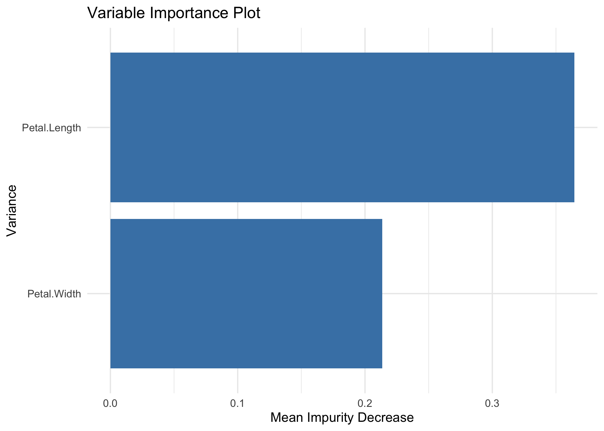
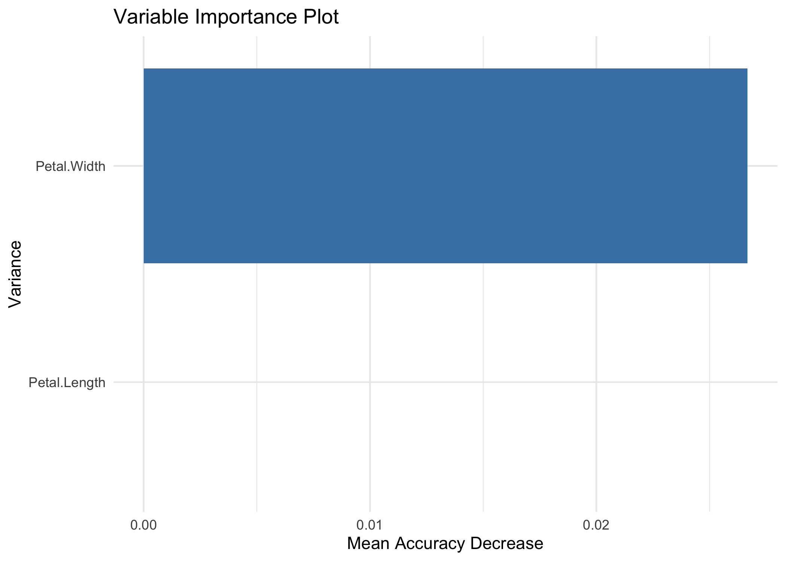

<!-- README.md is generated from README.Rmd. Please edit that file -->
<!-- badges: start -->

[](https://github.com/massimoaria/e2tree/actions/workflows/R-CMD-check.yaml)
<!-- badges: end -->

## Setup

You can install the developer version of e2tree from
[GitHub](https://github.com) with:

``` r
install.packages("remotes")
remotes::install_github("massimoaria/e2tree")
```

``` r
require(e2tree)
require(tidyverse)
options(dplyr.summarise.inform = FALSE)
require(randomForest)
require(Matrix)
require(future.apply)
```

## Warnings

The package is still under development and therefore, for the time
being, there are the following limitations:

- Only ensembles trained with the randomforest package are supported.
  Additional packages and approaches will be supported in the future;

- Currently e2tree works only in the case ofu classification problems.
  It will gradually be extended to other problems related to the nature
  of the response variable: regression, counting, multivariate response,
  etc.

## Example 1: IRIS dataset

In this example, we want to show the main functions of the e2tree
package.

Starting from the IRIS dataset, we will train an ensemble tree using the
randomforest package and then subsequently use e2tree to obtain an
explainable tree synthesis of the ensemble classifier.

``` r
# Set random seed to make results reproducible:
set.seed(0)
# Calculate the size of each of the data sets:
data_set_size <- floor(nrow(iris)/2)
# Generate a random sample of "data_set_size" indexes
indexes <- sample(1:nrow(iris), size = data_set_size)
# Assign the data to the correct sets
training <- iris[indexes,]
validation <- iris[-indexes,]
response_training <- training[,5]
response_validation <- validation[,5]
```

Train an Random Forest model with 1000 weak learners

``` r
# Perform training:
rf = randomForest(Species ~ ., data=training, ntree=1000, mtry=2, importance=TRUE, keep.inbag = TRUE, proximity=T)
```

Here, we create the dissimilarity matrix between observations through
the createDisMatrix function

``` r
D <- createDisMatrix(rf, data=training)
#> 
#> Analized  100  trees
#> Analized  200  trees
#> Analized  300  trees
#> Analized  400  trees
#> Analized  500  trees
#> Analized  600  trees
#> Analized  700  trees
#> Analized  800  trees
#> Analized  900  trees
#> Analized  1000  trees
#dis <- 1-rf$proximity
```

setting e2tree parameters

``` r
setting=list(impTotal=0.1, maxDec=0.01, n=5, level=5, tMax=5)
```

Build an explainable tree for RF 

``` r
tree <- e2tree(D, training[,-5], response_training, setting)
#> [1] 1
#> [1] 2
#> [1] 3
#> [1] 6
#> [1] 13
#> [1] 12
#> [1] 7
```

Let's have a look at the output

``` r
tree %>% glimpse()
#> Rows: 7
#> Columns: 19
#> $ node          <dbl> 1, 2, 3, 6, 7, 12, 13
#> $ n             <int> 75, 29, 46, 20, 26, 16, 4
#> $ pred          <chr> "setosa", "setosa", "virginica", "versicolor", "virginic…
#> $ prob          <chr> "0.386666666666667", "1", "0.58695652173913", "0.95", "1…
#> $ impTotal      <dbl> 0.69895205, 0.01628657, 0.58135876, 0.31262187, 0.129637…
#> $ impChildren   <dbl> 0.3628642, NA, 0.2091960, 0.2283824, NA, NA, NA
#> $ decImp        <dbl> 0.33608788, NA, 0.37216271, 0.08423945, NA, NA, NA
#> $ decImpSur     <dbl> 0.24963733, NA, 0.33018530, 0.02263852, NA, NA, NA
#> $ variable      <chr> "Petal.Length", NA, "Petal.Width", "Petal.Length", NA, N…
#> $ split         <dbl> 53, NA, 92, 64, NA, NA, NA
#> $ splitLabel    <chr> "Petal.Length <=1.9", NA, "Petal.Width <=1.7", "Petal.Le…
#> $ variableSur   <chr> "Petal.Width", NA, "Petal.Length", "Petal.Width", NA, NA…
#> $ splitLabelSur <chr> "Petal.Width <=0.6", NA, "Petal.Length <=4.7", "Petal.Wi…
#> $ parent        <dbl> 0, 1, 1, 3, 3, 6, 6
#> $ children      <list> <2, 3>, NA, <6, 7>, <12, 13>, NA, NA, NA
#> $ terminal      <lgl> FALSE, TRUE, FALSE, FALSE, TRUE, TRUE, TRUE
#> $ obs           <list> <1, 2, 3, 4, 5, 6, 7, 8, 9, 10, 11, 12, 13, 14, 15, 16, …
#> $ path          <chr> "", "Petal.Length <=1.9", "!Petal.Length <=1.9", "!Petal…
#> $ pred_val      <dbl> 1, 1, 3, 2, 3, 2, 2
```

Prediction with the new tree (example on training)

``` r
pred <- ePredTree(tree, training[,-5], target="virginica")
#> [1] 1
#> [1] 2
#> [1] 3
#> [1] 4
```

Comparison of predictions (training sample) of RF and e2tree

``` r
table(pred$fit,rf$predicted)
#>             
#>              setosa versicolor virginica
#>   setosa         29          0         0
#>   versicolor      0         18         2
#>   virginica       0          0        26
```

Comparison of predictions (training sample) of RF and correct response

``` r
table(rf$predicted, response_training)
#>             response_training
#>              setosa versicolor virginica
#>   setosa         29          0         0
#>   versicolor      0         17         1
#>   virginica       0          2        26
```

Comparison of predictions (training sample) of e2tree and correct response

``` r
table(pred$fit,response_training)
#>             response_training
#>              setosa versicolor virginica
#>   setosa         29          0         0
#>   versicolor      0         19         1
#>   virginica       0          0        26
```

Variable Importance

``` r
rfimp <- rf$importance %>% as.data.frame %>% 
  mutate(Variable = rownames(rf$importance),
         RF_Var_Imp = round(MeanDecreaseAccuracy,2)) %>% 
  select(Variable, RF_Var_Imp)

V <- vimp(tree, response_training, training[,-5])
```



``` r
V <- V %>% select(.data$Variable, .data$MeanImpurityDecrease, .data$`ImpDec_ setosa`, .data$`ImpDec_ versicolor`,.data$`ImpDec_ virginica`) %>% 
  mutate_at(c("MeanImpurityDecrease","ImpDec_ setosa", "ImpDec_ versicolor","ImpDec_ virginica"), round,2) %>% 
  left_join(rfimp, by = "Variable") %>% 
  select(Variable, RF_Var_Imp, MeanImpurityDecrease, starts_with("ImpDec")) %>% 
  rename(ETree_Var_Imp = MeanImpurityDecrease)

V
#> # A tibble: 2 × 6
#>   Variable     RF_Var_Imp ETree_Var_Imp `ImpDec_ setosa` `ImpDec_ versicolor`
#>   <chr>             <dbl>         <dbl>            <dbl>                <dbl>
#> 1 Petal.Length       0.27          0.36             0.34                 0.02
#> 2 Petal.Width        0.34          0.23            NA                   NA   
#> # … with 1 more variable: `ImpDec_ virginica` <dbl>
```

Comparison with the validation sample

``` r
rf.pred <- predict(rf, validation[,-5], proximity = TRUE)

pred_val<- ePredTree(tree, validation[,-5], target="virginica")
#> [1] 1
#> [1] 2
#> [1] 3
#> [1] 4
```

Comparison of predictions (sample validation) of RF and e2tree

``` r
table(pred_val$fit,rf.pred$predicted)
#>             
#>              setosa versicolor virginica
#>   setosa         21          0         0
#>   versicolor      0         34         0
#>   virginica       0          0        20
```

Comparison of predictions (validation sample) of RF and correct response

``` r
table(rf.pred$predicted, response_validation)
#>             response_validation
#>              setosa versicolor virginica
#>   setosa         21          0         0
#>   versicolor      0         30         4
#>   virginica       0          1        19
rf.prob <- predict(rf, validation[,-5], proximity = TRUE, type="prob")
roc_rf <- roc(response_validation,rf.prob$predicted[,"virginica"],target="virginica")
```


``` r
roc_rf$auc
#> [1] 0.9873725
```

Comparison of predictions (validation sample) of e2tree and correct response

``` r
table(pred_val$fit,response_validation)
#>             response_validation
#>              setosa versicolor virginica
#>   setosa         21          0         0
#>   versicolor      0         30         4
#>   virginica       0          1        19
roc_res <- roc(response_validation,pred_val$score,target="virginica")
```


``` r
roc_res$auc
#> [1] 0.96395
```
