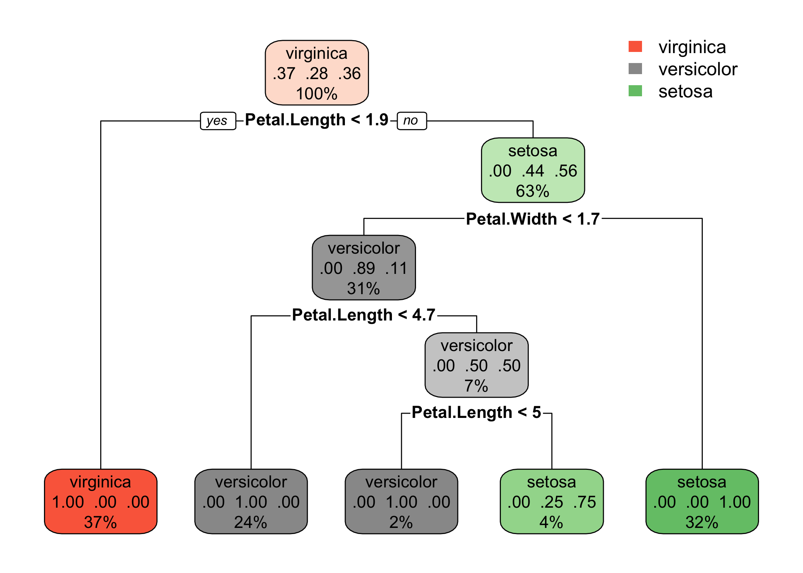
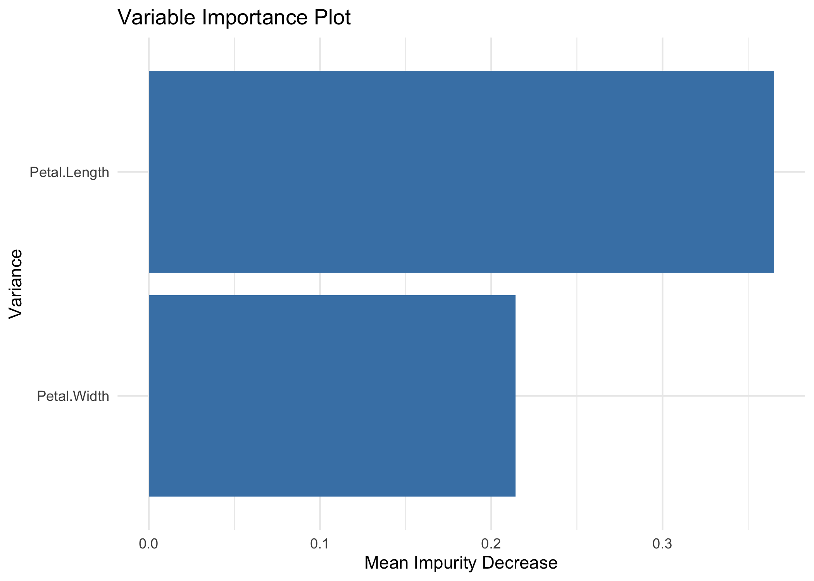
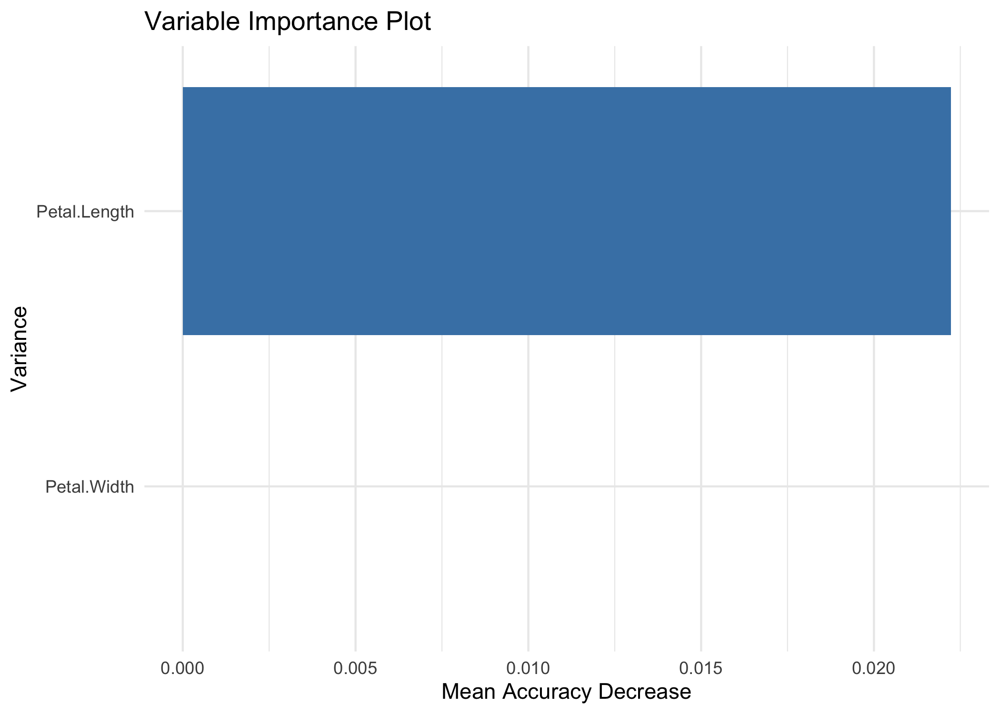

<!-- README.md is generated from README.Rmd. Please edit that file -->

# Explainable Ensemble Trees (e2tree)

<!-- badges: start -->

[](https://github.com/massimoaria/e2tree/actions/workflows/R-CMD-check.yaml) [](https://cran.r-project.org/package=e2tree)
<!-- badges: end -->

The Explainable Ensemble Trees (e2tree) key idea consists of the
definition of an algorithm to represent every ensemble approach based on
decision trees model using a single tree-like structure. The goal is to
explain the results from the esemble algorithm while preserving its
level of accuracy, which always outperforms those provided by a decision
tree. The proposed method is based on identifying the relationship
tree-like structure explaining the classification or regression paths
summarizing the whole ensemble process. There are two main advantages of
e2tree: - building an explainable tree that ensures the predictive
performance of an RF model - allowing the decision-maker to manage with
an intuitive structure (such as a tree-like structure).

In this example, we focus on Random Forest but, again, the algorithm can
be generalized to every ensemble approach based on decision trees.

## Setup

You can install the developer version of e2tree from
[GitHub](https://github.com) with:

``` r
install.packages("remotes")
remotes::install_github("massimoaria/e2tree")
```

``` r
require(e2tree)
require(randomForest)
require(dplyr)
require(ggplot2)
if (!(require(rsample, quietly=TRUE))){install.packages("rsample"); require(rsample, quietly=TRUE)} 
options(dplyr.summarise.inform = FALSE)
```

## Warnings

The package is still under development and therefore, for the time
being, there are the following limitations:

- Only ensembles trained with the randomForest package are supported.
  Additional packages and approaches will be supported in the future;

- Currently e2tree works only in the case of classification problems. It
  will gradually be extended to other problems related to the nature of
  the response variable: regression, counting, multivariate response,
  etc.

## Example 1: IRIS dataset

In this example, we want to show the main functions of the e2tree
package.

Starting from the IRIS dataset, we will train an ensemble tree using the
randomForest package and then subsequently use e2tree to obtain an
explainable tree synthesis of the ensemble classifier.

``` r
# Set random seed to make results reproducible:
set.seed(0)

# Initialize the split
iris_split <- iris %>% initial_split(prop = 0.6)
iris_split
#> <Training/Testing/Total>
#> <90/60/150>
# Assign the data to the correct sets
training <- iris_split %>% training()
validation <- iris_split %>% testing()
response_training <- training[,5]
response_validation <- validation[,5]
```

Train an Random Forest model with 1000 weak learners

``` r
# Perform training:
ensemble = randomForest(Species ~ ., data = training, importance = TRUE, proximity = TRUE)
```

Here, we create the dissimilarity matrix between observations through
the createDisMatrix function

``` r
D = createDisMatrix(ensemble, data = training, label = "Species", parallel = list(active = FALSE, no_cores = NULL))
#> Parallel mode OFF (1 core)
#> Classification Framework
#>   |                                                                              |                                                                      |   0%
#> 
#> Attaching package: 'Rcpp'
#> The following object is masked from 'package:rsample':
#> 
#>     populate
#>   |                                                                              |                                                                      |   1%  |                                                                              |=                                                                     |   1%  |                                                                              |=                                                                     |   2%  |                                                                              |==                                                                    |   2%  |                                                                              |==                                                                    |   3%  |                                                                              |===                                                                   |   4%  |                                                                              |===                                                                   |   5%  |                                                                              |====                                                                  |   5%  |                                                                              |====                                                                  |   6%  |                                                                              |=====                                                                 |   7%  |                                                                              |=====                                                                 |   8%  |                                                                              |======                                                                |   8%  |                                                                              |======                                                                |   9%  |                                                                              |=======                                                               |   9%  |                                                                              |=======                                                               |  10%  |                                                                              |=======                                                               |  11%  |                                                                              |========                                                              |  11%  |                                                                              |========                                                              |  12%  |                                                                              |=========                                                             |  12%  |                                                                              |=========                                                             |  13%  |                                                                              |==========                                                            |  14%  |                                                                              |==========                                                            |  15%  |                                                                              |===========                                                           |  15%  |                                                                              |===========                                                           |  16%  |                                                                              |============                                                          |  17%  |                                                                              |============                                                          |  18%  |                                                                              |=============                                                         |  18%  |                                                                              |=============                                                         |  19%  |                                                                              |==============                                                        |  19%  |                                                                              |==============                                                        |  20%  |                                                                              |==============                                                        |  21%  |                                                                              |===============                                                       |  21%  |                                                                              |===============                                                       |  22%  |                                                                              |================                                                      |  22%  |                                                                              |================                                                      |  23%  |                                                                              |=================                                                     |  24%  |                                                                              |=================                                                     |  25%  |                                                                              |==================                                                    |  25%  |                                                                              |==================                                                    |  26%  |                                                                              |===================                                                   |  27%  |                                                                              |===================                                                   |  28%  |                                                                              |====================                                                  |  28%  |                                                                              |====================                                                  |  29%  |                                                                              |=====================                                                 |  29%  |                                                                              |=====================                                                 |  30%  |                                                                              |=====================                                                 |  31%  |                                                                              |======================                                                |  31%  |                                                                              |======================                                                |  32%  |                                                                              |=======================                                               |  32%  |                                                                              |=======================                                               |  33%  |                                                                              |========================                                              |  34%  |                                                                              |========================                                              |  35%  |                                                                              |=========================                                             |  35%  |                                                                              |=========================                                             |  36%  |                                                                              |==========================                                            |  37%  |                                                                              |==========================                                            |  38%  |                                                                              |===========================                                           |  38%  |                                                                              |===========================                                           |  39%  |                                                                              |============================                                          |  39%  |                                                                              |============================                                          |  40%  |                                                                              |============================                                          |  41%  |                                                                              |=============================                                         |  41%  |                                                                              |=============================                                         |  42%  |                                                                              |==============================                                        |  42%  |                                                                              |==============================                                        |  43%  |                                                                              |===============================                                       |  44%  |                                                                              |===============================                                       |  45%  |                                                                              |================================                                      |  45%  |                                                                              |================================                                      |  46%  |                                                                              |=================================                                     |  47%  |                                                                              |=================================                                     |  48%  |                                                                              |==================================                                    |  48%  |                                                                              |==================================                                    |  49%  |                                                                              |===================================                                   |  49%  |                                                                              |===================================                                   |  50%  |                                                                              |===================================                                   |  51%  |                                                                              |====================================                                  |  51%  |                                                                              |====================================                                  |  52%  |                                                                              |=====================================                                 |  52%  |                                                                              |=====================================                                 |  53%  |                                                                              |======================================                                |  54%  |                                                                              |======================================                                |  55%  |                                                                              |=======================================                               |  55%  |                                                                              |=======================================                               |  56%  |                                                                              |========================================                              |  57%  |                                                                              |========================================                              |  58%  |                                                                              |=========================================                             |  58%  |                                                                              |=========================================                             |  59%  |                                                                              |==========================================                            |  59%  |                                                                              |==========================================                            |  60%  |                                                                              |==========================================                            |  61%  |                                                                              |===========================================                           |  61%  |                                                                              |===========================================                           |  62%  |                                                                              |============================================                          |  62%  |                                                                              |============================================                          |  63%  |                                                                              |=============================================                         |  64%  |                                                                              |=============================================                         |  65%  |                                                                              |==============================================                        |  65%  |                                                                              |==============================================                        |  66%  |                                                                              |===============================================                       |  67%  |                                                                              |===============================================                       |  68%  |                                                                              |================================================                      |  68%  |                                                                              |================================================                      |  69%  |                                                                              |=================================================                     |  69%  |                                                                              |=================================================                     |  70%  |                                                                              |=================================================                     |  71%  |                                                                              |==================================================                    |  71%  |                                                                              |==================================================                    |  72%  |                                                                              |===================================================                   |  72%  |                                                                              |===================================================                   |  73%  |                                                                              |====================================================                  |  74%  |                                                                              |====================================================                  |  75%  |                                                                              |=====================================================                 |  75%  |                                                                              |=====================================================                 |  76%  |                                                                              |======================================================                |  77%  |                                                                              |======================================================                |  78%  |                                                                              |=======================================================               |  78%  |                                                                              |=======================================================               |  79%  |                                                                              |========================================================              |  79%  |                                                                              |========================================================              |  80%  |                                                                              |========================================================              |  81%  |                                                                              |=========================================================             |  81%  |                                                                              |=========================================================             |  82%  |                                                                              |==========================================================            |  82%  |                                                                              |==========================================================            |  83%  |                                                                              |===========================================================           |  84%  |                                                                              |===========================================================           |  85%  |                                                                              |============================================================          |  85%  |                                                                              |============================================================          |  86%  |                                                                              |=============================================================         |  87%  |                                                                              |=============================================================         |  88%  |                                                                              |==============================================================        |  88%  |                                                                              |==============================================================        |  89%  |                                                                              |===============================================================       |  89%  |                                                                              |===============================================================       |  90%  |                                                                              |===============================================================       |  91%  |                                                                              |================================================================      |  91%  |                                                                              |================================================================      |  92%  |                                                                              |=================================================================     |  92%  |                                                                              |=================================================================     |  93%  |                                                                              |==================================================================    |  94%  |                                                                              |==================================================================    |  95%  |                                                                              |===================================================================   |  95%  |                                                                              |===================================================================   |  96%  |                                                                              |====================================================================  |  97%  |                                                                              |====================================================================  |  98%  |                                                                              |===================================================================== |  98%  |                                                                              |===================================================================== |  99%  |                                                                              |======================================================================|  99%  |                                                                              |======================================================================| 100%
#dis <- 1-rf$proximity
```

setting e2tree parameters

``` r
setting=list(impTotal=0.1, maxDec=0.01, n=2, level=5)
```

Build an explainable tree for RF

``` r
tree <- e2tree(Species ~ ., data = training, D, ensemble, setting)
```

Plot the Explainable Ensemble Tree

``` r
expl_plot <- rpart2Tree(tree, ensemble)
rpart.plot::rpart.plot(expl_plot)
```



Let’s have a look at the output

``` r
tree %>% glimpse()
#> List of 7
#>  $ tree   :'data.frame': 11 obs. of  21 variables:
#>   ..$ node         : num [1:11] 1 2 3 6 12 13 26 27 54 55 ...
#>   ..$ n            : int [1:11] 90 33 57 28 22 6 2 4 2 2 ...
#>   ..$ pred         : chr [1:11] "setosa" "setosa" "virginica" "versicolor" ...
#>   ..$ prob         : num [1:11] 0.367 1 0.561 0.893 1 ...
#>   ..$ impTotal     : num [1:11] 0.723 0.029 0.627 0.437 0.206 ...
#>   ..$ impChildren  : num [1:11] 0.408 NA 0.29 0.306 NA ...
#>   ..$ decImp       : num [1:11] 0.315 NA 0.338 0.132 NA ...
#>   ..$ decImpSur    : num [1:11] 0.2072 NA 0.3285 0.0744 NA ...
#>   ..$ variable     : chr [1:11] "Petal.Length" NA "Petal.Width" "Petal.Length" ...
#>   ..$ split        : num [1:11] 57 NA 97 68 NA 71 NA 72 NA NA ...
#>   ..$ splitLabel   : chr [1:11] "Petal.Length <=1.9" NA "Petal.Width <=1.7" "Petal.Length <=4.7" ...
#>   ..$ variableSur  : chr [1:11] "Petal.Width" NA "Petal.Length" "Sepal.Length" ...
#>   ..$ splitLabelSur: chr [1:11] "Petal.Width <=0.6" NA "Petal.Length <=4.7" "Sepal.Length <=5.8" ...
#>   ..$ parent       : num [1:11] 0 1 1 3 6 6 13 13 27 27 ...
#>   ..$ children     :List of 11
#>   .. ..$ : num [1:2] 2 3
#>   .. ..$ : logi NA
#>   .. ..$ : num [1:2] 6 7
#>   .. ..$ : num [1:2] 12 13
#>   .. ..$ : logi NA
#>   .. ..$ : num [1:2] 26 27
#>   .. ..$ : logi NA
#>   .. ..$ : num [1:2] 54 55
#>   .. ..$ : logi NA
#>   .. ..$ : logi NA
#>   .. ..$ : logi NA
#>   ..$ terminal     : logi [1:11] FALSE TRUE FALSE FALSE TRUE FALSE ...
#>   ..$ obs          :List of 11
#>   .. ..$ : int [1:90] 1 2 3 4 5 6 7 8 9 10 ...
#>   .. ..$ : int [1:33] 4 5 8 11 14 17 21 23 26 27 ...
#>   .. ..$ : int [1:57] 1 2 3 6 7 9 10 12 13 15 ...
#>   .. ..$ : int [1:28] 2 6 7 10 12 13 20 22 24 33 ...
#>   .. ..$ : int [1:22] 2 6 7 10 13 20 24 33 51 54 ...
#>   .. ..$ : int [1:6] 12 22 50 69 79 89
#>   .. ..$ : int [1:2] 12 50
#>   .. ..$ : int [1:4] 22 69 79 89
#>   .. ..$ : int [1:2] 22 79
#>   .. ..$ : int [1:2] 69 89
#>   .. ..$ : int [1:29] 1 3 9 15 16 18 19 25 28 31 ...
#>   ..$ path         : chr [1:11] "" "Petal.Length <=1.9" "!Petal.Length <=1.9" "!Petal.Length <=1.9 & Petal.Width <=1.7" ...
#>   ..$ ncat         : num [1:11] -1 NA -1 -1 NA -1 NA -1 NA NA ...
#>   ..$ pred_val     : num [1:11] 1 1 3 2 2 2 2 3 2 3 ...
#>   ..$ yval2        : num [1:11, 1:8] 1 1 3 2 2 2 2 3 2 3 ...
#>   .. ..- attr(*, "dimnames")=List of 2
#>  $ csplit : NULL
#>  $ splits : num [1:5, 1:5] 90 57 28 6 4 -1 -1 -1 -1 -1 ...
#>   ..- attr(*, "dimnames")=List of 2
#>   .. ..$ : chr [1:5] "Petal.Length" "Petal.Width" "Petal.Length" "Petal.Length" ...
#>   .. ..$ : chr [1:5] "count" "ncat" "improve" "index" ...
#>  $ call   : language e2tree(formula = Species ~ ., data = training, D = D, ensemble = ensemble,      setting = setting)
#>  $ terms  :Classes 'terms', 'formula'  language Species ~ Sepal.Length + Sepal.Width + Petal.Length + Petal.Width
#>   .. ..- attr(*, "variables")= language list(Species, Sepal.Length, Sepal.Width, Petal.Length, Petal.Width)
#>   .. ..- attr(*, "factors")= int [1:5, 1:4] 0 1 0 0 0 0 0 1 0 0 ...
#>   .. .. ..- attr(*, "dimnames")=List of 2
#>   .. ..- attr(*, "term.labels")= chr [1:4] "Sepal.Length" "Sepal.Width" "Petal.Length" "Petal.Width"
#>   .. ..- attr(*, "order")= int [1:4] 1 1 1 1
#>   .. ..- attr(*, "intercept")= int 1
#>   .. ..- attr(*, "response")= int 1
#>   .. ..- attr(*, ".Environment")=<environment: 0x139e68640> 
#>   .. ..- attr(*, "predvars")= language list(Species, Sepal.Length, Sepal.Width, Petal.Length, Petal.Width)
#>   .. ..- attr(*, "dataClasses")= Named chr [1:5] "factor" "numeric" "numeric" "numeric" ...
#>   .. .. ..- attr(*, "names")= chr [1:5] "Species" "Sepal.Length" "Sepal.Width" "Petal.Length" ...
#>  $ control:List of 5
#>   ..$ impTotal: num 0.1
#>   ..$ maxDec  : num 0.01
#>   ..$ n       : num 2
#>   ..$ level   : num 5
#>   ..$ tMax    : num 63
#>  $ N      : num [1:11] 1 2 3 6 12 13 26 27 54 55 ...
#>  - attr(*, "xlevels")= list()
#>  - attr(*, "ylevels")= chr [1:3] "virginica" "versicolor" "setosa"
#>  - attr(*, "class")= chr [1:2] "list" "e2tree"
```

Prediction with the new tree (example on training)

``` r
pred <- ePredTree(tree, training[,-5], target="virginica")
```

Comparison of predictions (training sample) of RF and e2tree

``` r
table(pred$fit, ensemble$predicted)
#>             
#>              setosa versicolor virginica
#>   setosa         33          0         0
#>   versicolor      0         24         2
#>   virginica       0          1        30
```

Comparison of predictions (training sample) of RF and correct response

``` r
table(ensemble$predicted, response_training)
#>             response_training
#>              setosa versicolor virginica
#>   setosa         33          0         0
#>   versicolor      0         23         2
#>   virginica       0          2        30
```

Comparison of predictions (training sample) of e2tree and correct
response

``` r
table(pred$fit,response_training)
#>             response_training
#>              setosa versicolor virginica
#>   setosa         33          0         0
#>   versicolor      0         25         1
#>   virginica       0          0        31
```

Variable Importance

``` r
ensemble_imp <- ensemble$importance %>% as.data.frame %>% 
  mutate(Variable = rownames(ensemble$importance),
         RF_Var_Imp = round(MeanDecreaseAccuracy,2)) %>% 
  select(Variable, RF_Var_Imp)

V <- vimp(tree, training)
#V <- V$vimp %>% 
#  select(Variable,MeanImpurityDecrease, `ImpDec_ setosa`, `ImpDec_ versicolor`,`ImpDec_ virginica`) %>% 
#  mutate_at(c("MeanImpurityDecrease","ImpDec_ setosa", "ImpDec_ versicolor","ImpDec_ virginica"), round,2) %>% 
#  left_join(ensemble_imp, by = "Variable") %>% 
#  select(Variable, RF_Var_Imp, MeanImpurityDecrease, starts_with("ImpDec")) %>% 
#  rename(ETree_Var_Imp = MeanImpurityDecrease)

V
#> $vimp
#> # A tibble: 2 × 9
#>   Variable     MeanImpurityDecrease MeanAccuracyDecrease `ImpDec_ setosa`
#>   <chr>                       <dbl>                <dbl>            <dbl>
#> 1 Petal.Length                0.366             2.22e- 2            0.315
#> 2 Petal.Width                 0.214             1.41e-16           NA    
#> # ℹ 5 more variables: `ImpDec_ versicolor` <dbl>, `ImpDec_ virginica` <dbl>,
#> #   `AccDec_ setosa` <dbl>, `AccDec_ versicolor` <dbl>,
#> #   `AccDec_ virginica` <dbl>
#> 
#> $g_imp
```



    #> 
    #> $g_acc



Comparison with the validation sample

``` r
ensemble.pred <- predict(ensemble, validation[,-5], proximity = TRUE)

pred_val<- ePredTree(tree, validation[,-5], target="virginica")
```

Comparison of predictions (sample validation) of RF and e2tree

``` r
table(pred_val$fit, ensemble.pred$predicted)
#>             
#>              setosa versicolor virginica
#>   setosa         17          0         0
#>   versicolor      0         26         0
#>   virginica       0          0        17
```

Comparison of predictions (validation sample) of RF and correct response

``` r
table(ensemble.pred$predicted, response_validation)
#>             response_validation
#>              setosa versicolor virginica
#>   setosa         17          0         0
#>   versicolor      0         24         2
#>   virginica       0          1        16
ensemble.prob <- predict(ensemble, validation[,-5], proximity = TRUE, type="prob")
roc_ensemble<- roc(response_validation, ensemble.prob$predicted[,"virginica"], target="virginica")
```


``` r
roc_ensemble$auc
#> [1] 0.9874563
```

Comparison of predictions (validation sample) of e2tree and correct
response

``` r
table(pred_val$fit, response_validation)
#>             response_validation
#>              setosa versicolor virginica
#>   setosa         17          0         0
#>   versicolor      0         24         2
#>   virginica       0          1        16
roc_res <- roc(response_validation, pred_val$score, target="virginica")
```


``` r
roc_res$auc
#> [1] 0.9325268
```
