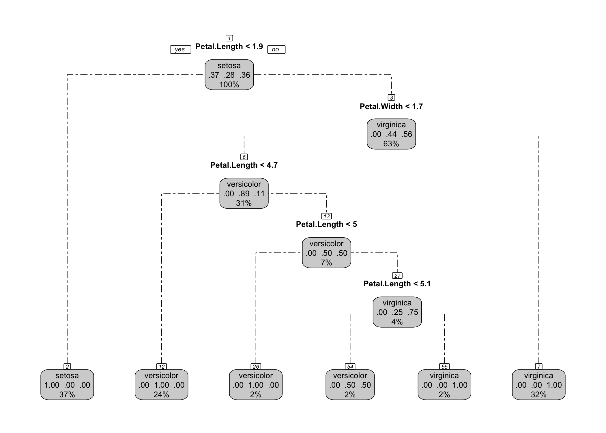
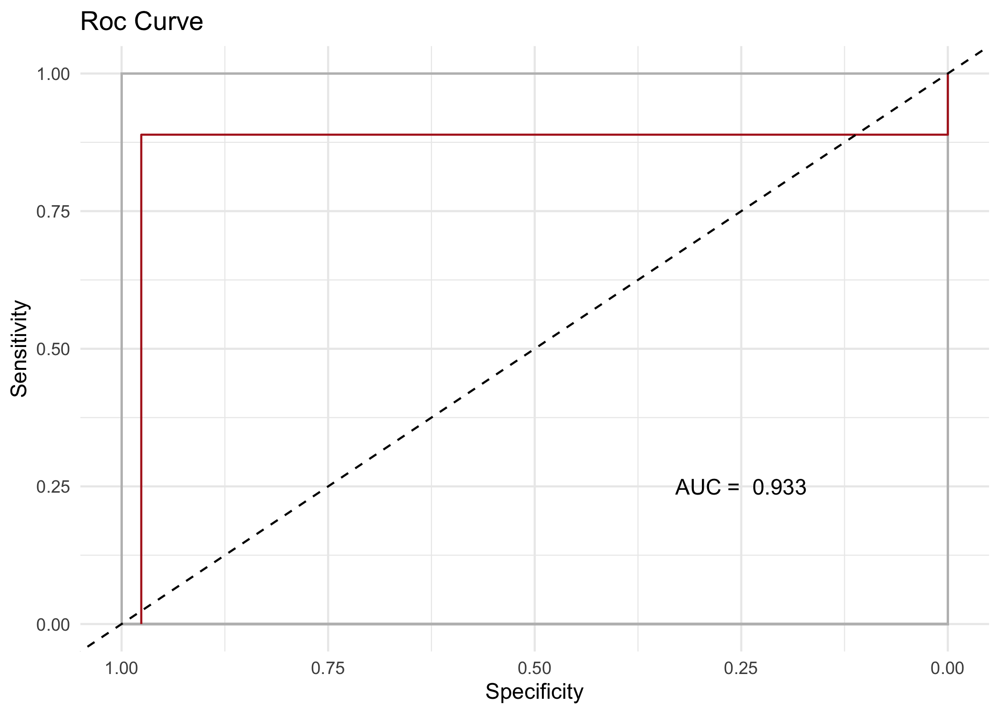

<!-- README.md is generated from README.Rmd. Please edit that file -->

# Explainable Ensemble Trees (e2tree)

<!-- badges: start -->

[](https://github.com/massimoaria/e2tree/actions/workflows/R-CMD-check.yaml)
<!-- badges: end -->

The Explainable Ensemble Trees (e2tree) key idea consists of the
definition of an algorithm to represent every ensemble approach based on
decision trees model using a single tree-like structure. The goal is to
explain the results from the esemble algorithm while preserving its
level of accuracy, which always outperforms those provided by a decision
tree. The proposed method is based on identifying the relationship
tree-like structure explaining the classification or regression paths
summarizing the whole ensemble process. There are two main advantages of
e2tree: - building an explainable tree that ensures the predictive
performance of an RF model - allowing the decision-maker to manage with
an intuitive structure (such as a tree-like structure).

In this example, we focus on Random Forest but, again, the algorithm can
be generalized to every ensemble approach based on decision trees.

## Setup

You can install the developer version of e2tree from
[GitHub](https://github.com) with:

``` r
install.packages("remotes")
remotes::install_github("massimoaria/e2tree")
```

You can install the released version of e2tree from
[CRAN](https://CRAN.R-project.org) with:

``` r
install.packages("e2tree")
```

``` r
require(e2tree)
require(randomForest)
require(dplyr)
require(ggplot2)
if (!(require(rsample, quietly=TRUE))){install.packages("rsample"); require(rsample, quietly=TRUE)} 
options(dplyr.summarise.inform = FALSE)
```

## Warnings

The package is still under development and therefore, for the time
being, there are the following limitations:

- Only ensembles trained with the randomForest package are supported.
  Additional packages and approaches will be supported in the future;

- Currently e2tree works only in the case of classification and
  regression problems. It will gradually be extended to other problems
  related to the nature of the response variable: counting, multivariate
  response, etc.

## Example 1: IRIS dataset

In this example, we want to show the main functions of the e2tree
package.

Starting from the IRIS dataset, we will train an ensemble tree using the
randomForest package and then subsequently use e2tree to obtain an
explainable tree synthesis of the ensemble classifier. We run a Random
Forest (RF) model, and then obtain the proximity matrix of the
observations as output. The idea behind the proximity matrix: if a pair
of observations is often at the a terminal node of several trees, this
means that both explain an underlying relationship. From this we are
able to calculate co-occurrences at nodes between pairs of observations
and obtain a matrix O of Co-Occurrences that will then be used to
construct the graphical E2Tree output. The final aim will be to explain
the relationship between predictors and response, reconstructing the
same structure as the proximity matrix output of the RF model.

``` r
# Set random seed to make results reproducible:
set.seed(0)

# Initialize the split
iris_split <- iris %>% initial_split(prop = 0.6)
iris_split
#> <Training/Testing/Total>
#> <90/60/150>
# Assign the data to the correct sets
training <- iris_split %>% training()
validation <- iris_split %>% testing()
response_training <- training[,5]
response_validation <- validation[,5]
```

Train an Random Forest model with 1000 weak learners

``` r
# Perform training:
ensemble = randomForest(Species ~ ., data = training, importance = TRUE, proximity = TRUE)
```

Here, we create the dissimilarity matrix between observations through
the createDisMatrix function

``` r
D = createDisMatrix(ensemble, data = training, label = "Species", parallel = list(active = FALSE, no_cores = NULL))
#> 
#> Attaching package: 'Rcpp'
#> The following object is masked from 'package:rsample':
#> 
#>     populate
```

setting e2tree parameters

``` r
setting=list(impTotal=0.1, maxDec=0.01, n=2, level=5)
```

Build an explainable tree for RF

``` r
tree <- e2tree(Species ~ ., data = training, D, ensemble, setting)
```

Plot the Explainable Ensemble Tree

``` r
expl_plot <- rpart2Tree(tree, ensemble)

# Plot using rpart.plot package:
plot_e2tree <- rpart.plot::rpart.plot(expl_plot,
                                      type=1,
                                      fallen.leaves = T,
                                      cex =0.55, 
                                      branch.lty = 6,
                                      nn = T, 
                                      roundint=F, 
                                      digits = 2,
                                      box.palette="lightgrey" 
                                      ) 
```



Prediction with the new tree (example on training)

``` r
pred <- ePredTree(tree, training[,-5], target="virginica")
```

Comparison of predictions (training sample) of RF and e2tree

``` r
table(pred$fit, ensemble$predicted)
#>             
#>              setosa versicolor virginica
#>   setosa         33          0         0
#>   versicolor      0         24         2
#>   virginica       0          1        30
```

Comparison of predictions (training sample) of RF and correct response

``` r
table(ensemble$predicted, response_training)
#>             response_training
#>              setosa versicolor virginica
#>   setosa         33          0         0
#>   versicolor      0         23         2
#>   virginica       0          2        30
```

Comparison of predictions (training sample) of e2tree and correct
response

``` r
table(pred$fit,response_training)
#>             response_training
#>              setosa versicolor virginica
#>   setosa         33          0         0
#>   versicolor      0         25         1
#>   virginica       0          0        31
```

Variable Importance

``` r
ensemble_imp <- ensemble$importance %>% as.data.frame %>% 
  mutate(Variable = rownames(ensemble$importance),
         RF_Var_Imp = round(MeanDecreaseAccuracy,2)) %>% 
  select(Variable, RF_Var_Imp)

V <- vimp(tree, training)
V
#> $vimp
#> # A tibble: 2 × 9
#>   Variable     MeanImpurityDecrease MeanAccuracyDecrease `ImpDec_ setosa`
#>   <chr>                       <dbl>                <dbl>            <dbl>
#> 1 Petal.Length                0.366             2.22e- 2            0.315
#> 2 Petal.Width                 0.214             1.41e-16           NA    
#> # ℹ 5 more variables: `ImpDec_ versicolor` <dbl>, `ImpDec_ virginica` <dbl>,
#> #   `AccDec_ setosa` <dbl>, `AccDec_ versicolor` <dbl>,
#> #   `AccDec_ virginica` <dbl>
#> 
#> $g_imp
```


    #> 
    #> $g_acc


Comparison with the validation sample

``` r
ensemble.pred <- predict(ensemble, validation[,-5], proximity = TRUE)

pred_val<- ePredTree(tree, validation[,-5], target="virginica")
```

Comparison of predictions (sample validation) of RF and e2tree

``` r
table(pred_val$fit, ensemble.pred$predicted)
#>             
#>              setosa versicolor virginica
#>   setosa         17          0         0
#>   versicolor      0         26         0
#>   virginica       0          0        17
```

Comparison of predictions (validation sample) of RF and correct response

``` r
table(ensemble.pred$predicted, response_validation)
#>             response_validation
#>              setosa versicolor virginica
#>   setosa         17          0         0
#>   versicolor      0         24         2
#>   virginica       0          1        16
ensemble.prob <- predict(ensemble, validation[,-5], proximity = TRUE, type="prob")
roc_ensemble<- roc(response_validation, ensemble.prob$predicted[,"virginica"], target="virginica")
```


``` r
roc_ensemble$auc
#> [1] 0.9874563
```

Comparison of predictions (validation sample) of e2tree and correct
response

``` r
table(pred_val$fit, response_validation)
#>             response_validation
#>              setosa versicolor virginica
#>   setosa         17          0         0
#>   versicolor      0         24         2
#>   virginica       0          1        16
roc_res <- roc(response_validation, pred_val$score, target="virginica")
```


``` r
roc_res$auc
#> [1] 0.9325268
```

To evaluate how well our tree captures the structure of the RF and
replicates its classification, we introduce a procedure to measure the
goodness of explainability. We start by visualizing the final partition
generated by the RF through a heatmap — a graphical representation of
the co-occurrence matrix, which reflects how often pairs of observations
are grouped together across the ensemble. Each cell shows a pairwise
similarity: the darker the cell, the closer to 1 the similarity —
meaning the two observations were frequently assigned to the same leaf.
Comparing these two matrices — both visually and statistically — allows
us to assess how well E2Tree reproduces the ensemble structure. To
formally test this alignment, we use the [Mantel
test](https://aacrjournals.org/cancerres/article/27/2_Part_1/209/476508/The-Detection-of-Disease-Clustering-and-a),
a statistical method that quantifies the correlation between the two
matrices. The Mantel test is a non-parametric method used to assess the
correlation between two distance or similarity matrices. It is
particularly useful when we are interested to study the relationships
between dissimilarity structures. The test uses permutation to generate
a null distribution, comparing the observed statistic against values
obtained under random reordering.

``` r
eComparison(training, tree, D, graph = TRUE)
```



    #> $mantel_test
    #> $mantel_test$z.stat
    #> [1] 1043.696
    #> 
    #> $mantel_test$p
    #> [1] 0.001
    #> 
    #> $mantel_test$alternative
    #> [1] "two.sided"
    #> 
    #> 
    #> $Proximity_matrix_e2tree
    #>    85 14 17 26 73 44 8 42 43 81 64 62 49 48 47 37 35 32 30 29 27 11 21 4 60 80
    #> 85  1  1  1  1  1  1 1  1  1  1  1  1  1  1  1  1  1  1  1  1  1  1  1 1  1  1
    #> 14  1  1  1  1  1  1 1  1  1  1  1  1  1  1  1  1  1  1  1  1  1  1  1 1  1  1
    #> 17  1  1  1  1  1  1 1  1  1  1  1  1  1  1  1  1  1  1  1  1  1  1  1 1  1  1
    #> 26  1  1  1  1  1  1 1  1  1  1  1  1  1  1  1  1  1  1  1  1  1  1  1 1  1  1
    #> 73  1  1  1  1  1  1 1  1  1  1  1  1  1  1  1  1  1  1  1  1  1  1  1 1  1  1
    #> 44  1  1  1  1  1  1 1  1  1  1  1  1  1  1  1  1  1  1  1  1  1  1  1 1  1  1
    #> 8   1  1  1  1  1  1 1  1  1  1  1  1  1  1  1  1  1  1  1  1  1  1  1 1  1  1
    #> 42  1  1  1  1  1  1 1  1  1  1  1  1  1  1  1  1  1  1  1  1  1  1  1 1  1  1
    #> 43  1  1  1  1  1  1 1  1  1  1  1  1  1  1  1  1  1  1  1  1  1  1  1 1  1  1
    #> 81  1  1  1  1  1  1 1  1  1  1  1  1  1  1  1  1  1  1  1  1  1  1  1 1  1  1
    #> 64  1  1  1  1  1  1 1  1  1  1  1  1  1  1  1  1  1  1  1  1  1  1  1 1  1  1
    #> 62  1  1  1  1  1  1 1  1  1  1  1  1  1  1  1  1  1  1  1  1  1  1  1 1  1  1
    #> 49  1  1  1  1  1  1 1  1  1  1  1  1  1  1  1  1  1  1  1  1  1  1  1 1  1  1
    #> 48  1  1  1  1  1  1 1  1  1  1  1  1  1  1  1  1  1  1  1  1  1  1  1 1  1  1
    #> 47  1  1  1  1  1  1 1  1  1  1  1  1  1  1  1  1  1  1  1  1  1  1  1 1  1  1
    #> 37  1  1  1  1  1  1 1  1  1  1  1  1  1  1  1  1  1  1  1  1  1  1  1 1  1  1
    #> 35  1  1  1  1  1  1 1  1  1  1  1  1  1  1  1  1  1  1  1  1  1  1  1 1  1  1
    #> 32  1  1  1  1  1  1 1  1  1  1  1  1  1  1  1  1  1  1  1  1  1  1  1 1  1  1
    #> 30  1  1  1  1  1  1 1  1  1  1  1  1  1  1  1  1  1  1  1  1  1  1  1 1  1  1
    #> 29  1  1  1  1  1  1 1  1  1  1  1  1  1  1  1  1  1  1  1  1  1  1  1 1  1  1
    #> 27  1  1  1  1  1  1 1  1  1  1  1  1  1  1  1  1  1  1  1  1  1  1  1 1  1  1
    #> 11  1  1  1  1  1  1 1  1  1  1  1  1  1  1  1  1  1  1  1  1  1  1  1 1  1  1
    #> 21  1  1  1  1  1  1 1  1  1  1  1  1  1  1  1  1  1  1  1  1  1  1  1 1  1  1
    #> 4   1  1  1  1  1  1 1  1  1  1  1  1  1  1  1  1  1  1  1  1  1  1  1 1  1  1
    #> 60  1  1  1  1  1  1 1  1  1  1  1  1  1  1  1  1  1  1  1  1  1  1  1 1  1  1
    #> 80  1  1  1  1  1  1 1  1  1  1  1  1  1  1  1  1  1  1  1  1  1  1  1 1  1  1
    #> 23  1  1  1  1  1  1 1  1  1  1  1  1  1  1  1  1  1  1  1  1  1  1  1 1  1  1
    #> 72  1  1  1  1  1  1 1  1  1  1  1  1  1  1  1  1  1  1  1  1  1  1  1 1  1  1
    #> 84  1  1  1  1  1  1 1  1  1  1  1  1  1  1  1  1  1  1  1  1  1  1  1 1  1  1
    #> 57  1  1  1  1  1  1 1  1  1  1  1  1  1  1  1  1  1  1  1  1  1  1  1 1  1  1
    #> 46  1  1  1  1  1  1 1  1  1  1  1  1  1  1  1  1  1  1  1  1  1  1  1 1  1  1
    #> 5   1  1  1  1  1  1 1  1  1  1  1  1  1  1  1  1  1  1  1  1  1  1  1 1  1  1
    #> 39  1  1  1  1  1  1 1  1  1  1  1  1  1  1  1  1  1  1  1  1  1  1  1 1  1  1
    #> 7   0  0  0  0  0  0 0  0  0  0  0  0  0  0  0  0  0  0  0  0  0  0  0 0  0  0
    #> 56  0  0  0  0  0  0 0  0  0  0  0  0  0  0  0  0  0  0  0  0  0  0  0 0  0  0
    #> 68  0  0  0  0  0  0 0  0  0  0  0  0  0  0  0  0  0  0  0  0  0  0  0 0  0  0
    #> 77  0  0  0  0  0  0 0  0  0  0  0  0  0  0  0  0  0  0  0  0  0  0  0 0  0  0
    #> 65  0  0  0  0  0  0 0  0  0  0  0  0  0  0  0  0  0  0  0  0  0  0  0 0  0  0
    #> 54  0  0  0  0  0  0 0  0  0  0  0  0  0  0  0  0  0  0  0  0  0  0  0 0  0  0
    #> 86  0  0  0  0  0  0 0  0  0  0  0  0  0  0  0  0  0  0  0  0  0  0  0 0  0  0
    #> 55  0  0  0  0  0  0 0  0  0  0  0  0  0  0  0  0  0  0  0  0  0  0  0 0  0  0
    #> 83  0  0  0  0  0  0 0  0  0  0  0  0  0  0  0  0  0  0  0  0  0  0  0 0  0  0
    #> 6   0  0  0  0  0  0 0  0  0  0  0  0  0  0  0  0  0  0  0  0  0  0  0 0  0  0
    #> 33  0  0  0  0  0  0 0  0  0  0  0  0  0  0  0  0  0  0  0  0  0  0  0 0  0  0
    #> 90  0  0  0  0  0  0 0  0  0  0  0  0  0  0  0  0  0  0  0  0  0  0  0 0  0  0
    #> 13  0  0  0  0  0  0 0  0  0  0  0  0  0  0  0  0  0  0  0  0  0  0  0 0  0  0
    #> 61  0  0  0  0  0  0 0  0  0  0  0  0  0  0  0  0  0  0  0  0  0  0  0 0  0  0
    #> 76  0  0  0  0  0  0 0  0  0  0  0  0  0  0  0  0  0  0  0  0  0  0  0 0  0  0
    #> 10  0  0  0  0  0  0 0  0  0  0  0  0  0  0  0  0  0  0  0  0  0  0  0 0  0  0
    #> 87  0  0  0  0  0  0 0  0  0  0  0  0  0  0  0  0  0  0  0  0  0  0  0 0  0  0
    #> 20  0  0  0  0  0  0 0  0  0  0  0  0  0  0  0  0  0  0  0  0  0  0  0 0  0  0
    #> 51  0  0  0  0  0  0 0  0  0  0  0  0  0  0  0  0  0  0  0  0  0  0  0 0  0  0
    #> 24  0  0  0  0  0  0 0  0  0  0  0  0  0  0  0  0  0  0  0  0  0  0  0 0  0  0
    #> 2   0  0  0  0  0  0 0  0  0  0  0  0  0  0  0  0  0  0  0  0  0  0  0 0  0  0
    #> 75  0  0  0  0  0  0 0  0  0  0  0  0  0  0  0  0  0  0  0  0  0  0  0 0  0  0
    #> 22  0  0  0  0  0  0 0  0  0  0  0  0  0  0  0  0  0  0  0  0  0  0  0 0  0  0
    #> 12  0  0  0  0  0  0 0  0  0  0  0  0  0  0  0  0  0  0  0  0  0  0  0 0  0  0
    #> 50  0  0  0  0  0  0 0  0  0  0  0  0  0  0  0  0  0  0  0  0  0  0  0 0  0  0
    #> 18  0  0  0  0  0  0 0  0  0  0  0  0  0  0  0  0  0  0  0  0  0  0  0 0  0  0
    #> 66  0  0  0  0  0  0 0  0  0  0  0  0  0  0  0  0  0  0  0  0  0  0  0 0  0  0
    #> 71  0  0  0  0  0  0 0  0  0  0  0  0  0  0  0  0  0  0  0  0  0  0  0 0  0  0
    #> 36  0  0  0  0  0  0 0  0  0  0  0  0  0  0  0  0  0  0  0  0  0  0  0 0  0  0
    #> 1   0  0  0  0  0  0 0  0  0  0  0  0  0  0  0  0  0  0  0  0  0  0  0 0  0  0
    #> 28  0  0  0  0  0  0 0  0  0  0  0  0  0  0  0  0  0  0  0  0  0  0  0 0  0  0
    #> 88  0  0  0  0  0  0 0  0  0  0  0  0  0  0  0  0  0  0  0  0  0  0  0 0  0  0
    #> 59  0  0  0  0  0  0 0  0  0  0  0  0  0  0  0  0  0  0  0  0  0  0  0 0  0  0
    #> 78  0  0  0  0  0  0 0  0  0  0  0  0  0  0  0  0  0  0  0  0  0  0  0 0  0  0
    #> 16  0  0  0  0  0  0 0  0  0  0  0  0  0  0  0  0  0  0  0  0  0  0  0 0  0  0
    #> 53  0  0  0  0  0  0 0  0  0  0  0  0  0  0  0  0  0  0  0  0  0  0  0 0  0  0
    #> 9   0  0  0  0  0  0 0  0  0  0  0  0  0  0  0  0  0  0  0  0  0  0  0 0  0  0
    #> 19  0  0  0  0  0  0 0  0  0  0  0  0  0  0  0  0  0  0  0  0  0  0  0 0  0  0
    #> 52  0  0  0  0  0  0 0  0  0  0  0  0  0  0  0  0  0  0  0  0  0  0  0 0  0  0
    #> 67  0  0  0  0  0  0 0  0  0  0  0  0  0  0  0  0  0  0  0  0  0  0  0 0  0  0
    #> 45  0  0  0  0  0  0 0  0  0  0  0  0  0  0  0  0  0  0  0  0  0  0  0 0  0  0
    #> 41  0  0  0  0  0  0 0  0  0  0  0  0  0  0  0  0  0  0  0  0  0  0  0 0  0  0
    #> 25  0  0  0  0  0  0 0  0  0  0  0  0  0  0  0  0  0  0  0  0  0  0  0 0  0  0
    #> 40  0  0  0  0  0  0 0  0  0  0  0  0  0  0  0  0  0  0  0  0  0  0  0 0  0  0
    #> 3   0  0  0  0  0  0 0  0  0  0  0  0  0  0  0  0  0  0  0  0  0  0  0 0  0  0
    #> 70  0  0  0  0  0  0 0  0  0  0  0  0  0  0  0  0  0  0  0  0  0  0  0 0  0  0
    #> 58  0  0  0  0  0  0 0  0  0  0  0  0  0  0  0  0  0  0  0  0  0  0  0 0  0  0
    #> 63  0  0  0  0  0  0 0  0  0  0  0  0  0  0  0  0  0  0  0  0  0  0  0 0  0  0
    #> 15  0  0  0  0  0  0 0  0  0  0  0  0  0  0  0  0  0  0  0  0  0  0  0 0  0  0
    #> 38  0  0  0  0  0  0 0  0  0  0  0  0  0  0  0  0  0  0  0  0  0  0  0 0  0  0
    #> 82  0  0  0  0  0  0 0  0  0  0  0  0  0  0  0  0  0  0  0  0  0  0  0 0  0  0
    #> 31  0  0  0  0  0  0 0  0  0  0  0  0  0  0  0  0  0  0  0  0  0  0  0 0  0  0
    #> 34  0  0  0  0  0  0 0  0  0  0  0  0  0  0  0  0  0  0  0  0  0  0  0 0  0  0
    #> 74  0  0  0  0  0  0 0  0  0  0  0  0  0  0  0  0  0  0  0  0  0  0  0 0  0  0
    #> 79  0  0  0  0  0  0 0  0  0  0  0  0  0  0  0  0  0  0  0  0  0  0  0 0  0  0
    #> 69  0  0  0  0  0  0 0  0  0  0  0  0  0  0  0  0  0  0  0  0  0  0  0 0  0  0
    #> 89  0  0  0  0  0  0 0  0  0  0  0  0  0  0  0  0  0  0  0  0  0  0  0 0  0  0
    #>    23 72 84 57 46 5 39 7 56 68 77 65 54 86 55 83 6 33 90 13 61 76 10 87 20 51
    #> 85  1  1  1  1  1 1  1 0  0  0  0  0  0  0  0  0 0  0  0  0  0  0  0  0  0  0
    #> 14  1  1  1  1  1 1  1 0  0  0  0  0  0  0  0  0 0  0  0  0  0  0  0  0  0  0
    #> 17  1  1  1  1  1 1  1 0  0  0  0  0  0  0  0  0 0  0  0  0  0  0  0  0  0  0
    #> 26  1  1  1  1  1 1  1 0  0  0  0  0  0  0  0  0 0  0  0  0  0  0  0  0  0  0
    #> 73  1  1  1  1  1 1  1 0  0  0  0  0  0  0  0  0 0  0  0  0  0  0  0  0  0  0
    #> 44  1  1  1  1  1 1  1 0  0  0  0  0  0  0  0  0 0  0  0  0  0  0  0  0  0  0
    #> 8   1  1  1  1  1 1  1 0  0  0  0  0  0  0  0  0 0  0  0  0  0  0  0  0  0  0
    #> 42  1  1  1  1  1 1  1 0  0  0  0  0  0  0  0  0 0  0  0  0  0  0  0  0  0  0
    #> 43  1  1  1  1  1 1  1 0  0  0  0  0  0  0  0  0 0  0  0  0  0  0  0  0  0  0
    #> 81  1  1  1  1  1 1  1 0  0  0  0  0  0  0  0  0 0  0  0  0  0  0  0  0  0  0
    #> 64  1  1  1  1  1 1  1 0  0  0  0  0  0  0  0  0 0  0  0  0  0  0  0  0  0  0
    #> 62  1  1  1  1  1 1  1 0  0  0  0  0  0  0  0  0 0  0  0  0  0  0  0  0  0  0
    #> 49  1  1  1  1  1 1  1 0  0  0  0  0  0  0  0  0 0  0  0  0  0  0  0  0  0  0
    #> 48  1  1  1  1  1 1  1 0  0  0  0  0  0  0  0  0 0  0  0  0  0  0  0  0  0  0
    #> 47  1  1  1  1  1 1  1 0  0  0  0  0  0  0  0  0 0  0  0  0  0  0  0  0  0  0
    #> 37  1  1  1  1  1 1  1 0  0  0  0  0  0  0  0  0 0  0  0  0  0  0  0  0  0  0
    #> 35  1  1  1  1  1 1  1 0  0  0  0  0  0  0  0  0 0  0  0  0  0  0  0  0  0  0
    #> 32  1  1  1  1  1 1  1 0  0  0  0  0  0  0  0  0 0  0  0  0  0  0  0  0  0  0
    #> 30  1  1  1  1  1 1  1 0  0  0  0  0  0  0  0  0 0  0  0  0  0  0  0  0  0  0
    #> 29  1  1  1  1  1 1  1 0  0  0  0  0  0  0  0  0 0  0  0  0  0  0  0  0  0  0
    #> 27  1  1  1  1  1 1  1 0  0  0  0  0  0  0  0  0 0  0  0  0  0  0  0  0  0  0
    #> 11  1  1  1  1  1 1  1 0  0  0  0  0  0  0  0  0 0  0  0  0  0  0  0  0  0  0
    #> 21  1  1  1  1  1 1  1 0  0  0  0  0  0  0  0  0 0  0  0  0  0  0  0  0  0  0
    #> 4   1  1  1  1  1 1  1 0  0  0  0  0  0  0  0  0 0  0  0  0  0  0  0  0  0  0
    #> 60  1  1  1  1  1 1  1 0  0  0  0  0  0  0  0  0 0  0  0  0  0  0  0  0  0  0
    #> 80  1  1  1  1  1 1  1 0  0  0  0  0  0  0  0  0 0  0  0  0  0  0  0  0  0  0
    #> 23  1  1  1  1  1 1  1 0  0  0  0  0  0  0  0  0 0  0  0  0  0  0  0  0  0  0
    #> 72  1  1  1  1  1 1  1 0  0  0  0  0  0  0  0  0 0  0  0  0  0  0  0  0  0  0
    #> 84  1  1  1  1  1 1  1 0  0  0  0  0  0  0  0  0 0  0  0  0  0  0  0  0  0  0
    #> 57  1  1  1  1  1 1  1 0  0  0  0  0  0  0  0  0 0  0  0  0  0  0  0  0  0  0
    #> 46  1  1  1  1  1 1  1 0  0  0  0  0  0  0  0  0 0  0  0  0  0  0  0  0  0  0
    #> 5   1  1  1  1  1 1  1 0  0  0  0  0  0  0  0  0 0  0  0  0  0  0  0  0  0  0
    #> 39  1  1  1  1  1 1  1 0  0  0  0  0  0  0  0  0 0  0  0  0  0  0  0  0  0  0
    #> 7   0  0  0  0  0 0  0 1  1  1  1  1  1  1  1  1 1  1  1  1  1  1  1  1  1  1
    #> 56  0  0  0  0  0 0  0 1  1  1  1  1  1  1  1  1 1  1  1  1  1  1  1  1  1  1
    #> 68  0  0  0  0  0 0  0 1  1  1  1  1  1  1  1  1 1  1  1  1  1  1  1  1  1  1
    #> 77  0  0  0  0  0 0  0 1  1  1  1  1  1  1  1  1 1  1  1  1  1  1  1  1  1  1
    #> 65  0  0  0  0  0 0  0 1  1  1  1  1  1  1  1  1 1  1  1  1  1  1  1  1  1  1
    #> 54  0  0  0  0  0 0  0 1  1  1  1  1  1  1  1  1 1  1  1  1  1  1  1  1  1  1
    #> 86  0  0  0  0  0 0  0 1  1  1  1  1  1  1  1  1 1  1  1  1  1  1  1  1  1  1
    #> 55  0  0  0  0  0 0  0 1  1  1  1  1  1  1  1  1 1  1  1  1  1  1  1  1  1  1
    #> 83  0  0  0  0  0 0  0 1  1  1  1  1  1  1  1  1 1  1  1  1  1  1  1  1  1  1
    #> 6   0  0  0  0  0 0  0 1  1  1  1  1  1  1  1  1 1  1  1  1  1  1  1  1  1  1
    #> 33  0  0  0  0  0 0  0 1  1  1  1  1  1  1  1  1 1  1  1  1  1  1  1  1  1  1
    #> 90  0  0  0  0  0 0  0 1  1  1  1  1  1  1  1  1 1  1  1  1  1  1  1  1  1  1
    #> 13  0  0  0  0  0 0  0 1  1  1  1  1  1  1  1  1 1  1  1  1  1  1  1  1  1  1
    #> 61  0  0  0  0  0 0  0 1  1  1  1  1  1  1  1  1 1  1  1  1  1  1  1  1  1  1
    #> 76  0  0  0  0  0 0  0 1  1  1  1  1  1  1  1  1 1  1  1  1  1  1  1  1  1  1
    #> 10  0  0  0  0  0 0  0 1  1  1  1  1  1  1  1  1 1  1  1  1  1  1  1  1  1  1
    #> 87  0  0  0  0  0 0  0 1  1  1  1  1  1  1  1  1 1  1  1  1  1  1  1  1  1  1
    #> 20  0  0  0  0  0 0  0 1  1  1  1  1  1  1  1  1 1  1  1  1  1  1  1  1  1  1
    #> 51  0  0  0  0  0 0  0 1  1  1  1  1  1  1  1  1 1  1  1  1  1  1  1  1  1  1
    #> 24  0  0  0  0  0 0  0 1  1  1  1  1  1  1  1  1 1  1  1  1  1  1  1  1  1  1
    #> 2   0  0  0  0  0 0  0 1  1  1  1  1  1  1  1  1 1  1  1  1  1  1  1  1  1  1
    #> 75  0  0  0  0  0 0  0 1  1  1  1  1  1  1  1  1 1  1  1  1  1  1  1  1  1  1
    #> 22  0  0  0  0  0 0  0 0  0  0  0  0  0  0  0  0 0  0  0  0  0  0  0  0  0  0
    #> 12  0  0  0  0  0 0  0 0  0  0  0  0  0  0  0  0 0  0  0  0  0  0  0  0  0  0
    #> 50  0  0  0  0  0 0  0 0  0  0  0  0  0  0  0  0 0  0  0  0  0  0  0  0  0  0
    #> 18  0  0  0  0  0 0  0 0  0  0  0  0  0  0  0  0 0  0  0  0  0  0  0  0  0  0
    #> 66  0  0  0  0  0 0  0 0  0  0  0  0  0  0  0  0 0  0  0  0  0  0  0  0  0  0
    #> 71  0  0  0  0  0 0  0 0  0  0  0  0  0  0  0  0 0  0  0  0  0  0  0  0  0  0
    #> 36  0  0  0  0  0 0  0 0  0  0  0  0  0  0  0  0 0  0  0  0  0  0  0  0  0  0
    #> 1   0  0  0  0  0 0  0 0  0  0  0  0  0  0  0  0 0  0  0  0  0  0  0  0  0  0
    #> 28  0  0  0  0  0 0  0 0  0  0  0  0  0  0  0  0 0  0  0  0  0  0  0  0  0  0
    #> 88  0  0  0  0  0 0  0 0  0  0  0  0  0  0  0  0 0  0  0  0  0  0  0  0  0  0
    #> 59  0  0  0  0  0 0  0 0  0  0  0  0  0  0  0  0 0  0  0  0  0  0  0  0  0  0
    #> 78  0  0  0  0  0 0  0 0  0  0  0  0  0  0  0  0 0  0  0  0  0  0  0  0  0  0
    #> 16  0  0  0  0  0 0  0 0  0  0  0  0  0  0  0  0 0  0  0  0  0  0  0  0  0  0
    #> 53  0  0  0  0  0 0  0 0  0  0  0  0  0  0  0  0 0  0  0  0  0  0  0  0  0  0
    #> 9   0  0  0  0  0 0  0 0  0  0  0  0  0  0  0  0 0  0  0  0  0  0  0  0  0  0
    #> 19  0  0  0  0  0 0  0 0  0  0  0  0  0  0  0  0 0  0  0  0  0  0  0  0  0  0
    #> 52  0  0  0  0  0 0  0 0  0  0  0  0  0  0  0  0 0  0  0  0  0  0  0  0  0  0
    #> 67  0  0  0  0  0 0  0 0  0  0  0  0  0  0  0  0 0  0  0  0  0  0  0  0  0  0
    #> 45  0  0  0  0  0 0  0 0  0  0  0  0  0  0  0  0 0  0  0  0  0  0  0  0  0  0
    #> 41  0  0  0  0  0 0  0 0  0  0  0  0  0  0  0  0 0  0  0  0  0  0  0  0  0  0
    #> 25  0  0  0  0  0 0  0 0  0  0  0  0  0  0  0  0 0  0  0  0  0  0  0  0  0  0
    #> 40  0  0  0  0  0 0  0 0  0  0  0  0  0  0  0  0 0  0  0  0  0  0  0  0  0  0
    #> 3   0  0  0  0  0 0  0 0  0  0  0  0  0  0  0  0 0  0  0  0  0  0  0  0  0  0
    #> 70  0  0  0  0  0 0  0 0  0  0  0  0  0  0  0  0 0  0  0  0  0  0  0  0  0  0
    #> 58  0  0  0  0  0 0  0 0  0  0  0  0  0  0  0  0 0  0  0  0  0  0  0  0  0  0
    #> 63  0  0  0  0  0 0  0 0  0  0  0  0  0  0  0  0 0  0  0  0  0  0  0  0  0  0
    #> 15  0  0  0  0  0 0  0 0  0  0  0  0  0  0  0  0 0  0  0  0  0  0  0  0  0  0
    #> 38  0  0  0  0  0 0  0 0  0  0  0  0  0  0  0  0 0  0  0  0  0  0  0  0  0  0
    #> 82  0  0  0  0  0 0  0 0  0  0  0  0  0  0  0  0 0  0  0  0  0  0  0  0  0  0
    #> 31  0  0  0  0  0 0  0 0  0  0  0  0  0  0  0  0 0  0  0  0  0  0  0  0  0  0
    #> 34  0  0  0  0  0 0  0 0  0  0  0  0  0  0  0  0 0  0  0  0  0  0  0  0  0  0
    #> 74  0  0  0  0  0 0  0 0  0  0  0  0  0  0  0  0 0  0  0  0  0  0  0  0  0  0
    #> 79  0  0  0  0  0 0  0 0  0  0  0  0  0  0  0  0 0  0  0  0  0  0  0  0  0  0
    #> 69  0  0  0  0  0 0  0 0  0  0  0  0  0  0  0  0 0  0  0  0  0  0  0  0  0  0
    #> 89  0  0  0  0  0 0  0 0  0  0  0  0  0  0  0  0 0  0  0  0  0  0  0  0  0  0
    #>    24 2 75        22 12 50 18 66 71 36 1 28 88 59 78 16 53 9 19 52 67 45 41 25
    #> 85  0 0  0 0.0000000  0  0  0  0  0  0 0  0  0  0  0  0  0 0  0  0  0  0  0  0
    #> 14  0 0  0 0.0000000  0  0  0  0  0  0 0  0  0  0  0  0  0 0  0  0  0  0  0  0
    #> 17  0 0  0 0.0000000  0  0  0  0  0  0 0  0  0  0  0  0  0 0  0  0  0  0  0  0
    #> 26  0 0  0 0.0000000  0  0  0  0  0  0 0  0  0  0  0  0  0 0  0  0  0  0  0  0
    #> 73  0 0  0 0.0000000  0  0  0  0  0  0 0  0  0  0  0  0  0 0  0  0  0  0  0  0
    #> 44  0 0  0 0.0000000  0  0  0  0  0  0 0  0  0  0  0  0  0 0  0  0  0  0  0  0
    #> 8   0 0  0 0.0000000  0  0  0  0  0  0 0  0  0  0  0  0  0 0  0  0  0  0  0  0
    #> 42  0 0  0 0.0000000  0  0  0  0  0  0 0  0  0  0  0  0  0 0  0  0  0  0  0  0
    #> 43  0 0  0 0.0000000  0  0  0  0  0  0 0  0  0  0  0  0  0 0  0  0  0  0  0  0
    #> 81  0 0  0 0.0000000  0  0  0  0  0  0 0  0  0  0  0  0  0 0  0  0  0  0  0  0
    #> 64  0 0  0 0.0000000  0  0  0  0  0  0 0  0  0  0  0  0  0 0  0  0  0  0  0  0
    #> 62  0 0  0 0.0000000  0  0  0  0  0  0 0  0  0  0  0  0  0 0  0  0  0  0  0  0
    #> 49  0 0  0 0.0000000  0  0  0  0  0  0 0  0  0  0  0  0  0 0  0  0  0  0  0  0
    #> 48  0 0  0 0.0000000  0  0  0  0  0  0 0  0  0  0  0  0  0 0  0  0  0  0  0  0
    #> 47  0 0  0 0.0000000  0  0  0  0  0  0 0  0  0  0  0  0  0 0  0  0  0  0  0  0
    #> 37  0 0  0 0.0000000  0  0  0  0  0  0 0  0  0  0  0  0  0 0  0  0  0  0  0  0
    #> 35  0 0  0 0.0000000  0  0  0  0  0  0 0  0  0  0  0  0  0 0  0  0  0  0  0  0
    #> 32  0 0  0 0.0000000  0  0  0  0  0  0 0  0  0  0  0  0  0 0  0  0  0  0  0  0
    #> 30  0 0  0 0.0000000  0  0  0  0  0  0 0  0  0  0  0  0  0 0  0  0  0  0  0  0
    #> 29  0 0  0 0.0000000  0  0  0  0  0  0 0  0  0  0  0  0  0 0  0  0  0  0  0  0
    #> 27  0 0  0 0.0000000  0  0  0  0  0  0 0  0  0  0  0  0  0 0  0  0  0  0  0  0
    #> 11  0 0  0 0.0000000  0  0  0  0  0  0 0  0  0  0  0  0  0 0  0  0  0  0  0  0
    #> 21  0 0  0 0.0000000  0  0  0  0  0  0 0  0  0  0  0  0  0 0  0  0  0  0  0  0
    #> 4   0 0  0 0.0000000  0  0  0  0  0  0 0  0  0  0  0  0  0 0  0  0  0  0  0  0
    #> 60  0 0  0 0.0000000  0  0  0  0  0  0 0  0  0  0  0  0  0 0  0  0  0  0  0  0
    #> 80  0 0  0 0.0000000  0  0  0  0  0  0 0  0  0  0  0  0  0 0  0  0  0  0  0  0
    #> 23  0 0  0 0.0000000  0  0  0  0  0  0 0  0  0  0  0  0  0 0  0  0  0  0  0  0
    #> 72  0 0  0 0.0000000  0  0  0  0  0  0 0  0  0  0  0  0  0 0  0  0  0  0  0  0
    #> 84  0 0  0 0.0000000  0  0  0  0  0  0 0  0  0  0  0  0  0 0  0  0  0  0  0  0
    #> 57  0 0  0 0.0000000  0  0  0  0  0  0 0  0  0  0  0  0  0 0  0  0  0  0  0  0
    #> 46  0 0  0 0.0000000  0  0  0  0  0  0 0  0  0  0  0  0  0 0  0  0  0  0  0  0
    #> 5   0 0  0 0.0000000  0  0  0  0  0  0 0  0  0  0  0  0  0 0  0  0  0  0  0  0
    #> 39  0 0  0 0.0000000  0  0  0  0  0  0 0  0  0  0  0  0  0 0  0  0  0  0  0  0
    #> 7   1 1  1 0.0000000  0  0  0  0  0  0 0  0  0  0  0  0  0 0  0  0  0  0  0  0
    #> 56  1 1  1 0.0000000  0  0  0  0  0  0 0  0  0  0  0  0  0 0  0  0  0  0  0  0
    #> 68  1 1  1 0.0000000  0  0  0  0  0  0 0  0  0  0  0  0  0 0  0  0  0  0  0  0
    #> 77  1 1  1 0.0000000  0  0  0  0  0  0 0  0  0  0  0  0  0 0  0  0  0  0  0  0
    #> 65  1 1  1 0.0000000  0  0  0  0  0  0 0  0  0  0  0  0  0 0  0  0  0  0  0  0
    #> 54  1 1  1 0.0000000  0  0  0  0  0  0 0  0  0  0  0  0  0 0  0  0  0  0  0  0
    #> 86  1 1  1 0.0000000  0  0  0  0  0  0 0  0  0  0  0  0  0 0  0  0  0  0  0  0
    #> 55  1 1  1 0.0000000  0  0  0  0  0  0 0  0  0  0  0  0  0 0  0  0  0  0  0  0
    #> 83  1 1  1 0.0000000  0  0  0  0  0  0 0  0  0  0  0  0  0 0  0  0  0  0  0  0
    #> 6   1 1  1 0.0000000  0  0  0  0  0  0 0  0  0  0  0  0  0 0  0  0  0  0  0  0
    #> 33  1 1  1 0.0000000  0  0  0  0  0  0 0  0  0  0  0  0  0 0  0  0  0  0  0  0
    #> 90  1 1  1 0.0000000  0  0  0  0  0  0 0  0  0  0  0  0  0 0  0  0  0  0  0  0
    #> 13  1 1  1 0.0000000  0  0  0  0  0  0 0  0  0  0  0  0  0 0  0  0  0  0  0  0
    #> 61  1 1  1 0.0000000  0  0  0  0  0  0 0  0  0  0  0  0  0 0  0  0  0  0  0  0
    #> 76  1 1  1 0.0000000  0  0  0  0  0  0 0  0  0  0  0  0  0 0  0  0  0  0  0  0
    #> 10  1 1  1 0.0000000  0  0  0  0  0  0 0  0  0  0  0  0  0 0  0  0  0  0  0  0
    #> 87  1 1  1 0.0000000  0  0  0  0  0  0 0  0  0  0  0  0  0 0  0  0  0  0  0  0
    #> 20  1 1  1 0.0000000  0  0  0  0  0  0 0  0  0  0  0  0  0 0  0  0  0  0  0  0
    #> 51  1 1  1 0.0000000  0  0  0  0  0  0 0  0  0  0  0  0  0 0  0  0  0  0  0  0
    #> 24  1 1  1 0.0000000  0  0  0  0  0  0 0  0  0  0  0  0  0 0  0  0  0  0  0  0
    #> 2   1 1  1 0.0000000  0  0  0  0  0  0 0  0  0  0  0  0  0 0  0  0  0  0  0  0
    #> 75  1 1  1 0.0000000  0  0  0  0  0  0 0  0  0  0  0  0  0 0  0  0  0  0  0  0
    #> 22  0 0  0 1.0000000  0  0  0  0  0  0 0  0  0  0  0  0  0 0  0  0  0  0  0  0
    #> 12  0 0  0 0.0000000  1  1  0  0  0  0 0  0  0  0  0  0  0 0  0  0  0  0  0  0
    #> 50  0 0  0 0.0000000  1  1  0  0  0  0 0  0  0  0  0  0  0 0  0  0  0  0  0  0
    #> 18  0 0  0 0.0000000  0  0  1  1  1  1 1  1  1  1  1  1  1 1  1  1  1  1  1  1
    #> 66  0 0  0 0.0000000  0  0  1  1  1  1 1  1  1  1  1  1  1 1  1  1  1  1  1  1
    #> 71  0 0  0 0.0000000  0  0  1  1  1  1 1  1  1  1  1  1  1 1  1  1  1  1  1  1
    #> 36  0 0  0 0.0000000  0  0  1  1  1  1 1  1  1  1  1  1  1 1  1  1  1  1  1  1
    #> 1   0 0  0 0.0000000  0  0  1  1  1  1 1  1  1  1  1  1  1 1  1  1  1  1  1  1
    #> 28  0 0  0 0.0000000  0  0  1  1  1  1 1  1  1  1  1  1  1 1  1  1  1  1  1  1
    #> 88  0 0  0 0.0000000  0  0  1  1  1  1 1  1  1  1  1  1  1 1  1  1  1  1  1  1
    #> 59  0 0  0 0.0000000  0  0  1  1  1  1 1  1  1  1  1  1  1 1  1  1  1  1  1  1
    #> 78  0 0  0 0.0000000  0  0  1  1  1  1 1  1  1  1  1  1  1 1  1  1  1  1  1  1
    #> 16  0 0  0 0.0000000  0  0  1  1  1  1 1  1  1  1  1  1  1 1  1  1  1  1  1  1
    #> 53  0 0  0 0.0000000  0  0  1  1  1  1 1  1  1  1  1  1  1 1  1  1  1  1  1  1
    #> 9   0 0  0 0.0000000  0  0  1  1  1  1 1  1  1  1  1  1  1 1  1  1  1  1  1  1
    #> 19  0 0  0 0.0000000  0  0  1  1  1  1 1  1  1  1  1  1  1 1  1  1  1  1  1  1
    #> 52  0 0  0 0.0000000  0  0  1  1  1  1 1  1  1  1  1  1  1 1  1  1  1  1  1  1
    #> 67  0 0  0 0.0000000  0  0  1  1  1  1 1  1  1  1  1  1  1 1  1  1  1  1  1  1
    #> 45  0 0  0 0.0000000  0  0  1  1  1  1 1  1  1  1  1  1  1 1  1  1  1  1  1  1
    #> 41  0 0  0 0.0000000  0  0  1  1  1  1 1  1  1  1  1  1  1 1  1  1  1  1  1  1
    #> 25  0 0  0 0.0000000  0  0  1  1  1  1 1  1  1  1  1  1  1 1  1  1  1  1  1  1
    #> 40  0 0  0 0.0000000  0  0  1  1  1  1 1  1  1  1  1  1  1 1  1  1  1  1  1  1
    #> 3   0 0  0 0.0000000  0  0  1  1  1  1 1  1  1  1  1  1  1 1  1  1  1  1  1  1
    #> 70  0 0  0 0.0000000  0  0  1  1  1  1 1  1  1  1  1  1  1 1  1  1  1  1  1  1
    #> 58  0 0  0 0.0000000  0  0  1  1  1  1 1  1  1  1  1  1  1 1  1  1  1  1  1  1
    #> 63  0 0  0 0.0000000  0  0  1  1  1  1 1  1  1  1  1  1  1 1  1  1  1  1  1  1
    #> 15  0 0  0 0.0000000  0  0  1  1  1  1 1  1  1  1  1  1  1 1  1  1  1  1  1  1
    #> 38  0 0  0 0.0000000  0  0  1  1  1  1 1  1  1  1  1  1  1 1  1  1  1  1  1  1
    #> 82  0 0  0 0.0000000  0  0  1  1  1  1 1  1  1  1  1  1  1 1  1  1  1  1  1  1
    #> 31  0 0  0 0.0000000  0  0  1  1  1  1 1  1  1  1  1  1  1 1  1  1  1  1  1  1
    #> 34  0 0  0 0.0000000  0  0  1  1  1  1 1  1  1  1  1  1  1 1  1  1  1  1  1  1
    #> 74  0 0  0 0.0000000  0  0  1  1  1  1 1  1  1  1  1  1  1 1  1  1  1  1  1  1
    #> 79  0 0  0 0.7071068  0  0  0  0  0  0 0  0  0  0  0  0  0 0  0  0  0  0  0  0
    #> 69  0 0  0 0.0000000  0  0  0  0  0  0 0  0  0  0  0  0  0 0  0  0  0  0  0  0
    #> 89  0 0  0 0.0000000  0  0  0  0  0  0 0  0  0  0  0  0  0 0  0  0  0  0  0  0
    #>    40 3 70 58 63 15 38 82 31 34 74        79 69 89
    #> 85  0 0  0  0  0  0  0  0  0  0  0 0.0000000  0  0
    #> 14  0 0  0  0  0  0  0  0  0  0  0 0.0000000  0  0
    #> 17  0 0  0  0  0  0  0  0  0  0  0 0.0000000  0  0
    #> 26  0 0  0  0  0  0  0  0  0  0  0 0.0000000  0  0
    #> 73  0 0  0  0  0  0  0  0  0  0  0 0.0000000  0  0
    #> 44  0 0  0  0  0  0  0  0  0  0  0 0.0000000  0  0
    #> 8   0 0  0  0  0  0  0  0  0  0  0 0.0000000  0  0
    #> 42  0 0  0  0  0  0  0  0  0  0  0 0.0000000  0  0
    #> 43  0 0  0  0  0  0  0  0  0  0  0 0.0000000  0  0
    #> 81  0 0  0  0  0  0  0  0  0  0  0 0.0000000  0  0
    #> 64  0 0  0  0  0  0  0  0  0  0  0 0.0000000  0  0
    #> 62  0 0  0  0  0  0  0  0  0  0  0 0.0000000  0  0
    #> 49  0 0  0  0  0  0  0  0  0  0  0 0.0000000  0  0
    #> 48  0 0  0  0  0  0  0  0  0  0  0 0.0000000  0  0
    #> 47  0 0  0  0  0  0  0  0  0  0  0 0.0000000  0  0
    #> 37  0 0  0  0  0  0  0  0  0  0  0 0.0000000  0  0
    #> 35  0 0  0  0  0  0  0  0  0  0  0 0.0000000  0  0
    #> 32  0 0  0  0  0  0  0  0  0  0  0 0.0000000  0  0
    #> 30  0 0  0  0  0  0  0  0  0  0  0 0.0000000  0  0
    #> 29  0 0  0  0  0  0  0  0  0  0  0 0.0000000  0  0
    #> 27  0 0  0  0  0  0  0  0  0  0  0 0.0000000  0  0
    #> 11  0 0  0  0  0  0  0  0  0  0  0 0.0000000  0  0
    #> 21  0 0  0  0  0  0  0  0  0  0  0 0.0000000  0  0
    #> 4   0 0  0  0  0  0  0  0  0  0  0 0.0000000  0  0
    #> 60  0 0  0  0  0  0  0  0  0  0  0 0.0000000  0  0
    #> 80  0 0  0  0  0  0  0  0  0  0  0 0.0000000  0  0
    #> 23  0 0  0  0  0  0  0  0  0  0  0 0.0000000  0  0
    #> 72  0 0  0  0  0  0  0  0  0  0  0 0.0000000  0  0
    #> 84  0 0  0  0  0  0  0  0  0  0  0 0.0000000  0  0
    #> 57  0 0  0  0  0  0  0  0  0  0  0 0.0000000  0  0
    #> 46  0 0  0  0  0  0  0  0  0  0  0 0.0000000  0  0
    #> 5   0 0  0  0  0  0  0  0  0  0  0 0.0000000  0  0
    #> 39  0 0  0  0  0  0  0  0  0  0  0 0.0000000  0  0
    #> 7   0 0  0  0  0  0  0  0  0  0  0 0.0000000  0  0
    #> 56  0 0  0  0  0  0  0  0  0  0  0 0.0000000  0  0
    #> 68  0 0  0  0  0  0  0  0  0  0  0 0.0000000  0  0
    #> 77  0 0  0  0  0  0  0  0  0  0  0 0.0000000  0  0
    #> 65  0 0  0  0  0  0  0  0  0  0  0 0.0000000  0  0
    #> 54  0 0  0  0  0  0  0  0  0  0  0 0.0000000  0  0
    #> 86  0 0  0  0  0  0  0  0  0  0  0 0.0000000  0  0
    #> 55  0 0  0  0  0  0  0  0  0  0  0 0.0000000  0  0
    #> 83  0 0  0  0  0  0  0  0  0  0  0 0.0000000  0  0
    #> 6   0 0  0  0  0  0  0  0  0  0  0 0.0000000  0  0
    #> 33  0 0  0  0  0  0  0  0  0  0  0 0.0000000  0  0
    #> 90  0 0  0  0  0  0  0  0  0  0  0 0.0000000  0  0
    #> 13  0 0  0  0  0  0  0  0  0  0  0 0.0000000  0  0
    #> 61  0 0  0  0  0  0  0  0  0  0  0 0.0000000  0  0
    #> 76  0 0  0  0  0  0  0  0  0  0  0 0.0000000  0  0
    #> 10  0 0  0  0  0  0  0  0  0  0  0 0.0000000  0  0
    #> 87  0 0  0  0  0  0  0  0  0  0  0 0.0000000  0  0
    #> 20  0 0  0  0  0  0  0  0  0  0  0 0.0000000  0  0
    #> 51  0 0  0  0  0  0  0  0  0  0  0 0.0000000  0  0
    #> 24  0 0  0  0  0  0  0  0  0  0  0 0.0000000  0  0
    #> 2   0 0  0  0  0  0  0  0  0  0  0 0.0000000  0  0
    #> 75  0 0  0  0  0  0  0  0  0  0  0 0.0000000  0  0
    #> 22  0 0  0  0  0  0  0  0  0  0  0 0.7071068  0  0
    #> 12  0 0  0  0  0  0  0  0  0  0  0 0.0000000  0  0
    #> 50  0 0  0  0  0  0  0  0  0  0  0 0.0000000  0  0
    #> 18  1 1  1  1  1  1  1  1  1  1  1 0.0000000  0  0
    #> 66  1 1  1  1  1  1  1  1  1  1  1 0.0000000  0  0
    #> 71  1 1  1  1  1  1  1  1  1  1  1 0.0000000  0  0
    #> 36  1 1  1  1  1  1  1  1  1  1  1 0.0000000  0  0
    #> 1   1 1  1  1  1  1  1  1  1  1  1 0.0000000  0  0
    #> 28  1 1  1  1  1  1  1  1  1  1  1 0.0000000  0  0
    #> 88  1 1  1  1  1  1  1  1  1  1  1 0.0000000  0  0
    #> 59  1 1  1  1  1  1  1  1  1  1  1 0.0000000  0  0
    #> 78  1 1  1  1  1  1  1  1  1  1  1 0.0000000  0  0
    #> 16  1 1  1  1  1  1  1  1  1  1  1 0.0000000  0  0
    #> 53  1 1  1  1  1  1  1  1  1  1  1 0.0000000  0  0
    #> 9   1 1  1  1  1  1  1  1  1  1  1 0.0000000  0  0
    #> 19  1 1  1  1  1  1  1  1  1  1  1 0.0000000  0  0
    #> 52  1 1  1  1  1  1  1  1  1  1  1 0.0000000  0  0
    #> 67  1 1  1  1  1  1  1  1  1  1  1 0.0000000  0  0
    #> 45  1 1  1  1  1  1  1  1  1  1  1 0.0000000  0  0
    #> 41  1 1  1  1  1  1  1  1  1  1  1 0.0000000  0  0
    #> 25  1 1  1  1  1  1  1  1  1  1  1 0.0000000  0  0
    #> 40  1 1  1  1  1  1  1  1  1  1  1 0.0000000  0  0
    #> 3   1 1  1  1  1  1  1  1  1  1  1 0.0000000  0  0
    #> 70  1 1  1  1  1  1  1  1  1  1  1 0.0000000  0  0
    #> 58  1 1  1  1  1  1  1  1  1  1  1 0.0000000  0  0
    #> 63  1 1  1  1  1  1  1  1  1  1  1 0.0000000  0  0
    #> 15  1 1  1  1  1  1  1  1  1  1  1 0.0000000  0  0
    #> 38  1 1  1  1  1  1  1  1  1  1  1 0.0000000  0  0
    #> 82  1 1  1  1  1  1  1  1  1  1  1 0.0000000  0  0
    #> 31  1 1  1  1  1  1  1  1  1  1  1 0.0000000  0  0
    #> 34  1 1  1  1  1  1  1  1  1  1  1 0.0000000  0  0
    #> 74  1 1  1  1  1  1  1  1  1  1  1 0.0000000  0  0
    #> 79  0 0  0  0  0  0  0  0  0  0  0 1.0000000  0  0
    #> 69  0 0  0  0  0  0  0  0  0  0  0 0.0000000  1  1
    #> 89  0 0  0  0  0  0  0  0  0  0  0 0.0000000  1  1
    #> 
    #> $Proximity_matrix_ensemble
    #>            85         14         17         26         73         44          8
    #> 85 1.00000000 0.93959320 0.94442279 0.89888761 0.91130122 0.91130122 0.91130122
    #> 14 0.93959320 1.00000000 0.99530593 0.94731745 0.96864301 0.96864301 0.96864301
    #> 17 0.94442279 0.99530593 1.00000000 0.94717414 0.96864301 0.96864301 0.96864301
    #> 26 0.89888761 0.94731745 0.94717414 1.00000000 0.96590275 0.96590275 0.96590275
    #> 73 0.91130122 0.96864301 0.96864301 0.96590275 1.00000000 1.00000000 1.00000000
    #> 44 0.91130122 0.96864301 0.96864301 0.96590275 1.00000000 1.00000000 1.00000000
    #> 8  0.91130122 0.96864301 0.96864301 0.96590275 1.00000000 1.00000000 1.00000000
    #> 42 0.91130122 0.96864301 0.96864301 0.96590275 1.00000000 1.00000000 1.00000000
    #> 43 0.90818115 0.96571872 0.96571872 0.96792646 0.99607519 0.99607519 0.99607519
    #> 81 0.91032360 0.96773819 0.96773819 0.96796459 0.99799591 0.99799591 0.99799591
    #> 64 0.91032360 0.96773819 0.96773819 0.96796459 0.99799591 0.99799591 0.99799591
    #> 62 0.91032360 0.96773819 0.96773819 0.96796459 0.99799591 0.99799591 0.99799591
    #> 49 0.91032360 0.96773819 0.96773819 0.96796459 0.99799591 0.99799591 0.99799591
    #> 48 0.91032360 0.96773819 0.96773819 0.96796459 0.99799591 0.99799591 0.99799591
    #> 47 0.91032360 0.96773819 0.96773819 0.96796459 0.99799591 0.99799591 0.99799591
    #> 37 0.91032360 0.96773819 0.96773819 0.96796459 0.99799591 0.99799591 0.99799591
    #> 35 0.91032360 0.96773819 0.96773819 0.96796459 0.99799591 0.99799591 0.99799591
    #> 32 0.91032360 0.96773819 0.96773819 0.96796459 0.99799591 0.99799591 0.99799591
    #> 30 0.91032360 0.96773819 0.96773819 0.96796459 0.99799591 0.99799591 0.99799591
    #> 29 0.91032360 0.96773819 0.96773819 0.96796459 0.99799591 0.99799591 0.99799591
    #> 27 0.91032360 0.96773819 0.96773819 0.96796459 0.99799591 0.99799591 0.99799591
    #> 11 0.91032360 0.96773819 0.96773819 0.96796459 0.99799591 0.99799591 0.99799591
    #> 21 0.91032360 0.96773819 0.96773819 0.96796459 0.99799591 0.99799591 0.99799591
    #> 4  0.90504640 0.96279344 0.96279344 0.97302495 0.99305566 0.99305566 0.99305566
    #> 60 0.90504640 0.96279344 0.96279344 0.97302495 0.99305566 0.99305566 0.99305566
    #> 80 0.90394711 0.96175567 0.96175567 0.97401477 0.99208747 0.99208747 0.99208747
    #> 23 0.90394711 0.96175567 0.96175567 0.97401477 0.99208747 0.99208747 0.99208747
    #> 72 0.90394711 0.96175567 0.96175567 0.97401477 0.99208747 0.99208747 0.99208747
    #> 84 0.90069412 0.95765363 0.95765363 0.97513624 0.98709941 0.98709941 0.98709941
    #> 57 0.90063157 0.95758713 0.95758713 0.97702720 0.98709941 0.98709941 0.98709941
    #> 46 0.90063157 0.95758713 0.95758713 0.97702720 0.98709941 0.98709941 0.98709941
    #> 5  0.90063157 0.95758713 0.95758713 0.97702720 0.98709941 0.98709941 0.98709941
    #> 39 0.90063157 0.95758713 0.95758713 0.97702720 0.98709941 0.98709941 0.98709941
    #> 7  0.00000000 0.09861265 0.09859773 0.00000000 0.13919149 0.13919149 0.13919149
    #> 56 0.06957633 0.11029348 0.06940963 0.08416854 0.00000000 0.00000000 0.00000000
    #> 68 0.06957633 0.11029348 0.06940963 0.08416854 0.00000000 0.00000000 0.00000000
    #> 77 0.00000000 0.00000000 0.00000000 0.11690400 0.00000000 0.00000000 0.00000000
    #> 65 0.00000000 0.00000000 0.00000000 0.14461207 0.00000000 0.00000000 0.00000000
    #> 54 0.00000000 0.00000000 0.00000000 0.12319807 0.00000000 0.00000000 0.00000000
    #> 86 0.00000000 0.00000000 0.00000000 0.13680100 0.00000000 0.00000000 0.00000000
    #> 55 0.23300872 0.10824025 0.07978175 0.04362359 0.00000000 0.00000000 0.00000000
    #> 83 0.23300872 0.10824025 0.07978175 0.04362359 0.00000000 0.00000000 0.00000000
    #> 6  0.22593247 0.11804671 0.09264734 0.00000000 0.06153046 0.06153046 0.06153046
    #> 33 0.22971966 0.10957965 0.08158914 0.00000000 0.04317410 0.04317410 0.04317410
    #> 90 0.22559594 0.10069026 0.06919668 0.00000000 0.00000000 0.00000000 0.00000000
    #> 13 0.23639129 0.12406127 0.07951706 0.04362359 0.00000000 0.00000000 0.00000000
    #> 61 0.23639129 0.12406127 0.07951706 0.00000000 0.00000000 0.00000000 0.00000000
    #> 76 0.23639129 0.12406127 0.07951706 0.04362359 0.00000000 0.00000000 0.00000000
    #> 10 0.23632019 0.11692037 0.07951706 0.04362359 0.00000000 0.00000000 0.00000000
    #> 87 0.23999962 0.13026366 0.08888143 0.04362359 0.00000000 0.00000000 0.00000000
    #> 20 0.23982450 0.13026366 0.08888143 0.00000000 0.00000000 0.00000000 0.00000000
    #> 51 0.23982450 0.13026366 0.08888143 0.04362359 0.00000000 0.00000000 0.00000000
    #> 24 0.22156820 0.11029348 0.06940963 0.04362359 0.00000000 0.00000000 0.00000000
    #> 2  0.23632019 0.11692037 0.07951706 0.04362359 0.00000000 0.00000000 0.00000000
    #> 75 0.23632019 0.11692037 0.07951706 0.04362359 0.00000000 0.00000000 0.00000000
    #> 22 0.11682169 0.07003710 0.05513663 0.00000000 0.00000000 0.00000000 0.00000000
    #> 12 0.14925901 0.06023349 0.00000000 0.04362359 0.00000000 0.00000000 0.00000000
    #> 50 0.14296903 0.06023349 0.00000000 0.00000000 0.00000000 0.00000000 0.00000000
    #> 18 0.00000000 0.00000000 0.00000000 0.00000000 0.00000000 0.00000000 0.00000000
    #> 66 0.00000000 0.00000000 0.00000000 0.00000000 0.00000000 0.00000000 0.00000000
    #> 71 0.00000000 0.00000000 0.00000000 0.00000000 0.00000000 0.00000000 0.00000000
    #> 36 0.00000000 0.00000000 0.00000000 0.00000000 0.00000000 0.00000000 0.00000000
    #> 1  0.00000000 0.00000000 0.00000000 0.00000000 0.00000000 0.00000000 0.00000000
    #> 28 0.00000000 0.00000000 0.00000000 0.00000000 0.00000000 0.00000000 0.00000000
    #> 88 0.00000000 0.00000000 0.00000000 0.00000000 0.00000000 0.00000000 0.00000000
    #> 59 0.00000000 0.00000000 0.00000000 0.00000000 0.00000000 0.00000000 0.00000000
    #> 78 0.00000000 0.00000000 0.00000000 0.00000000 0.00000000 0.00000000 0.00000000
    #> 16 0.04291050 0.04281417 0.04280769 0.00000000 0.04275493 0.04275493 0.04275493
    #> 53 0.05644255 0.04281417 0.05630731 0.00000000 0.04275493 0.04275493 0.04275493
    #> 9  0.00000000 0.00000000 0.00000000 0.00000000 0.00000000 0.00000000 0.00000000
    #> 19 0.00000000 0.00000000 0.00000000 0.00000000 0.00000000 0.00000000 0.00000000
    #> 52 0.00000000 0.00000000 0.00000000 0.00000000 0.00000000 0.00000000 0.00000000
    #> 67 0.00000000 0.00000000 0.00000000 0.00000000 0.00000000 0.00000000 0.00000000
    #> 45 0.00000000 0.00000000 0.00000000 0.00000000 0.00000000 0.00000000 0.00000000
    #> 41 0.00000000 0.00000000 0.00000000 0.00000000 0.00000000 0.00000000 0.00000000
    #> 25 0.00000000 0.00000000 0.00000000 0.00000000 0.00000000 0.00000000 0.00000000
    #> 40 0.00000000 0.00000000 0.00000000 0.00000000 0.00000000 0.00000000 0.00000000
    #> 3  0.00000000 0.00000000 0.00000000 0.00000000 0.00000000 0.00000000 0.00000000
    #> 70 0.00000000 0.00000000 0.00000000 0.00000000 0.00000000 0.00000000 0.00000000
    #> 58 0.00000000 0.00000000 0.00000000 0.00000000 0.00000000 0.00000000 0.00000000
    #> 63 0.00000000 0.00000000 0.00000000 0.00000000 0.00000000 0.00000000 0.00000000
    #> 15 0.00000000 0.00000000 0.00000000 0.00000000 0.00000000 0.00000000 0.00000000
    #> 38 0.00000000 0.00000000 0.00000000 0.00000000 0.00000000 0.00000000 0.00000000
    #> 82 0.00000000 0.00000000 0.00000000 0.00000000 0.00000000 0.00000000 0.00000000
    #> 31 0.04016640 0.00000000 0.00000000 0.00000000 0.00000000 0.00000000 0.00000000
    #> 34 0.07052988 0.00000000 0.00000000 0.00000000 0.00000000 0.00000000 0.00000000
    #> 74 0.07052988 0.00000000 0.00000000 0.00000000 0.00000000 0.00000000 0.00000000
    #> 79 0.10210085 0.05680270 0.03879776 0.00000000 0.00000000 0.00000000 0.00000000
    #> 69 0.05666355 0.05680270 0.03879776 0.00000000 0.00000000 0.00000000 0.00000000
    #> 89 0.05676905 0.05706199 0.03917629 0.00000000 0.00000000 0.00000000 0.00000000
    #>            42         43         81         64         62         49         48
    #> 85 0.91130122 0.90818115 0.91032360 0.91032360 0.91032360 0.91032360 0.91032360
    #> 14 0.96864301 0.96571872 0.96773819 0.96773819 0.96773819 0.96773819 0.96773819
    #> 17 0.96864301 0.96571872 0.96773819 0.96773819 0.96773819 0.96773819 0.96773819
    #> 26 0.96590275 0.96792646 0.96796459 0.96796459 0.96796459 0.96796459 0.96796459
    #> 73 1.00000000 0.99607519 0.99799591 0.99799591 0.99799591 0.99799591 0.99799591
    #> 44 1.00000000 0.99607519 0.99799591 0.99799591 0.99799591 0.99799591 0.99799591
    #> 8  1.00000000 0.99607519 0.99799591 0.99799591 0.99799591 0.99799591 0.99799591
    #> 42 1.00000000 0.99607519 0.99799591 0.99799591 0.99799591 0.99799591 0.99799591
    #> 43 0.99607519 1.00000000 0.99804331 0.99804331 0.99804331 0.99804331 0.99804331
    #> 81 0.99799591 0.99804331 1.00000000 1.00000000 1.00000000 1.00000000 1.00000000
    #> 64 0.99799591 0.99804331 1.00000000 1.00000000 1.00000000 1.00000000 1.00000000
    #> 62 0.99799591 0.99804331 1.00000000 1.00000000 1.00000000 1.00000000 1.00000000
    #> 49 0.99799591 0.99804331 1.00000000 1.00000000 1.00000000 1.00000000 1.00000000
    #> 48 0.99799591 0.99804331 1.00000000 1.00000000 1.00000000 1.00000000 1.00000000
    #> 47 0.99799591 0.99804331 1.00000000 1.00000000 1.00000000 1.00000000 1.00000000
    #> 37 0.99799591 0.99804331 1.00000000 1.00000000 1.00000000 1.00000000 1.00000000
    #> 35 0.99799591 0.99804331 1.00000000 1.00000000 1.00000000 1.00000000 1.00000000
    #> 32 0.99799591 0.99804331 1.00000000 1.00000000 1.00000000 1.00000000 1.00000000
    #> 30 0.99799591 0.99804331 1.00000000 1.00000000 1.00000000 1.00000000 1.00000000
    #> 29 0.99799591 0.99804331 1.00000000 1.00000000 1.00000000 1.00000000 1.00000000
    #> 27 0.99799591 0.99804331 1.00000000 1.00000000 1.00000000 1.00000000 1.00000000
    #> 11 0.99799591 0.99804331 1.00000000 1.00000000 1.00000000 1.00000000 1.00000000
    #> 21 0.99799591 0.99804331 1.00000000 1.00000000 1.00000000 1.00000000 1.00000000
    #> 4  0.99305566 0.99502919 0.99506838 0.99506838 0.99506838 0.99506838 0.99506838
    #> 60 0.99305566 0.99502919 0.99506838 0.99506838 0.99506838 0.99506838 0.99506838
    #> 80 0.99208747 0.99406274 0.99410189 0.99410189 0.99410189 0.99410189 0.99410189
    #> 23 0.99208747 0.99406274 0.99410189 0.99410189 0.99410189 0.99410189 0.99410189
    #> 72 0.99208747 0.99406274 0.99410189 0.99410189 0.99410189 0.99410189 0.99410189
    #> 84 0.98709941 0.98908369 0.98912265 0.98912265 0.98912265 0.98912265 0.98912265
    #> 57 0.98709941 0.98908369 0.98912265 0.98912265 0.98912265 0.98912265 0.98912265
    #> 46 0.98709941 0.98908369 0.98912265 0.98912265 0.98912265 0.98912265 0.98912265
    #> 5  0.98709941 0.98908369 0.98912265 0.98912265 0.98912265 0.98912265 0.98912265
    #> 39 0.98709941 0.98908369 0.98912265 0.98912265 0.98912265 0.98912265 0.98912265
    #> 7  0.13919149 0.14589386 0.13921007 0.13921007 0.13921007 0.13921007 0.13921007
    #> 56 0.00000000 0.04367035 0.00000000 0.00000000 0.00000000 0.00000000 0.00000000
    #> 68 0.00000000 0.04367035 0.00000000 0.00000000 0.00000000 0.00000000 0.00000000
    #> 77 0.00000000 0.06035362 0.04166050 0.04166050 0.04166050 0.04166050 0.04166050
    #> 65 0.00000000 0.04165886 0.04166050 0.04166050 0.04166050 0.04166050 0.04166050
    #> 54 0.00000000 0.06035362 0.04166050 0.04166050 0.04166050 0.04166050 0.04166050
    #> 86 0.00000000 0.04165886 0.04166050 0.04166050 0.04166050 0.04166050 0.04166050
    #> 55 0.00000000 0.04367035 0.00000000 0.00000000 0.00000000 0.00000000 0.00000000
    #> 83 0.00000000 0.04367035 0.00000000 0.00000000 0.00000000 0.00000000 0.00000000
    #> 6  0.06153046 0.07545734 0.06153868 0.06153868 0.06153868 0.06153868 0.06153868
    #> 33 0.04317410 0.06141216 0.04317987 0.04317987 0.04317987 0.04317987 0.04317987
    #> 90 0.00000000 0.04367035 0.00000000 0.00000000 0.00000000 0.00000000 0.00000000
    #> 13 0.00000000 0.04367035 0.00000000 0.00000000 0.00000000 0.00000000 0.00000000
    #> 61 0.00000000 0.04367035 0.00000000 0.00000000 0.00000000 0.00000000 0.00000000
    #> 76 0.00000000 0.04367035 0.00000000 0.00000000 0.00000000 0.00000000 0.00000000
    #> 10 0.00000000 0.04367035 0.00000000 0.00000000 0.00000000 0.00000000 0.00000000
    #> 87 0.00000000 0.04367035 0.00000000 0.00000000 0.00000000 0.00000000 0.00000000
    #> 20 0.00000000 0.04367035 0.00000000 0.00000000 0.00000000 0.00000000 0.00000000
    #> 51 0.00000000 0.04367035 0.00000000 0.00000000 0.00000000 0.00000000 0.00000000
    #> 24 0.00000000 0.04367035 0.00000000 0.00000000 0.00000000 0.00000000 0.00000000
    #> 2  0.00000000 0.04367035 0.00000000 0.00000000 0.00000000 0.00000000 0.00000000
    #> 75 0.00000000 0.04367035 0.00000000 0.00000000 0.00000000 0.00000000 0.00000000
    #> 22 0.00000000 0.00000000 0.00000000 0.00000000 0.00000000 0.00000000 0.00000000
    #> 12 0.00000000 0.00000000 0.00000000 0.00000000 0.00000000 0.00000000 0.00000000
    #> 50 0.00000000 0.00000000 0.00000000 0.00000000 0.00000000 0.00000000 0.00000000
    #> 18 0.00000000 0.00000000 0.00000000 0.00000000 0.00000000 0.00000000 0.00000000
    #> 66 0.00000000 0.00000000 0.00000000 0.00000000 0.00000000 0.00000000 0.00000000
    #> 71 0.00000000 0.00000000 0.00000000 0.00000000 0.00000000 0.00000000 0.00000000
    #> 36 0.00000000 0.00000000 0.00000000 0.00000000 0.00000000 0.00000000 0.00000000
    #> 1  0.00000000 0.00000000 0.00000000 0.00000000 0.00000000 0.00000000 0.00000000
    #> 28 0.00000000 0.00000000 0.00000000 0.00000000 0.00000000 0.00000000 0.00000000
    #> 88 0.00000000 0.00000000 0.00000000 0.00000000 0.00000000 0.00000000 0.00000000
    #> 59 0.00000000 0.00000000 0.00000000 0.00000000 0.00000000 0.00000000 0.00000000
    #> 78 0.00000000 0.00000000 0.00000000 0.00000000 0.00000000 0.00000000 0.00000000
    #> 16 0.04275493 0.00000000 0.04276064 0.04276064 0.04276064 0.04276064 0.04276064
    #> 53 0.04275493 0.00000000 0.04276064 0.04276064 0.04276064 0.04276064 0.04276064
    #> 9  0.00000000 0.00000000 0.00000000 0.00000000 0.00000000 0.00000000 0.00000000
    #> 19 0.00000000 0.00000000 0.00000000 0.00000000 0.00000000 0.00000000 0.00000000
    #> 52 0.00000000 0.00000000 0.00000000 0.00000000 0.00000000 0.00000000 0.00000000
    #> 67 0.00000000 0.00000000 0.00000000 0.00000000 0.00000000 0.00000000 0.00000000
    #> 45 0.00000000 0.00000000 0.00000000 0.00000000 0.00000000 0.00000000 0.00000000
    #> 41 0.00000000 0.00000000 0.00000000 0.00000000 0.00000000 0.00000000 0.00000000
    #> 25 0.00000000 0.00000000 0.00000000 0.00000000 0.00000000 0.00000000 0.00000000
    #> 40 0.00000000 0.00000000 0.00000000 0.00000000 0.00000000 0.00000000 0.00000000
    #> 3  0.00000000 0.00000000 0.00000000 0.00000000 0.00000000 0.00000000 0.00000000
    #> 70 0.00000000 0.00000000 0.00000000 0.00000000 0.00000000 0.00000000 0.00000000
    #> 58 0.00000000 0.00000000 0.00000000 0.00000000 0.00000000 0.00000000 0.00000000
    #> 63 0.00000000 0.00000000 0.00000000 0.00000000 0.00000000 0.00000000 0.00000000
    #> 15 0.00000000 0.00000000 0.00000000 0.00000000 0.00000000 0.00000000 0.00000000
    #> 38 0.00000000 0.00000000 0.00000000 0.00000000 0.00000000 0.00000000 0.00000000
    #> 82 0.00000000 0.00000000 0.00000000 0.00000000 0.00000000 0.00000000 0.00000000
    #> 31 0.00000000 0.00000000 0.00000000 0.00000000 0.00000000 0.00000000 0.00000000
    #> 34 0.00000000 0.00000000 0.00000000 0.00000000 0.00000000 0.00000000 0.00000000
    #> 74 0.00000000 0.00000000 0.00000000 0.00000000 0.00000000 0.00000000 0.00000000
    #> 79 0.00000000 0.00000000 0.00000000 0.00000000 0.00000000 0.00000000 0.00000000
    #> 69 0.00000000 0.00000000 0.00000000 0.00000000 0.00000000 0.00000000 0.00000000
    #> 89 0.00000000 0.00000000 0.00000000 0.00000000 0.00000000 0.00000000 0.00000000
    #>            47         37         35         32         30         29         27
    #> 85 0.91032360 0.91032360 0.91032360 0.91032360 0.91032360 0.91032360 0.91032360
    #> 14 0.96773819 0.96773819 0.96773819 0.96773819 0.96773819 0.96773819 0.96773819
    #> 17 0.96773819 0.96773819 0.96773819 0.96773819 0.96773819 0.96773819 0.96773819
    #> 26 0.96796459 0.96796459 0.96796459 0.96796459 0.96796459 0.96796459 0.96796459
    #> 73 0.99799591 0.99799591 0.99799591 0.99799591 0.99799591 0.99799591 0.99799591
    #> 44 0.99799591 0.99799591 0.99799591 0.99799591 0.99799591 0.99799591 0.99799591
    #> 8  0.99799591 0.99799591 0.99799591 0.99799591 0.99799591 0.99799591 0.99799591
    #> 42 0.99799591 0.99799591 0.99799591 0.99799591 0.99799591 0.99799591 0.99799591
    #> 43 0.99804331 0.99804331 0.99804331 0.99804331 0.99804331 0.99804331 0.99804331
    #> 81 1.00000000 1.00000000 1.00000000 1.00000000 1.00000000 1.00000000 1.00000000
    #> 64 1.00000000 1.00000000 1.00000000 1.00000000 1.00000000 1.00000000 1.00000000
    #> 62 1.00000000 1.00000000 1.00000000 1.00000000 1.00000000 1.00000000 1.00000000
    #> 49 1.00000000 1.00000000 1.00000000 1.00000000 1.00000000 1.00000000 1.00000000
    #> 48 1.00000000 1.00000000 1.00000000 1.00000000 1.00000000 1.00000000 1.00000000
    #> 47 1.00000000 1.00000000 1.00000000 1.00000000 1.00000000 1.00000000 1.00000000
    #> 37 1.00000000 1.00000000 1.00000000 1.00000000 1.00000000 1.00000000 1.00000000
    #> 35 1.00000000 1.00000000 1.00000000 1.00000000 1.00000000 1.00000000 1.00000000
    #> 32 1.00000000 1.00000000 1.00000000 1.00000000 1.00000000 1.00000000 1.00000000
    #> 30 1.00000000 1.00000000 1.00000000 1.00000000 1.00000000 1.00000000 1.00000000
    #> 29 1.00000000 1.00000000 1.00000000 1.00000000 1.00000000 1.00000000 1.00000000
    #> 27 1.00000000 1.00000000 1.00000000 1.00000000 1.00000000 1.00000000 1.00000000
    #> 11 1.00000000 1.00000000 1.00000000 1.00000000 1.00000000 1.00000000 1.00000000
    #> 21 1.00000000 1.00000000 1.00000000 1.00000000 1.00000000 1.00000000 1.00000000
    #> 4  0.99506838 0.99506838 0.99506838 0.99506838 0.99506838 0.99506838 0.99506838
    #> 60 0.99506838 0.99506838 0.99506838 0.99506838 0.99506838 0.99506838 0.99506838
    #> 80 0.99410189 0.99410189 0.99410189 0.99410189 0.99410189 0.99410189 0.99410189
    #> 23 0.99410189 0.99410189 0.99410189 0.99410189 0.99410189 0.99410189 0.99410189
    #> 72 0.99410189 0.99410189 0.99410189 0.99410189 0.99410189 0.99410189 0.99410189
    #> 84 0.98912265 0.98912265 0.98912265 0.98912265 0.98912265 0.98912265 0.98912265
    #> 57 0.98912265 0.98912265 0.98912265 0.98912265 0.98912265 0.98912265 0.98912265
    #> 46 0.98912265 0.98912265 0.98912265 0.98912265 0.98912265 0.98912265 0.98912265
    #> 5  0.98912265 0.98912265 0.98912265 0.98912265 0.98912265 0.98912265 0.98912265
    #> 39 0.98912265 0.98912265 0.98912265 0.98912265 0.98912265 0.98912265 0.98912265
    #> 7  0.13921007 0.13921007 0.13921007 0.13921007 0.13921007 0.13921007 0.13921007
    #> 56 0.00000000 0.00000000 0.00000000 0.00000000 0.00000000 0.00000000 0.00000000
    #> 68 0.00000000 0.00000000 0.00000000 0.00000000 0.00000000 0.00000000 0.00000000
    #> 77 0.04166050 0.04166050 0.04166050 0.04166050 0.04166050 0.04166050 0.04166050
    #> 65 0.04166050 0.04166050 0.04166050 0.04166050 0.04166050 0.04166050 0.04166050
    #> 54 0.04166050 0.04166050 0.04166050 0.04166050 0.04166050 0.04166050 0.04166050
    #> 86 0.04166050 0.04166050 0.04166050 0.04166050 0.04166050 0.04166050 0.04166050
    #> 55 0.00000000 0.00000000 0.00000000 0.00000000 0.00000000 0.00000000 0.00000000
    #> 83 0.00000000 0.00000000 0.00000000 0.00000000 0.00000000 0.00000000 0.00000000
    #> 6  0.06153868 0.06153868 0.06153868 0.06153868 0.06153868 0.06153868 0.06153868
    #> 33 0.04317987 0.04317987 0.04317987 0.04317987 0.04317987 0.04317987 0.04317987
    #> 90 0.00000000 0.00000000 0.00000000 0.00000000 0.00000000 0.00000000 0.00000000
    #> 13 0.00000000 0.00000000 0.00000000 0.00000000 0.00000000 0.00000000 0.00000000
    #> 61 0.00000000 0.00000000 0.00000000 0.00000000 0.00000000 0.00000000 0.00000000
    #> 76 0.00000000 0.00000000 0.00000000 0.00000000 0.00000000 0.00000000 0.00000000
    #> 10 0.00000000 0.00000000 0.00000000 0.00000000 0.00000000 0.00000000 0.00000000
    #> 87 0.00000000 0.00000000 0.00000000 0.00000000 0.00000000 0.00000000 0.00000000
    #> 20 0.00000000 0.00000000 0.00000000 0.00000000 0.00000000 0.00000000 0.00000000
    #> 51 0.00000000 0.00000000 0.00000000 0.00000000 0.00000000 0.00000000 0.00000000
    #> 24 0.00000000 0.00000000 0.00000000 0.00000000 0.00000000 0.00000000 0.00000000
    #> 2  0.00000000 0.00000000 0.00000000 0.00000000 0.00000000 0.00000000 0.00000000
    #> 75 0.00000000 0.00000000 0.00000000 0.00000000 0.00000000 0.00000000 0.00000000
    #> 22 0.00000000 0.00000000 0.00000000 0.00000000 0.00000000 0.00000000 0.00000000
    #> 12 0.00000000 0.00000000 0.00000000 0.00000000 0.00000000 0.00000000 0.00000000
    #> 50 0.00000000 0.00000000 0.00000000 0.00000000 0.00000000 0.00000000 0.00000000
    #> 18 0.00000000 0.00000000 0.00000000 0.00000000 0.00000000 0.00000000 0.00000000
    #> 66 0.00000000 0.00000000 0.00000000 0.00000000 0.00000000 0.00000000 0.00000000
    #> 71 0.00000000 0.00000000 0.00000000 0.00000000 0.00000000 0.00000000 0.00000000
    #> 36 0.00000000 0.00000000 0.00000000 0.00000000 0.00000000 0.00000000 0.00000000
    #> 1  0.00000000 0.00000000 0.00000000 0.00000000 0.00000000 0.00000000 0.00000000
    #> 28 0.00000000 0.00000000 0.00000000 0.00000000 0.00000000 0.00000000 0.00000000
    #> 88 0.00000000 0.00000000 0.00000000 0.00000000 0.00000000 0.00000000 0.00000000
    #> 59 0.00000000 0.00000000 0.00000000 0.00000000 0.00000000 0.00000000 0.00000000
    #> 78 0.00000000 0.00000000 0.00000000 0.00000000 0.00000000 0.00000000 0.00000000
    #> 16 0.04276064 0.04276064 0.04276064 0.04276064 0.04276064 0.04276064 0.04276064
    #> 53 0.04276064 0.04276064 0.04276064 0.04276064 0.04276064 0.04276064 0.04276064
    #> 9  0.00000000 0.00000000 0.00000000 0.00000000 0.00000000 0.00000000 0.00000000
    #> 19 0.00000000 0.00000000 0.00000000 0.00000000 0.00000000 0.00000000 0.00000000
    #> 52 0.00000000 0.00000000 0.00000000 0.00000000 0.00000000 0.00000000 0.00000000
    #> 67 0.00000000 0.00000000 0.00000000 0.00000000 0.00000000 0.00000000 0.00000000
    #> 45 0.00000000 0.00000000 0.00000000 0.00000000 0.00000000 0.00000000 0.00000000
    #> 41 0.00000000 0.00000000 0.00000000 0.00000000 0.00000000 0.00000000 0.00000000
    #> 25 0.00000000 0.00000000 0.00000000 0.00000000 0.00000000 0.00000000 0.00000000
    #> 40 0.00000000 0.00000000 0.00000000 0.00000000 0.00000000 0.00000000 0.00000000
    #> 3  0.00000000 0.00000000 0.00000000 0.00000000 0.00000000 0.00000000 0.00000000
    #> 70 0.00000000 0.00000000 0.00000000 0.00000000 0.00000000 0.00000000 0.00000000
    #> 58 0.00000000 0.00000000 0.00000000 0.00000000 0.00000000 0.00000000 0.00000000
    #> 63 0.00000000 0.00000000 0.00000000 0.00000000 0.00000000 0.00000000 0.00000000
    #> 15 0.00000000 0.00000000 0.00000000 0.00000000 0.00000000 0.00000000 0.00000000
    #> 38 0.00000000 0.00000000 0.00000000 0.00000000 0.00000000 0.00000000 0.00000000
    #> 82 0.00000000 0.00000000 0.00000000 0.00000000 0.00000000 0.00000000 0.00000000
    #> 31 0.00000000 0.00000000 0.00000000 0.00000000 0.00000000 0.00000000 0.00000000
    #> 34 0.00000000 0.00000000 0.00000000 0.00000000 0.00000000 0.00000000 0.00000000
    #> 74 0.00000000 0.00000000 0.00000000 0.00000000 0.00000000 0.00000000 0.00000000
    #> 79 0.00000000 0.00000000 0.00000000 0.00000000 0.00000000 0.00000000 0.00000000
    #> 69 0.00000000 0.00000000 0.00000000 0.00000000 0.00000000 0.00000000 0.00000000
    #> 89 0.00000000 0.00000000 0.00000000 0.00000000 0.00000000 0.00000000 0.00000000
    #>            11         21          4         60         80         23         72
    #> 85 0.91032360 0.91032360 0.90504640 0.90504640 0.90394711 0.90394711 0.90394711
    #> 14 0.96773819 0.96773819 0.96279344 0.96279344 0.96175567 0.96175567 0.96175567
    #> 17 0.96773819 0.96773819 0.96279344 0.96279344 0.96175567 0.96175567 0.96175567
    #> 26 0.96796459 0.96796459 0.97302495 0.97302495 0.97401477 0.97401477 0.97401477
    #> 73 0.99799591 0.99799591 0.99305566 0.99305566 0.99208747 0.99208747 0.99208747
    #> 44 0.99799591 0.99799591 0.99305566 0.99305566 0.99208747 0.99208747 0.99208747
    #> 8  0.99799591 0.99799591 0.99305566 0.99305566 0.99208747 0.99208747 0.99208747
    #> 42 0.99799591 0.99799591 0.99305566 0.99305566 0.99208747 0.99208747 0.99208747
    #> 43 0.99804331 0.99804331 0.99502919 0.99502919 0.99406274 0.99406274 0.99406274
    #> 81 1.00000000 1.00000000 0.99506838 0.99506838 0.99410189 0.99410189 0.99410189
    #> 64 1.00000000 1.00000000 0.99506838 0.99506838 0.99410189 0.99410189 0.99410189
    #> 62 1.00000000 1.00000000 0.99506838 0.99506838 0.99410189 0.99410189 0.99410189
    #> 49 1.00000000 1.00000000 0.99506838 0.99506838 0.99410189 0.99410189 0.99410189
    #> 48 1.00000000 1.00000000 0.99506838 0.99506838 0.99410189 0.99410189 0.99410189
    #> 47 1.00000000 1.00000000 0.99506838 0.99506838 0.99410189 0.99410189 0.99410189
    #> 37 1.00000000 1.00000000 0.99506838 0.99506838 0.99410189 0.99410189 0.99410189
    #> 35 1.00000000 1.00000000 0.99506838 0.99506838 0.99410189 0.99410189 0.99410189
    #> 32 1.00000000 1.00000000 0.99506838 0.99506838 0.99410189 0.99410189 0.99410189
    #> 30 1.00000000 1.00000000 0.99506838 0.99506838 0.99410189 0.99410189 0.99410189
    #> 29 1.00000000 1.00000000 0.99506838 0.99506838 0.99410189 0.99410189 0.99410189
    #> 27 1.00000000 1.00000000 0.99506838 0.99506838 0.99410189 0.99410189 0.99410189
    #> 11 1.00000000 1.00000000 0.99506838 0.99506838 0.99410189 0.99410189 0.99410189
    #> 21 1.00000000 1.00000000 0.99506838 0.99506838 0.99410189 0.99410189 0.99410189
    #> 4  0.99506838 0.99506838 1.00000000 1.00000000 0.99899796 0.99899796 0.99899796
    #> 60 0.99506838 0.99506838 1.00000000 1.00000000 0.99899796 0.99899796 0.99899796
    #> 80 0.99410189 0.99410189 0.99899796 0.99899796 1.00000000 1.00000000 1.00000000
    #> 23 0.99410189 0.99410189 0.99899796 0.99899796 1.00000000 1.00000000 1.00000000
    #> 72 0.99410189 0.99410189 0.99899796 0.99899796 1.00000000 1.00000000 1.00000000
    #> 84 0.98912265 0.98912265 0.99312608 0.99312608 0.99413366 0.99413366 0.99413366
    #> 57 0.98912265 0.98912265 0.99397342 0.99397342 0.99498038 0.99498038 0.99498038
    #> 46 0.98912265 0.98912265 0.99397342 0.99397342 0.99498038 0.99498038 0.99498038
    #> 5  0.98912265 0.98912265 0.99397342 0.99397342 0.99498038 0.99498038 0.99498038
    #> 39 0.98912265 0.98912265 0.99397342 0.99397342 0.99498038 0.99498038 0.99498038
    #> 7  0.13921007 0.13921007 0.13923207 0.13923207 0.13922650 0.13922650 0.13922650
    #> 56 0.00000000 0.00000000 0.00000000 0.00000000 0.00000000 0.00000000 0.00000000
    #> 68 0.00000000 0.00000000 0.00000000 0.00000000 0.00000000 0.00000000 0.00000000
    #> 77 0.04166050 0.04166050 0.04166708 0.04166708 0.04166541 0.04166541 0.04166541
    #> 65 0.04166050 0.04166050 0.05857644 0.05857644 0.05857409 0.05857409 0.05857409
    #> 54 0.04166050 0.04166050 0.04166708 0.04166708 0.04166541 0.04166541 0.04166541
    #> 86 0.04166050 0.04166050 0.07247297 0.07247297 0.07247007 0.07247007 0.07247007
    #> 55 0.00000000 0.00000000 0.00000000 0.00000000 0.00000000 0.00000000 0.00000000
    #> 83 0.00000000 0.00000000 0.00000000 0.00000000 0.00000000 0.00000000 0.00000000
    #> 6  0.06153868 0.06153868 0.06154840 0.06154840 0.04318496 0.04318496 0.04318496
    #> 33 0.04317987 0.04317987 0.04318669 0.04318669 0.04318496 0.04318496 0.04318496
    #> 90 0.00000000 0.00000000 0.00000000 0.00000000 0.00000000 0.00000000 0.00000000
    #> 13 0.00000000 0.00000000 0.00000000 0.00000000 0.00000000 0.00000000 0.00000000
    #> 61 0.00000000 0.00000000 0.00000000 0.00000000 0.00000000 0.00000000 0.00000000
    #> 76 0.00000000 0.00000000 0.00000000 0.00000000 0.00000000 0.00000000 0.00000000
    #> 10 0.00000000 0.00000000 0.00000000 0.00000000 0.00000000 0.00000000 0.00000000
    #> 87 0.00000000 0.00000000 0.00000000 0.00000000 0.00000000 0.00000000 0.00000000
    #> 20 0.00000000 0.00000000 0.00000000 0.00000000 0.00000000 0.00000000 0.00000000
    #> 51 0.00000000 0.00000000 0.00000000 0.00000000 0.00000000 0.00000000 0.00000000
    #> 24 0.00000000 0.00000000 0.00000000 0.00000000 0.00000000 0.00000000 0.00000000
    #> 2  0.00000000 0.00000000 0.00000000 0.00000000 0.00000000 0.00000000 0.00000000
    #> 75 0.00000000 0.00000000 0.00000000 0.00000000 0.00000000 0.00000000 0.00000000
    #> 22 0.00000000 0.00000000 0.00000000 0.00000000 0.00000000 0.00000000 0.00000000
    #> 12 0.00000000 0.00000000 0.00000000 0.00000000 0.00000000 0.00000000 0.00000000
    #> 50 0.00000000 0.00000000 0.00000000 0.00000000 0.00000000 0.00000000 0.00000000
    #> 18 0.00000000 0.00000000 0.00000000 0.00000000 0.00000000 0.00000000 0.00000000
    #> 66 0.00000000 0.00000000 0.00000000 0.00000000 0.00000000 0.00000000 0.00000000
    #> 71 0.00000000 0.00000000 0.00000000 0.00000000 0.00000000 0.00000000 0.00000000
    #> 36 0.00000000 0.00000000 0.00000000 0.00000000 0.00000000 0.00000000 0.00000000
    #> 1  0.00000000 0.00000000 0.00000000 0.00000000 0.00000000 0.00000000 0.00000000
    #> 28 0.00000000 0.00000000 0.00000000 0.00000000 0.00000000 0.00000000 0.00000000
    #> 88 0.00000000 0.00000000 0.00000000 0.00000000 0.00000000 0.00000000 0.00000000
    #> 59 0.00000000 0.00000000 0.00000000 0.00000000 0.00000000 0.00000000 0.00000000
    #> 78 0.00000000 0.00000000 0.00000000 0.00000000 0.00000000 0.00000000 0.00000000
    #> 16 0.04276064 0.04276064 0.00000000 0.00000000 0.00000000 0.00000000 0.00000000
    #> 53 0.04276064 0.04276064 0.00000000 0.00000000 0.00000000 0.00000000 0.00000000
    #> 9  0.00000000 0.00000000 0.00000000 0.00000000 0.00000000 0.00000000 0.00000000
    #> 19 0.00000000 0.00000000 0.00000000 0.00000000 0.00000000 0.00000000 0.00000000
    #> 52 0.00000000 0.00000000 0.00000000 0.00000000 0.00000000 0.00000000 0.00000000
    #> 67 0.00000000 0.00000000 0.00000000 0.00000000 0.00000000 0.00000000 0.00000000
    #> 45 0.00000000 0.00000000 0.00000000 0.00000000 0.00000000 0.00000000 0.00000000
    #> 41 0.00000000 0.00000000 0.00000000 0.00000000 0.00000000 0.00000000 0.00000000
    #> 25 0.00000000 0.00000000 0.00000000 0.00000000 0.00000000 0.00000000 0.00000000
    #> 40 0.00000000 0.00000000 0.00000000 0.00000000 0.00000000 0.00000000 0.00000000
    #> 3  0.00000000 0.00000000 0.00000000 0.00000000 0.00000000 0.00000000 0.00000000
    #> 70 0.00000000 0.00000000 0.00000000 0.00000000 0.00000000 0.00000000 0.00000000
    #> 58 0.00000000 0.00000000 0.00000000 0.00000000 0.00000000 0.00000000 0.00000000
    #> 63 0.00000000 0.00000000 0.00000000 0.00000000 0.00000000 0.00000000 0.00000000
    #> 15 0.00000000 0.00000000 0.00000000 0.00000000 0.00000000 0.00000000 0.00000000
    #> 38 0.00000000 0.00000000 0.00000000 0.00000000 0.00000000 0.00000000 0.00000000
    #> 82 0.00000000 0.00000000 0.00000000 0.00000000 0.00000000 0.00000000 0.00000000
    #> 31 0.00000000 0.00000000 0.00000000 0.00000000 0.00000000 0.00000000 0.00000000
    #> 34 0.00000000 0.00000000 0.00000000 0.00000000 0.00000000 0.00000000 0.00000000
    #> 74 0.00000000 0.00000000 0.00000000 0.00000000 0.00000000 0.00000000 0.00000000
    #> 79 0.00000000 0.00000000 0.00000000 0.00000000 0.00000000 0.00000000 0.00000000
    #> 69 0.00000000 0.00000000 0.00000000 0.00000000 0.00000000 0.00000000 0.00000000
    #> 89 0.00000000 0.00000000 0.00000000 0.00000000 0.00000000 0.00000000 0.00000000
    #>            84         57         46          5         39          7         56
    #> 85 0.90069412 0.90063157 0.90063157 0.90063157 0.90063157 0.00000000 0.06957633
    #> 14 0.95765363 0.95758713 0.95758713 0.95758713 0.95758713 0.09861265 0.11029348
    #> 17 0.95765363 0.95758713 0.95758713 0.95758713 0.95758713 0.09859773 0.06940963
    #> 26 0.97513624 0.97702720 0.97702720 0.97702720 0.97702720 0.00000000 0.08416854
    #> 73 0.98709941 0.98709941 0.98709941 0.98709941 0.98709941 0.13919149 0.00000000
    #> 44 0.98709941 0.98709941 0.98709941 0.98709941 0.98709941 0.13919149 0.00000000
    #> 8  0.98709941 0.98709941 0.98709941 0.98709941 0.98709941 0.13919149 0.00000000
    #> 42 0.98709941 0.98709941 0.98709941 0.98709941 0.98709941 0.13919149 0.00000000
    #> 43 0.98908369 0.98908369 0.98908369 0.98908369 0.98908369 0.14589386 0.04367035
    #> 81 0.98912265 0.98912265 0.98912265 0.98912265 0.98912265 0.13921007 0.00000000
    #> 64 0.98912265 0.98912265 0.98912265 0.98912265 0.98912265 0.13921007 0.00000000
    #> 62 0.98912265 0.98912265 0.98912265 0.98912265 0.98912265 0.13921007 0.00000000
    #> 49 0.98912265 0.98912265 0.98912265 0.98912265 0.98912265 0.13921007 0.00000000
    #> 48 0.98912265 0.98912265 0.98912265 0.98912265 0.98912265 0.13921007 0.00000000
    #> 47 0.98912265 0.98912265 0.98912265 0.98912265 0.98912265 0.13921007 0.00000000
    #> 37 0.98912265 0.98912265 0.98912265 0.98912265 0.98912265 0.13921007 0.00000000
    #> 35 0.98912265 0.98912265 0.98912265 0.98912265 0.98912265 0.13921007 0.00000000
    #> 32 0.98912265 0.98912265 0.98912265 0.98912265 0.98912265 0.13921007 0.00000000
    #> 30 0.98912265 0.98912265 0.98912265 0.98912265 0.98912265 0.13921007 0.00000000
    #> 29 0.98912265 0.98912265 0.98912265 0.98912265 0.98912265 0.13921007 0.00000000
    #> 27 0.98912265 0.98912265 0.98912265 0.98912265 0.98912265 0.13921007 0.00000000
    #> 11 0.98912265 0.98912265 0.98912265 0.98912265 0.98912265 0.13921007 0.00000000
    #> 21 0.98912265 0.98912265 0.98912265 0.98912265 0.98912265 0.13921007 0.00000000
    #> 4  0.99312608 0.99397342 0.99397342 0.99397342 0.99397342 0.13923207 0.00000000
    #> 60 0.99312608 0.99397342 0.99397342 0.99397342 0.99397342 0.13923207 0.00000000
    #> 80 0.99413366 0.99498038 0.99498038 0.99498038 0.99498038 0.13922650 0.00000000
    #> 23 0.99413366 0.99498038 0.99498038 0.99498038 0.99498038 0.13922650 0.00000000
    #> 72 0.99413366 0.99498038 0.99498038 0.99498038 0.99498038 0.13922650 0.00000000
    #> 84 1.00000000 0.99808640 0.99808640 0.99808640 0.99808640 0.15188547 0.06070556
    #> 57 0.99808640 1.00000000 1.00000000 1.00000000 1.00000000 0.13921688 0.00000000
    #> 46 0.99808640 1.00000000 1.00000000 1.00000000 1.00000000 0.13921688 0.00000000
    #> 5  0.99808640 1.00000000 1.00000000 1.00000000 1.00000000 0.13921688 0.00000000
    #> 39 0.99808640 1.00000000 1.00000000 1.00000000 1.00000000 0.13921688 0.00000000
    #> 7  0.15188547 0.13921688 0.13921688 0.13921688 0.13921688 1.00000000 0.90106531
    #> 56 0.06070556 0.00000000 0.00000000 0.00000000 0.00000000 0.90106531 1.00000000
    #> 68 0.06070556 0.00000000 0.00000000 0.00000000 0.00000000 0.90106531 0.99897590
    #> 77 0.07362861 0.04166254 0.04166254 0.04166254 0.04166254 0.94008217 0.94293715
    #> 65 0.08435693 0.05857005 0.05857005 0.05857005 0.05857005 0.92021280 0.96519644
    #> 54 0.07362861 0.04166254 0.04166254 0.04166254 0.04166254 0.92109130 0.96776882
    #> 86 0.05857412 0.07246506 0.07246506 0.07246506 0.07246506 0.91802143 0.96485092
    #> 55 0.06070556 0.00000000 0.00000000 0.00000000 0.00000000 0.78899154 0.83640330
    #> 83 0.06070556 0.00000000 0.00000000 0.00000000 0.00000000 0.78385113 0.83155236
    #> 6  0.04300003 0.00000000 0.00000000 0.00000000 0.00000000 0.77625166 0.78489274
    #> 33 0.04300003 0.00000000 0.00000000 0.00000000 0.00000000 0.80952184 0.77710930
    #> 90 0.06070556 0.00000000 0.00000000 0.00000000 0.00000000 0.80105055 0.80702742
    #> 13 0.06070556 0.00000000 0.00000000 0.00000000 0.00000000 0.87923663 0.85896147
    #> 61 0.06070556 0.00000000 0.00000000 0.00000000 0.00000000 0.84338032 0.85191230
    #> 76 0.06070556 0.00000000 0.00000000 0.00000000 0.00000000 0.83024092 0.84801956
    #> 10 0.06070556 0.00000000 0.00000000 0.00000000 0.00000000 0.80139998 0.87722334
    #> 87 0.06070556 0.00000000 0.00000000 0.00000000 0.00000000 0.81641672 0.86974934
    #> 20 0.06070556 0.00000000 0.00000000 0.00000000 0.00000000 0.87599352 0.91480100
    #> 51 0.06070556 0.00000000 0.00000000 0.00000000 0.00000000 0.87101709 0.92123173
    #> 24 0.06070556 0.00000000 0.00000000 0.00000000 0.00000000 0.84965378 0.94574047
    #> 2  0.06070556 0.00000000 0.00000000 0.00000000 0.00000000 0.83807902 0.92185441
    #> 75 0.06070556 0.00000000 0.00000000 0.00000000 0.00000000 0.83807902 0.92185441
    #> 22 0.06070556 0.00000000 0.00000000 0.00000000 0.00000000 0.42525903 0.42059742
    #> 12 0.06070556 0.00000000 0.00000000 0.00000000 0.00000000 0.54142778 0.55907150
    #> 50 0.06070556 0.00000000 0.00000000 0.00000000 0.00000000 0.53310643 0.47445707
    #> 18 0.00000000 0.00000000 0.00000000 0.00000000 0.00000000 0.07621773 0.05485846
    #> 66 0.00000000 0.00000000 0.00000000 0.00000000 0.00000000 0.05490531 0.05492602
    #> 71 0.00000000 0.00000000 0.00000000 0.00000000 0.00000000 0.05490531 0.05492602
    #> 36 0.00000000 0.00000000 0.00000000 0.00000000 0.00000000 0.00000000 0.03785514
    #> 1  0.00000000 0.00000000 0.00000000 0.00000000 0.00000000 0.04212679 0.00000000
    #> 28 0.00000000 0.00000000 0.00000000 0.00000000 0.00000000 0.04211291 0.00000000
    #> 88 0.00000000 0.00000000 0.00000000 0.00000000 0.00000000 0.04207799 0.00000000
    #> 59 0.00000000 0.00000000 0.00000000 0.00000000 0.00000000 0.04207799 0.00000000
    #> 78 0.00000000 0.00000000 0.00000000 0.00000000 0.00000000 0.04207799 0.00000000
    #> 16 0.00000000 0.00000000 0.00000000 0.00000000 0.00000000 0.04208409 0.00000000
    #> 53 0.00000000 0.00000000 0.00000000 0.00000000 0.00000000 0.04209836 0.00000000
    #> 9  0.00000000 0.00000000 0.00000000 0.00000000 0.00000000 0.04208037 0.00000000
    #> 19 0.00000000 0.00000000 0.00000000 0.00000000 0.00000000 0.04208037 0.00000000
    #> 52 0.00000000 0.00000000 0.00000000 0.00000000 0.00000000 0.04208215 0.00000000
    #> 67 0.00000000 0.00000000 0.00000000 0.00000000 0.00000000 0.04208928 0.00000000
    #> 45 0.00000000 0.00000000 0.00000000 0.00000000 0.00000000 0.04205645 0.00000000
    #> 41 0.00000000 0.00000000 0.00000000 0.00000000 0.00000000 0.04205645 0.00000000
    #> 25 0.00000000 0.00000000 0.00000000 0.00000000 0.00000000 0.04205645 0.00000000
    #> 40 0.00000000 0.00000000 0.00000000 0.00000000 0.00000000 0.04205645 0.00000000
    #> 3  0.00000000 0.00000000 0.00000000 0.00000000 0.00000000 0.04206543 0.00000000
    #> 70 0.00000000 0.00000000 0.00000000 0.00000000 0.00000000 0.04207810 0.00000000
    #> 58 0.00000000 0.00000000 0.00000000 0.00000000 0.00000000 0.04206780 0.00000000
    #> 63 0.00000000 0.00000000 0.00000000 0.00000000 0.00000000 0.04207544 0.00000000
    #> 15 0.00000000 0.00000000 0.00000000 0.00000000 0.00000000 0.04207544 0.00000000
    #> 38 0.00000000 0.00000000 0.00000000 0.00000000 0.00000000 0.04207544 0.00000000
    #> 82 0.00000000 0.00000000 0.00000000 0.00000000 0.00000000 0.04187345 0.07105473
    #> 31 0.00000000 0.00000000 0.00000000 0.00000000 0.00000000 0.19927433 0.19898474
    #> 34 0.00000000 0.00000000 0.00000000 0.00000000 0.00000000 0.22765024 0.23539576
    #> 74 0.00000000 0.00000000 0.00000000 0.00000000 0.00000000 0.25180280 0.24558789
    #> 79 0.06070556 0.00000000 0.00000000 0.00000000 0.00000000 0.35528025 0.34234198
    #> 69 0.00000000 0.00000000 0.00000000 0.00000000 0.00000000 0.21783825 0.14167892
    #> 89 0.00000000 0.00000000 0.00000000 0.00000000 0.00000000 0.22933400 0.30027634
    #>            68         77         65         54         86         55         83
    #> 85 0.06957633 0.00000000 0.00000000 0.00000000 0.00000000 0.23300872 0.23300872
    #> 14 0.11029348 0.00000000 0.00000000 0.00000000 0.00000000 0.10824025 0.10824025
    #> 17 0.06940963 0.00000000 0.00000000 0.00000000 0.00000000 0.07978175 0.07978175
    #> 26 0.08416854 0.11690400 0.14461207 0.12319807 0.13680100 0.04362359 0.04362359
    #> 73 0.00000000 0.00000000 0.00000000 0.00000000 0.00000000 0.00000000 0.00000000
    #> 44 0.00000000 0.00000000 0.00000000 0.00000000 0.00000000 0.00000000 0.00000000
    #> 8  0.00000000 0.00000000 0.00000000 0.00000000 0.00000000 0.00000000 0.00000000
    #> 42 0.00000000 0.00000000 0.00000000 0.00000000 0.00000000 0.00000000 0.00000000
    #> 43 0.04367035 0.06035362 0.04165886 0.06035362 0.04165886 0.04367035 0.04367035
    #> 81 0.00000000 0.04166050 0.04166050 0.04166050 0.04166050 0.00000000 0.00000000
    #> 64 0.00000000 0.04166050 0.04166050 0.04166050 0.04166050 0.00000000 0.00000000
    #> 62 0.00000000 0.04166050 0.04166050 0.04166050 0.04166050 0.00000000 0.00000000
    #> 49 0.00000000 0.04166050 0.04166050 0.04166050 0.04166050 0.00000000 0.00000000
    #> 48 0.00000000 0.04166050 0.04166050 0.04166050 0.04166050 0.00000000 0.00000000
    #> 47 0.00000000 0.04166050 0.04166050 0.04166050 0.04166050 0.00000000 0.00000000
    #> 37 0.00000000 0.04166050 0.04166050 0.04166050 0.04166050 0.00000000 0.00000000
    #> 35 0.00000000 0.04166050 0.04166050 0.04166050 0.04166050 0.00000000 0.00000000
    #> 32 0.00000000 0.04166050 0.04166050 0.04166050 0.04166050 0.00000000 0.00000000
    #> 30 0.00000000 0.04166050 0.04166050 0.04166050 0.04166050 0.00000000 0.00000000
    #> 29 0.00000000 0.04166050 0.04166050 0.04166050 0.04166050 0.00000000 0.00000000
    #> 27 0.00000000 0.04166050 0.04166050 0.04166050 0.04166050 0.00000000 0.00000000
    #> 11 0.00000000 0.04166050 0.04166050 0.04166050 0.04166050 0.00000000 0.00000000
    #> 21 0.00000000 0.04166050 0.04166050 0.04166050 0.04166050 0.00000000 0.00000000
    #> 4  0.00000000 0.04166708 0.05857644 0.04166708 0.07247297 0.00000000 0.00000000
    #> 60 0.00000000 0.04166708 0.05857644 0.04166708 0.07247297 0.00000000 0.00000000
    #> 80 0.00000000 0.04166541 0.05857409 0.04166541 0.07247007 0.00000000 0.00000000
    #> 23 0.00000000 0.04166541 0.05857409 0.04166541 0.07247007 0.00000000 0.00000000
    #> 72 0.00000000 0.04166541 0.05857409 0.04166541 0.07247007 0.00000000 0.00000000
    #> 84 0.06070556 0.07362861 0.08435693 0.07362861 0.05857412 0.06070556 0.06070556
    #> 57 0.00000000 0.04166254 0.05857005 0.04166254 0.07246506 0.00000000 0.00000000
    #> 46 0.00000000 0.04166254 0.05857005 0.04166254 0.07246506 0.00000000 0.00000000
    #> 5  0.00000000 0.04166254 0.05857005 0.04166254 0.07246506 0.00000000 0.00000000
    #> 39 0.00000000 0.04166254 0.05857005 0.04166254 0.07246506 0.00000000 0.00000000
    #> 7  0.90106531 0.94008217 0.92021280 0.92109130 0.91802143 0.78899154 0.78385113
    #> 56 0.99897590 0.94293715 0.96519644 0.96776882 0.96485092 0.83640330 0.83155236
    #> 68 1.00000000 0.94342011 0.96462918 0.96671178 0.96379061 0.83683169 0.83197827
    #> 77 0.94342011 1.00000000 0.97112872 0.97468156 0.97178494 0.79892119 0.79382966
    #> 65 0.96462918 0.97112872 1.00000000 0.99492375 0.99393967 0.81013639 0.80511124
    #> 54 0.96671178 0.97468156 0.99492375 1.00000000 0.99714122 0.80959357 0.80458675
    #> 86 0.96379061 0.97178494 0.99393967 0.99714122 1.00000000 0.80609016 0.80106107
    #> 55 0.83683169 0.79892119 0.81013639 0.80959357 0.80609016 1.00000000 0.99293452
    #> 83 0.83197827 0.79382966 0.80511124 0.80458675 0.80106107 0.99293452 1.00000000
    #> 6  0.78529475 0.77633196 0.75773038 0.75738364 0.75487613 0.93384422 0.94098963
    #> 33 0.77750733 0.77098834 0.75100774 0.75068698 0.74815652 0.93660469 0.94372706
    #> 90 0.80744076 0.80120228 0.78070733 0.78027324 0.77663532 0.96710060 0.97397659
    #> 13 0.85940142 0.84966931 0.82793823 0.82733118 0.82390454 0.89569035 0.89077886
    #> 61 0.85234864 0.84121379 0.82050300 0.81992264 0.81646434 0.92842399 0.92254506
    #> 76 0.84845390 0.83735658 0.81528587 0.81472436 0.81124350 0.92906414 0.92318878
    #> 10 0.87767264 0.82904542 0.84232645 0.84166830 0.83830133 0.93016062 0.92429136
    #> 87 0.87019481 0.82485465 0.83697241 0.83633319 0.83294426 0.96521460 0.95979429
    #> 20 0.91526955 0.87459170 0.88491295 0.88410735 0.88090575 0.91256152 0.90772814
    #> 51 0.92170357 0.87908971 0.89051659 0.88969198 0.88651097 0.91783510 0.91304910
    #> 24 0.94514138 0.88619184 0.91255758 0.91165903 0.90855658 0.88827118 0.88368309
    #> 2  0.92232657 0.87740831 0.88885531 0.88803633 0.88484924 0.91072900 0.90625329
    #> 75 0.92232657 0.87740831 0.88885531 0.88803633 0.88484924 0.91072900 0.90625329
    #> 22 0.42081285 0.43480224 0.40776523 0.40688619 0.40225195 0.35287047 0.34993900
    #> 12 0.55752305 0.54914691 0.54399345 0.54282073 0.53936476 0.64758844 0.64261792
    #> 50 0.47470008 0.49263997 0.46460173 0.46360016 0.45954226 0.62207985 0.62815497
    #> 18 0.05485846 0.05485846 0.05485846 0.05485846 0.05485846 0.00000000 0.00000000
    #> 66 0.05493718 0.05493718 0.05493718 0.05489462 0.05489669 0.00000000 0.00000000
    #> 71 0.05493718 0.05493718 0.05493718 0.05489462 0.05489669 0.00000000 0.00000000
    #> 36 0.03785987 0.00000000 0.03785987 0.03783351 0.03783493 0.00000000 0.00000000
    #> 1  0.00000000 0.00000000 0.00000000 0.00000000 0.00000000 0.00000000 0.00000000
    #> 28 0.00000000 0.00000000 0.00000000 0.00000000 0.00000000 0.00000000 0.00000000
    #> 88 0.00000000 0.00000000 0.00000000 0.00000000 0.00000000 0.00000000 0.00000000
    #> 59 0.00000000 0.00000000 0.00000000 0.00000000 0.00000000 0.00000000 0.00000000
    #> 78 0.00000000 0.00000000 0.00000000 0.00000000 0.00000000 0.00000000 0.00000000
    #> 16 0.00000000 0.00000000 0.00000000 0.00000000 0.00000000 0.00000000 0.00000000
    #> 53 0.00000000 0.00000000 0.00000000 0.00000000 0.00000000 0.00000000 0.00000000
    #> 9  0.00000000 0.00000000 0.00000000 0.00000000 0.00000000 0.00000000 0.00000000
    #> 19 0.00000000 0.00000000 0.00000000 0.00000000 0.00000000 0.00000000 0.00000000
    #> 52 0.00000000 0.00000000 0.00000000 0.00000000 0.00000000 0.00000000 0.00000000
    #> 67 0.00000000 0.00000000 0.00000000 0.00000000 0.00000000 0.00000000 0.00000000
    #> 45 0.00000000 0.00000000 0.00000000 0.00000000 0.00000000 0.00000000 0.00000000
    #> 41 0.00000000 0.00000000 0.00000000 0.00000000 0.00000000 0.00000000 0.00000000
    #> 25 0.00000000 0.00000000 0.00000000 0.00000000 0.00000000 0.00000000 0.00000000
    #> 40 0.00000000 0.00000000 0.00000000 0.00000000 0.00000000 0.00000000 0.00000000
    #> 3  0.00000000 0.00000000 0.00000000 0.00000000 0.00000000 0.00000000 0.00000000
    #> 70 0.00000000 0.00000000 0.00000000 0.00000000 0.00000000 0.00000000 0.00000000
    #> 58 0.00000000 0.00000000 0.00000000 0.00000000 0.00000000 0.00000000 0.00000000
    #> 63 0.00000000 0.00000000 0.00000000 0.00000000 0.00000000 0.00000000 0.00000000
    #> 15 0.00000000 0.00000000 0.00000000 0.00000000 0.00000000 0.00000000 0.00000000
    #> 38 0.00000000 0.00000000 0.00000000 0.00000000 0.00000000 0.00000000 0.00000000
    #> 82 0.07109113 0.06019949 0.07116754 0.07101412 0.07101679 0.11148484 0.11144108
    #> 31 0.19908666 0.19504730 0.19513537 0.19471471 0.19472205 0.11962266 0.11962266
    #> 34 0.23551632 0.22816615 0.22826917 0.22777708 0.22778567 0.23902951 0.23893567
    #> 74 0.24571368 0.23869055 0.23879833 0.23828354 0.23829253 0.24335165 0.24325611
    #> 79 0.34251732 0.35781802 0.32872047 0.32801183 0.32223849 0.40354580 0.39966053
    #> 69 0.14175148 0.16584646 0.14190384 0.14159793 0.14160327 0.23821215 0.24169751
    #> 89 0.30213059 0.29516301 0.29191554 0.29128625 0.29129723 0.26082716 0.26072476
    #>             6         33         90         13         61         76         10
    #> 85 0.22593247 0.22971966 0.22559594 0.23639129 0.23639129 0.23639129 0.23632019
    #> 14 0.11804671 0.10957965 0.10069026 0.12406127 0.12406127 0.12406127 0.11692037
    #> 17 0.09264734 0.08158914 0.06919668 0.07951706 0.07951706 0.07951706 0.07951706
    #> 26 0.00000000 0.00000000 0.00000000 0.04362359 0.00000000 0.04362359 0.04362359
    #> 73 0.06153046 0.04317410 0.00000000 0.00000000 0.00000000 0.00000000 0.00000000
    #> 44 0.06153046 0.04317410 0.00000000 0.00000000 0.00000000 0.00000000 0.00000000
    #> 8  0.06153046 0.04317410 0.00000000 0.00000000 0.00000000 0.00000000 0.00000000
    #> 42 0.06153046 0.04317410 0.00000000 0.00000000 0.00000000 0.00000000 0.00000000
    #> 43 0.07545734 0.06141216 0.04367035 0.04367035 0.04367035 0.04367035 0.04367035
    #> 81 0.06153868 0.04317987 0.00000000 0.00000000 0.00000000 0.00000000 0.00000000
    #> 64 0.06153868 0.04317987 0.00000000 0.00000000 0.00000000 0.00000000 0.00000000
    #> 62 0.06153868 0.04317987 0.00000000 0.00000000 0.00000000 0.00000000 0.00000000
    #> 49 0.06153868 0.04317987 0.00000000 0.00000000 0.00000000 0.00000000 0.00000000
    #> 48 0.06153868 0.04317987 0.00000000 0.00000000 0.00000000 0.00000000 0.00000000
    #> 47 0.06153868 0.04317987 0.00000000 0.00000000 0.00000000 0.00000000 0.00000000
    #> 37 0.06153868 0.04317987 0.00000000 0.00000000 0.00000000 0.00000000 0.00000000
    #> 35 0.06153868 0.04317987 0.00000000 0.00000000 0.00000000 0.00000000 0.00000000
    #> 32 0.06153868 0.04317987 0.00000000 0.00000000 0.00000000 0.00000000 0.00000000
    #> 30 0.06153868 0.04317987 0.00000000 0.00000000 0.00000000 0.00000000 0.00000000
    #> 29 0.06153868 0.04317987 0.00000000 0.00000000 0.00000000 0.00000000 0.00000000
    #> 27 0.06153868 0.04317987 0.00000000 0.00000000 0.00000000 0.00000000 0.00000000
    #> 11 0.06153868 0.04317987 0.00000000 0.00000000 0.00000000 0.00000000 0.00000000
    #> 21 0.06153868 0.04317987 0.00000000 0.00000000 0.00000000 0.00000000 0.00000000
    #> 4  0.06154840 0.04318669 0.00000000 0.00000000 0.00000000 0.00000000 0.00000000
    #> 60 0.06154840 0.04318669 0.00000000 0.00000000 0.00000000 0.00000000 0.00000000
    #> 80 0.04318496 0.04318496 0.00000000 0.00000000 0.00000000 0.00000000 0.00000000
    #> 23 0.04318496 0.04318496 0.00000000 0.00000000 0.00000000 0.00000000 0.00000000
    #> 72 0.04318496 0.04318496 0.00000000 0.00000000 0.00000000 0.00000000 0.00000000
    #> 84 0.04300003 0.04300003 0.06070556 0.06070556 0.06070556 0.06070556 0.06070556
    #> 57 0.00000000 0.00000000 0.00000000 0.00000000 0.00000000 0.00000000 0.00000000
    #> 46 0.00000000 0.00000000 0.00000000 0.00000000 0.00000000 0.00000000 0.00000000
    #> 5  0.00000000 0.00000000 0.00000000 0.00000000 0.00000000 0.00000000 0.00000000
    #> 39 0.00000000 0.00000000 0.00000000 0.00000000 0.00000000 0.00000000 0.00000000
    #> 7  0.77625166 0.80952184 0.80105055 0.87923663 0.84338032 0.83024092 0.80139998
    #> 56 0.78489274 0.77710930 0.80702742 0.85896147 0.85191230 0.84801956 0.87722334
    #> 68 0.78529475 0.77750733 0.80744076 0.85940142 0.85234864 0.84845390 0.87767264
    #> 77 0.77633196 0.77098834 0.80120228 0.84966931 0.84121379 0.83735658 0.82904542
    #> 65 0.75773038 0.75100774 0.78070733 0.82793823 0.82050300 0.81528587 0.84232645
    #> 54 0.75738364 0.75068698 0.78027324 0.82733118 0.81992264 0.81472436 0.84166830
    #> 86 0.75487613 0.74815652 0.77663532 0.82390454 0.81646434 0.81124350 0.83830133
    #> 55 0.93384422 0.93660469 0.96710060 0.89569035 0.92842399 0.92906414 0.93016062
    #> 83 0.94098963 0.94372706 0.97397659 0.89077886 0.92254506 0.92318878 0.92429136
    #> 6  1.00000000 0.94905822 0.96271498 0.87360129 0.91642119 0.91654328 0.88334445
    #> 33 0.94905822 1.00000000 0.96731559 0.90597199 0.91367538 0.91379099 0.87834207
    #> 90 0.96271498 0.96731559 1.00000000 0.90033349 0.94638983 0.93481392 0.89759928
    #> 13 0.87360129 0.90597199 0.90033349 1.00000000 0.95030998 0.94898418 0.91317850
    #> 61 0.91642119 0.91367538 0.94638983 0.95030998 1.00000000 0.98274194 0.94114800
    #> 76 0.91654328 0.91379099 0.93481392 0.94898418 0.98274194 1.00000000 0.95796968
    #> 10 0.88334445 0.87834207 0.89759928 0.91317850 0.94114800 0.95796968 1.00000000
    #> 87 0.90571048 0.90302865 0.93350067 0.93007337 0.95955742 0.95794469 0.96115443
    #> 20 0.86717124 0.86092084 0.89136982 0.93093939 0.93661011 0.92300135 0.92935573
    #> 51 0.86310989 0.85684124 0.88659048 0.93631400 0.93107040 0.92843620 0.93584470
    #> 24 0.83284068 0.82650527 0.85603103 0.90730480 0.90076517 0.89804896 0.93012839
    #> 2  0.85462342 0.84830619 0.87827887 0.93041457 0.92403662 0.92347940 0.95579075
    #> 75 0.85462342 0.84830619 0.87827887 0.93041457 0.92403662 0.92347940 0.95579075
    #> 22 0.32717418 0.36635233 0.36099591 0.48144935 0.41687732 0.43007902 0.41171316
    #> 12 0.62963176 0.66843615 0.65530530 0.61441675 0.62324858 0.63461310 0.62368318
    #> 50 0.62620858 0.68008226 0.65392438 0.58914835 0.60156955 0.60557702 0.56062068
    #> 18 0.07163622 0.10236022 0.00000000 0.08091092 0.03195409 0.06926458 0.06926458
    #> 66 0.00000000 0.05981208 0.00000000 0.06914942 0.00000000 0.03786284 0.03786284
    #> 71 0.00000000 0.05981208 0.00000000 0.06914942 0.00000000 0.03786284 0.03786284
    #> 36 0.14971641 0.07229411 0.00000000 0.04199134 0.00000000 0.04061420 0.04061420
    #> 1  0.16057231 0.10224618 0.00000000 0.05940748 0.00000000 0.05797061 0.05797061
    #> 28 0.07153283 0.10221249 0.00000000 0.05938790 0.00000000 0.05795151 0.05795151
    #> 88 0.15481639 0.09313658 0.00000000 0.05933866 0.00000000 0.05790346 0.05790346
    #> 59 0.15481639 0.09313658 0.00000000 0.05933866 0.00000000 0.05790346 0.05790346
    #> 78 0.15481639 0.09313658 0.00000000 0.05933866 0.00000000 0.05790346 0.05790346
    #> 16 0.16040957 0.10214255 0.00000000 0.05934727 0.00000000 0.05791185 0.05791185
    #> 53 0.16046396 0.10217719 0.00000000 0.05936739 0.00000000 0.05793149 0.05793149
    #> 9  0.16039539 0.10213352 0.00000000 0.05934202 0.00000000 0.05790673 0.05790673
    #> 19 0.16039539 0.10213352 0.00000000 0.05934202 0.00000000 0.05790673 0.05790673
    #> 52 0.14832804 0.10213785 0.00000000 0.05934454 0.00000000 0.05790919 0.05790919
    #> 67 0.16042936 0.10215516 0.00000000 0.05935459 0.00000000 0.05791900 0.05791900
    #> 45 0.07143693 0.10207546 0.00000000 0.05930829 0.00000000 0.05787381 0.05787381
    #> 41 0.07143693 0.10207546 0.00000000 0.05930829 0.00000000 0.05787381 0.05787381
    #> 25 0.07143693 0.10207546 0.00000000 0.05930829 0.00000000 0.05787381 0.05787381
    #> 40 0.07143693 0.10207546 0.00000000 0.05930829 0.00000000 0.05787381 0.05787381
    #> 3  0.05788617 0.09310877 0.00000000 0.05932095 0.00000000 0.05788617 0.05788617
    #> 70 0.05790360 0.09313681 0.00000000 0.05933881 0.00000000 0.05790360 0.05790360
    #> 58 0.07145622 0.10210303 0.00000000 0.05932430 0.00000000 0.05788944 0.05788944
    #> 63 0.07146919 0.10212155 0.00000000 0.05933507 0.00000000 0.05789995 0.05789995
    #> 15 0.07146919 0.10212155 0.00000000 0.05933507 0.00000000 0.05789995 0.05789995
    #> 38 0.07146919 0.10212155 0.00000000 0.05933507 0.00000000 0.05789995 0.05789995
    #> 82 0.11967447 0.13912911 0.11153565 0.07250665 0.07227993 0.08310886 0.08315415
    #> 31 0.12666138 0.14636080 0.11962266 0.15609572 0.13333973 0.14825135 0.14825135
    #> 34 0.24253967 0.25715432 0.23913845 0.25395052 0.25027221 0.25984146 0.26343474
    #> 74 0.25026367 0.26443619 0.24346256 0.27400766 0.26556197 0.27266053 0.26553148
    #> 79 0.38069561 0.42518424 0.41165361 0.41378454 0.40778712 0.41913981 0.40721927
    #> 69 0.32855194 0.29129497 0.26144969 0.23308515 0.23488961 0.23117870 0.18585323
    #> 89 0.23221403 0.19286485 0.25031925 0.25624465 0.29587000 0.31698373 0.32549742
    #>            87         20         51         24          2         75         22
    #> 85 0.23999962 0.23982450 0.23982450 0.22156820 0.23632019 0.23632019 0.11682169
    #> 14 0.13026366 0.13026366 0.13026366 0.11029348 0.11692037 0.11692037 0.07003710
    #> 17 0.08888143 0.08888143 0.08888143 0.06940963 0.07951706 0.07951706 0.05513663
    #> 26 0.04362359 0.00000000 0.04362359 0.04362359 0.04362359 0.04362359 0.00000000
    #> 73 0.00000000 0.00000000 0.00000000 0.00000000 0.00000000 0.00000000 0.00000000
    #> 44 0.00000000 0.00000000 0.00000000 0.00000000 0.00000000 0.00000000 0.00000000
    #> 8  0.00000000 0.00000000 0.00000000 0.00000000 0.00000000 0.00000000 0.00000000
    #> 42 0.00000000 0.00000000 0.00000000 0.00000000 0.00000000 0.00000000 0.00000000
    #> 43 0.04367035 0.04367035 0.04367035 0.04367035 0.04367035 0.04367035 0.00000000
    #> 81 0.00000000 0.00000000 0.00000000 0.00000000 0.00000000 0.00000000 0.00000000
    #> 64 0.00000000 0.00000000 0.00000000 0.00000000 0.00000000 0.00000000 0.00000000
    #> 62 0.00000000 0.00000000 0.00000000 0.00000000 0.00000000 0.00000000 0.00000000
    #> 49 0.00000000 0.00000000 0.00000000 0.00000000 0.00000000 0.00000000 0.00000000
    #> 48 0.00000000 0.00000000 0.00000000 0.00000000 0.00000000 0.00000000 0.00000000
    #> 47 0.00000000 0.00000000 0.00000000 0.00000000 0.00000000 0.00000000 0.00000000
    #> 37 0.00000000 0.00000000 0.00000000 0.00000000 0.00000000 0.00000000 0.00000000
    #> 35 0.00000000 0.00000000 0.00000000 0.00000000 0.00000000 0.00000000 0.00000000
    #> 32 0.00000000 0.00000000 0.00000000 0.00000000 0.00000000 0.00000000 0.00000000
    #> 30 0.00000000 0.00000000 0.00000000 0.00000000 0.00000000 0.00000000 0.00000000
    #> 29 0.00000000 0.00000000 0.00000000 0.00000000 0.00000000 0.00000000 0.00000000
    #> 27 0.00000000 0.00000000 0.00000000 0.00000000 0.00000000 0.00000000 0.00000000
    #> 11 0.00000000 0.00000000 0.00000000 0.00000000 0.00000000 0.00000000 0.00000000
    #> 21 0.00000000 0.00000000 0.00000000 0.00000000 0.00000000 0.00000000 0.00000000
    #> 4  0.00000000 0.00000000 0.00000000 0.00000000 0.00000000 0.00000000 0.00000000
    #> 60 0.00000000 0.00000000 0.00000000 0.00000000 0.00000000 0.00000000 0.00000000
    #> 80 0.00000000 0.00000000 0.00000000 0.00000000 0.00000000 0.00000000 0.00000000
    #> 23 0.00000000 0.00000000 0.00000000 0.00000000 0.00000000 0.00000000 0.00000000
    #> 72 0.00000000 0.00000000 0.00000000 0.00000000 0.00000000 0.00000000 0.00000000
    #> 84 0.06070556 0.06070556 0.06070556 0.06070556 0.06070556 0.06070556 0.06070556
    #> 57 0.00000000 0.00000000 0.00000000 0.00000000 0.00000000 0.00000000 0.00000000
    #> 46 0.00000000 0.00000000 0.00000000 0.00000000 0.00000000 0.00000000 0.00000000
    #> 5  0.00000000 0.00000000 0.00000000 0.00000000 0.00000000 0.00000000 0.00000000
    #> 39 0.00000000 0.00000000 0.00000000 0.00000000 0.00000000 0.00000000 0.00000000
    #> 7  0.81641672 0.87599352 0.87101709 0.84965378 0.83807902 0.83807902 0.42525903
    #> 56 0.86974934 0.91480100 0.92123173 0.94574047 0.92185441 0.92185441 0.42059742
    #> 68 0.87019481 0.91526955 0.92170357 0.94514138 0.92232657 0.92232657 0.42081285
    #> 77 0.82485465 0.87459170 0.87908971 0.88619184 0.87740831 0.87740831 0.43480224
    #> 65 0.83697241 0.88491295 0.89051659 0.91255758 0.88885531 0.88885531 0.40776523
    #> 54 0.83633319 0.88410735 0.88969198 0.91165903 0.88803633 0.88803633 0.40688619
    #> 86 0.83294426 0.88090575 0.88651097 0.90855658 0.88484924 0.88484924 0.40225195
    #> 55 0.96521460 0.91256152 0.91783510 0.88827118 0.91072900 0.91072900 0.35287047
    #> 83 0.95979429 0.90772814 0.91304910 0.88368309 0.90625329 0.90625329 0.34993900
    #> 6  0.90571048 0.86717124 0.86310989 0.83284068 0.85462342 0.85462342 0.32717418
    #> 33 0.90302865 0.86092084 0.85684124 0.82650527 0.84830619 0.84830619 0.36635233
    #> 90 0.93350067 0.89136982 0.88659048 0.85603103 0.87827887 0.87827887 0.36099591
    #> 13 0.93007337 0.93093939 0.93631400 0.90730480 0.93041457 0.93041457 0.48144935
    #> 61 0.95955742 0.93661011 0.93107040 0.90076517 0.92403662 0.92403662 0.41687732
    #> 76 0.95794469 0.92300135 0.92843620 0.89804896 0.92347940 0.92347940 0.43007902
    #> 10 0.96115443 0.92935573 0.93584470 0.93012839 0.95579075 0.95579075 0.41171316
    #> 87 1.00000000 0.94327097 0.95048121 0.92100400 0.94473562 0.94473562 0.38713488
    #> 20 0.94327097 1.00000000 0.99314598 0.96463663 0.95747322 0.95747322 0.43180375
    #> 51 0.95048121 0.99314598 1.00000000 0.97167406 0.96456500 0.96456500 0.43777299
    #> 24 0.92100400 0.96463663 0.97167406 1.00000000 0.97443337 0.97443337 0.43429191
    #> 2  0.94473562 0.95747322 0.96456500 0.97443337 1.00000000 1.00000000 0.45716474
    #> 75 0.94473562 0.95747322 0.96456500 0.97443337 1.00000000 1.00000000 0.45716474
    #> 22 0.38713488 0.43180375 0.43777299 0.43429191 0.45716474 0.45716474 1.00000000
    #> 12 0.61903997 0.57371933 0.57968508 0.60386731 0.59882186 0.59882186 0.53967899
    #> 50 0.59120792 0.54471805 0.54090092 0.50558222 0.52747715 0.52747715 0.54882476
    #> 18 0.00000000 0.07107446 0.05485846 0.05485846 0.05485846 0.05485846 0.42292690
    #> 66 0.00000000 0.05493718 0.05493718 0.05493718 0.05493718 0.05493718 0.44290294
    #> 71 0.00000000 0.05493718 0.05493718 0.05493718 0.05493718 0.05493718 0.44290294
    #> 36 0.00000000 0.00000000 0.00000000 0.03785987 0.00000000 0.00000000 0.39965115
    #> 1  0.00000000 0.00000000 0.00000000 0.00000000 0.00000000 0.00000000 0.38682463
    #> 28 0.00000000 0.00000000 0.00000000 0.00000000 0.00000000 0.00000000 0.39594778
    #> 88 0.00000000 0.00000000 0.00000000 0.00000000 0.00000000 0.00000000 0.38864977
    #> 59 0.00000000 0.00000000 0.00000000 0.00000000 0.00000000 0.00000000 0.38864977
    #> 78 0.00000000 0.00000000 0.00000000 0.00000000 0.00000000 0.00000000 0.38864977
    #> 16 0.00000000 0.00000000 0.00000000 0.00000000 0.00000000 0.00000000 0.38643256
    #> 53 0.00000000 0.00000000 0.00000000 0.00000000 0.00000000 0.00000000 0.38656359
    #> 9  0.00000000 0.00000000 0.00000000 0.00000000 0.00000000 0.00000000 0.38639840
    #> 19 0.00000000 0.00000000 0.00000000 0.00000000 0.00000000 0.00000000 0.38639840
    #> 52 0.00000000 0.00000000 0.00000000 0.00000000 0.00000000 0.00000000 0.38641477
    #> 67 0.00000000 0.00000000 0.00000000 0.00000000 0.00000000 0.00000000 0.38648026
    #> 45 0.00000000 0.00000000 0.00000000 0.00000000 0.00000000 0.00000000 0.38617873
    #> 41 0.00000000 0.00000000 0.00000000 0.00000000 0.00000000 0.00000000 0.38617873
    #> 25 0.00000000 0.00000000 0.00000000 0.00000000 0.00000000 0.00000000 0.38617873
    #> 40 0.00000000 0.00000000 0.00000000 0.00000000 0.00000000 0.00000000 0.38617873
    #> 3  0.00000000 0.00000000 0.00000000 0.00000000 0.00000000 0.00000000 0.39772114
    #> 70 0.00000000 0.00000000 0.00000000 0.00000000 0.00000000 0.00000000 0.40171521
    #> 58 0.00000000 0.00000000 0.00000000 0.00000000 0.00000000 0.00000000 0.39552374
    #> 63 0.00000000 0.00000000 0.00000000 0.00000000 0.00000000 0.00000000 0.39559552
    #> 15 0.00000000 0.00000000 0.00000000 0.00000000 0.00000000 0.00000000 0.39559552
    #> 38 0.00000000 0.00000000 0.00000000 0.00000000 0.00000000 0.00000000 0.39559552
    #> 82 0.07216756 0.04208032 0.04204235 0.07122456 0.07299729 0.07299729 0.30260956
    #> 31 0.12630605 0.20717710 0.20717710 0.20717710 0.15067761 0.15067761 0.31266328
    #> 34 0.25193680 0.24317810 0.24295869 0.24647552 0.24992514 0.24992514 0.30550391
    #> 74 0.25401845 0.26807321 0.26395354 0.25627309 0.25959534 0.25959534 0.31402729
    #> 79 0.40061530 0.37191294 0.37894164 0.35623789 0.38360960 0.38360960 0.63709032
    #> 69 0.22303765 0.21881191 0.21019878 0.14201754 0.17566453 0.17566453 0.51822209
    #> 89 0.28502896 0.29574899 0.30155132 0.31234700 0.31296886 0.31296886 0.57830822
    #>            12         50         18         66         71         36          1
    #> 85 0.14925901 0.14296903 0.00000000 0.00000000 0.00000000 0.00000000 0.00000000
    #> 14 0.06023349 0.06023349 0.00000000 0.00000000 0.00000000 0.00000000 0.00000000
    #> 17 0.00000000 0.00000000 0.00000000 0.00000000 0.00000000 0.00000000 0.00000000
    #> 26 0.04362359 0.00000000 0.00000000 0.00000000 0.00000000 0.00000000 0.00000000
    #> 73 0.00000000 0.00000000 0.00000000 0.00000000 0.00000000 0.00000000 0.00000000
    #> 44 0.00000000 0.00000000 0.00000000 0.00000000 0.00000000 0.00000000 0.00000000
    #> 8  0.00000000 0.00000000 0.00000000 0.00000000 0.00000000 0.00000000 0.00000000
    #> 42 0.00000000 0.00000000 0.00000000 0.00000000 0.00000000 0.00000000 0.00000000
    #> 43 0.00000000 0.00000000 0.00000000 0.00000000 0.00000000 0.00000000 0.00000000
    #> 81 0.00000000 0.00000000 0.00000000 0.00000000 0.00000000 0.00000000 0.00000000
    #> 64 0.00000000 0.00000000 0.00000000 0.00000000 0.00000000 0.00000000 0.00000000
    #> 62 0.00000000 0.00000000 0.00000000 0.00000000 0.00000000 0.00000000 0.00000000
    #> 49 0.00000000 0.00000000 0.00000000 0.00000000 0.00000000 0.00000000 0.00000000
    #> 48 0.00000000 0.00000000 0.00000000 0.00000000 0.00000000 0.00000000 0.00000000
    #> 47 0.00000000 0.00000000 0.00000000 0.00000000 0.00000000 0.00000000 0.00000000
    #> 37 0.00000000 0.00000000 0.00000000 0.00000000 0.00000000 0.00000000 0.00000000
    #> 35 0.00000000 0.00000000 0.00000000 0.00000000 0.00000000 0.00000000 0.00000000
    #> 32 0.00000000 0.00000000 0.00000000 0.00000000 0.00000000 0.00000000 0.00000000
    #> 30 0.00000000 0.00000000 0.00000000 0.00000000 0.00000000 0.00000000 0.00000000
    #> 29 0.00000000 0.00000000 0.00000000 0.00000000 0.00000000 0.00000000 0.00000000
    #> 27 0.00000000 0.00000000 0.00000000 0.00000000 0.00000000 0.00000000 0.00000000
    #> 11 0.00000000 0.00000000 0.00000000 0.00000000 0.00000000 0.00000000 0.00000000
    #> 21 0.00000000 0.00000000 0.00000000 0.00000000 0.00000000 0.00000000 0.00000000
    #> 4  0.00000000 0.00000000 0.00000000 0.00000000 0.00000000 0.00000000 0.00000000
    #> 60 0.00000000 0.00000000 0.00000000 0.00000000 0.00000000 0.00000000 0.00000000
    #> 80 0.00000000 0.00000000 0.00000000 0.00000000 0.00000000 0.00000000 0.00000000
    #> 23 0.00000000 0.00000000 0.00000000 0.00000000 0.00000000 0.00000000 0.00000000
    #> 72 0.00000000 0.00000000 0.00000000 0.00000000 0.00000000 0.00000000 0.00000000
    #> 84 0.06070556 0.06070556 0.00000000 0.00000000 0.00000000 0.00000000 0.00000000
    #> 57 0.00000000 0.00000000 0.00000000 0.00000000 0.00000000 0.00000000 0.00000000
    #> 46 0.00000000 0.00000000 0.00000000 0.00000000 0.00000000 0.00000000 0.00000000
    #> 5  0.00000000 0.00000000 0.00000000 0.00000000 0.00000000 0.00000000 0.00000000
    #> 39 0.00000000 0.00000000 0.00000000 0.00000000 0.00000000 0.00000000 0.00000000
    #> 7  0.54142778 0.53310643 0.07621773 0.05490531 0.05490531 0.00000000 0.04212679
    #> 56 0.55907150 0.47445707 0.05485846 0.05492602 0.05492602 0.03785514 0.00000000
    #> 68 0.55752305 0.47470008 0.05485846 0.05493718 0.05493718 0.03785987 0.00000000
    #> 77 0.54914691 0.49263997 0.05485846 0.05493718 0.05493718 0.00000000 0.00000000
    #> 65 0.54399345 0.46460173 0.05485846 0.05493718 0.05493718 0.03785987 0.00000000
    #> 54 0.54282073 0.46360016 0.05485846 0.05489462 0.05489462 0.03783351 0.00000000
    #> 86 0.53936476 0.45954226 0.05485846 0.05489669 0.05489669 0.03783493 0.00000000
    #> 55 0.64758844 0.62207985 0.00000000 0.00000000 0.00000000 0.00000000 0.00000000
    #> 83 0.64261792 0.62815497 0.00000000 0.00000000 0.00000000 0.00000000 0.00000000
    #> 6  0.62963176 0.62620858 0.07163622 0.00000000 0.00000000 0.14971641 0.16057231
    #> 33 0.66843615 0.68008226 0.10236022 0.05981208 0.05981208 0.07229411 0.10224618
    #> 90 0.65530530 0.65392438 0.00000000 0.00000000 0.00000000 0.00000000 0.00000000
    #> 13 0.61441675 0.58914835 0.08091092 0.06914942 0.06914942 0.04199134 0.05940748
    #> 61 0.62324858 0.60156955 0.03195409 0.00000000 0.00000000 0.00000000 0.00000000
    #> 76 0.63461310 0.60557702 0.06926458 0.03786284 0.03786284 0.04061420 0.05797061
    #> 10 0.62368318 0.56062068 0.06926458 0.03786284 0.03786284 0.04061420 0.05797061
    #> 87 0.61903997 0.59120792 0.00000000 0.00000000 0.00000000 0.00000000 0.00000000
    #> 20 0.57371933 0.54471805 0.07107446 0.05493718 0.05493718 0.00000000 0.00000000
    #> 51 0.57968508 0.54090092 0.05485846 0.05493718 0.05493718 0.00000000 0.00000000
    #> 24 0.60386731 0.50558222 0.05485846 0.05493718 0.05493718 0.03785987 0.00000000
    #> 2  0.59882186 0.52747715 0.05485846 0.05493718 0.05493718 0.00000000 0.00000000
    #> 75 0.59882186 0.52747715 0.05485846 0.05493718 0.05493718 0.00000000 0.00000000
    #> 22 0.53967899 0.54882476 0.42292690 0.44290294 0.44290294 0.39965115 0.38682463
    #> 12 1.00000000 0.73619794 0.19164961 0.19888272 0.19888272 0.24870561 0.21557259
    #> 50 0.73619794 1.00000000 0.39561055 0.33654412 0.33654412 0.39696906 0.45531321
    #> 18 0.19164961 0.39561055 1.00000000 0.94721074 0.94721074 0.85024454 0.90452010
    #> 66 0.19888272 0.33654412 0.94721074 1.00000000 1.00000000 0.86877099 0.86380403
    #> 71 0.19888272 0.33654412 0.94721074 1.00000000 1.00000000 0.86877099 0.86380403
    #> 36 0.24870561 0.39696906 0.85024454 0.86877099 0.86877099 1.00000000 0.93384669
    #> 1  0.21557259 0.45531321 0.90452010 0.86380403 0.86380403 0.93384669 1.00000000
    #> 28 0.23169133 0.45719211 0.92377743 0.87819804 0.87819804 0.91354012 0.97529601
    #> 88 0.21937583 0.43949252 0.88363864 0.85197590 0.85197590 0.96265234 0.96811793
    #> 59 0.21937583 0.43949252 0.88363864 0.85197590 0.85197590 0.96370762 0.96916727
    #> 78 0.21937583 0.43949252 0.88363864 0.85197590 0.85197590 0.96370762 0.96916727
    #> 16 0.21535410 0.44372546 0.88469928 0.84747316 0.84747316 0.95869995 0.97225184
    #> 53 0.21542712 0.44387592 0.88384890 0.84655955 0.84655955 0.95796355 0.97153485
    #> 9  0.21533506 0.44368624 0.88691636 0.84859701 0.84859701 0.96073372 0.97111968
    #> 19 0.21533506 0.44368624 0.88576946 0.84859701 0.84859701 0.95861520 0.97216589
    #> 52 0.21534418 0.45005594 0.89152697 0.85221927 0.85221927 0.95138162 0.97111719
    #> 67 0.21538068 0.45013222 0.88710425 0.84997410 0.84997410 0.95456623 0.97841043
    #> 45 0.21521264 0.45182866 0.89779413 0.85882207 0.85882207 0.93864695 0.96073667
    #> 41 0.21521264 0.45182866 0.89666243 0.85882207 0.85882207 0.93864695 0.96179297
    #> 25 0.21521264 0.45182866 0.89666243 0.85882207 0.85882207 0.93864695 0.96179297
    #> 40 0.21521264 0.45182866 0.89666243 0.85882207 0.85882207 0.93864695 0.96179297
    #> 3  0.23520345 0.44138968 0.91005916 0.87357194 0.87357194 0.93446797 0.94642106
    #> 70 0.23813701 0.43498184 0.91351783 0.87831017 0.87831017 0.93048684 0.94249761
    #> 58 0.23144321 0.44556327 0.91212997 0.87028130 0.87028130 0.92921509 0.95162467
    #> 63 0.23148521 0.45203270 0.90782851 0.86458161 0.86458161 0.93473182 0.95480526
    #> 15 0.23148521 0.45203270 0.90782851 0.86458161 0.86458161 0.93581846 0.95374025
    #> 38 0.23148521 0.45203270 0.90782851 0.86458161 0.86458161 0.93581846 0.95374025
    #> 82 0.35444738 0.40504812 0.82468586 0.84587183 0.84587183 0.85298816 0.83778171
    #> 31 0.26287165 0.36070569 0.89660412 0.88111060 0.88111060 0.78730387 0.81872010
    #> 34 0.31672542 0.40639760 0.86506828 0.84347163 0.84347163 0.81169456 0.84083175
    #> 74 0.26663229 0.38533655 0.89193782 0.85724801 0.85724801 0.79103625 0.82679056
    #> 79 0.57087694 0.58031740 0.43599314 0.35094844 0.35094844 0.44022874 0.49806729
    #> 69 0.30230276 0.52639307 0.45293986 0.38585583 0.38585583 0.56976703 0.57534747
    #> 89 0.41887382 0.34349599 0.36436446 0.37094853 0.37094853 0.47109004 0.39398224
    #>            28         88         59         78         16         53          9
    #> 85 0.00000000 0.00000000 0.00000000 0.00000000 0.04291050 0.05644255 0.00000000
    #> 14 0.00000000 0.00000000 0.00000000 0.00000000 0.04281417 0.04281417 0.00000000
    #> 17 0.00000000 0.00000000 0.00000000 0.00000000 0.04280769 0.05630731 0.00000000
    #> 26 0.00000000 0.00000000 0.00000000 0.00000000 0.00000000 0.00000000 0.00000000
    #> 73 0.00000000 0.00000000 0.00000000 0.00000000 0.04275493 0.04275493 0.00000000
    #> 44 0.00000000 0.00000000 0.00000000 0.00000000 0.04275493 0.04275493 0.00000000
    #> 8  0.00000000 0.00000000 0.00000000 0.00000000 0.04275493 0.04275493 0.00000000
    #> 42 0.00000000 0.00000000 0.00000000 0.00000000 0.04275493 0.04275493 0.00000000
    #> 43 0.00000000 0.00000000 0.00000000 0.00000000 0.00000000 0.00000000 0.00000000
    #> 81 0.00000000 0.00000000 0.00000000 0.00000000 0.04276064 0.04276064 0.00000000
    #> 64 0.00000000 0.00000000 0.00000000 0.00000000 0.04276064 0.04276064 0.00000000
    #> 62 0.00000000 0.00000000 0.00000000 0.00000000 0.04276064 0.04276064 0.00000000
    #> 49 0.00000000 0.00000000 0.00000000 0.00000000 0.04276064 0.04276064 0.00000000
    #> 48 0.00000000 0.00000000 0.00000000 0.00000000 0.04276064 0.04276064 0.00000000
    #> 47 0.00000000 0.00000000 0.00000000 0.00000000 0.04276064 0.04276064 0.00000000
    #> 37 0.00000000 0.00000000 0.00000000 0.00000000 0.04276064 0.04276064 0.00000000
    #> 35 0.00000000 0.00000000 0.00000000 0.00000000 0.04276064 0.04276064 0.00000000
    #> 32 0.00000000 0.00000000 0.00000000 0.00000000 0.04276064 0.04276064 0.00000000
    #> 30 0.00000000 0.00000000 0.00000000 0.00000000 0.04276064 0.04276064 0.00000000
    #> 29 0.00000000 0.00000000 0.00000000 0.00000000 0.04276064 0.04276064 0.00000000
    #> 27 0.00000000 0.00000000 0.00000000 0.00000000 0.04276064 0.04276064 0.00000000
    #> 11 0.00000000 0.00000000 0.00000000 0.00000000 0.04276064 0.04276064 0.00000000
    #> 21 0.00000000 0.00000000 0.00000000 0.00000000 0.04276064 0.04276064 0.00000000
    #> 4  0.00000000 0.00000000 0.00000000 0.00000000 0.00000000 0.00000000 0.00000000
    #> 60 0.00000000 0.00000000 0.00000000 0.00000000 0.00000000 0.00000000 0.00000000
    #> 80 0.00000000 0.00000000 0.00000000 0.00000000 0.00000000 0.00000000 0.00000000
    #> 23 0.00000000 0.00000000 0.00000000 0.00000000 0.00000000 0.00000000 0.00000000
    #> 72 0.00000000 0.00000000 0.00000000 0.00000000 0.00000000 0.00000000 0.00000000
    #> 84 0.00000000 0.00000000 0.00000000 0.00000000 0.00000000 0.00000000 0.00000000
    #> 57 0.00000000 0.00000000 0.00000000 0.00000000 0.00000000 0.00000000 0.00000000
    #> 46 0.00000000 0.00000000 0.00000000 0.00000000 0.00000000 0.00000000 0.00000000
    #> 5  0.00000000 0.00000000 0.00000000 0.00000000 0.00000000 0.00000000 0.00000000
    #> 39 0.00000000 0.00000000 0.00000000 0.00000000 0.00000000 0.00000000 0.00000000
    #> 7  0.04211291 0.04207799 0.04207799 0.04207799 0.04208409 0.04209836 0.04208037
    #> 56 0.00000000 0.00000000 0.00000000 0.00000000 0.00000000 0.00000000 0.00000000
    #> 68 0.00000000 0.00000000 0.00000000 0.00000000 0.00000000 0.00000000 0.00000000
    #> 77 0.00000000 0.00000000 0.00000000 0.00000000 0.00000000 0.00000000 0.00000000
    #> 65 0.00000000 0.00000000 0.00000000 0.00000000 0.00000000 0.00000000 0.00000000
    #> 54 0.00000000 0.00000000 0.00000000 0.00000000 0.00000000 0.00000000 0.00000000
    #> 86 0.00000000 0.00000000 0.00000000 0.00000000 0.00000000 0.00000000 0.00000000
    #> 55 0.00000000 0.00000000 0.00000000 0.00000000 0.00000000 0.00000000 0.00000000
    #> 83 0.00000000 0.00000000 0.00000000 0.00000000 0.00000000 0.00000000 0.00000000
    #> 6  0.07153283 0.15481639 0.15481639 0.15481639 0.16040957 0.16046396 0.16039539
    #> 33 0.10221249 0.09313658 0.09313658 0.09313658 0.10214255 0.10217719 0.10213352
    #> 90 0.00000000 0.00000000 0.00000000 0.00000000 0.00000000 0.00000000 0.00000000
    #> 13 0.05938790 0.05933866 0.05933866 0.05933866 0.05934727 0.05936739 0.05934202
    #> 61 0.00000000 0.00000000 0.00000000 0.00000000 0.00000000 0.00000000 0.00000000
    #> 76 0.05795151 0.05790346 0.05790346 0.05790346 0.05791185 0.05793149 0.05790673
    #> 10 0.05795151 0.05790346 0.05790346 0.05790346 0.05791185 0.05793149 0.05790673
    #> 87 0.00000000 0.00000000 0.00000000 0.00000000 0.00000000 0.00000000 0.00000000
    #> 20 0.00000000 0.00000000 0.00000000 0.00000000 0.00000000 0.00000000 0.00000000
    #> 51 0.00000000 0.00000000 0.00000000 0.00000000 0.00000000 0.00000000 0.00000000
    #> 24 0.00000000 0.00000000 0.00000000 0.00000000 0.00000000 0.00000000 0.00000000
    #> 2  0.00000000 0.00000000 0.00000000 0.00000000 0.00000000 0.00000000 0.00000000
    #> 75 0.00000000 0.00000000 0.00000000 0.00000000 0.00000000 0.00000000 0.00000000
    #> 22 0.39594778 0.38864977 0.38864977 0.38864977 0.38643256 0.38656359 0.38639840
    #> 12 0.23169133 0.21937583 0.21937583 0.21937583 0.21535410 0.21542712 0.21533506
    #> 50 0.45719211 0.43949252 0.43949252 0.43949252 0.44372546 0.44387592 0.44368624
    #> 18 0.92377743 0.88363864 0.88363864 0.88363864 0.88469928 0.88384890 0.88691636
    #> 66 0.87819804 0.85197590 0.85197590 0.85197590 0.84747316 0.84655955 0.84859701
    #> 71 0.87819804 0.85197590 0.85197590 0.85197590 0.84747316 0.84655955 0.84859701
    #> 36 0.91354012 0.96265234 0.96370762 0.96370762 0.95869995 0.95796355 0.96073372
    #> 1  0.97529601 0.96811793 0.96916727 0.96916727 0.97225184 0.97153485 0.97111968
    #> 28 1.00000000 0.94673566 0.94673566 0.94673566 0.94988651 0.94913727 0.94873167
    #> 88 0.94673566 1.00000000 0.99898305 0.99898305 0.99401905 0.99299598 0.99606205
    #> 59 0.94673566 0.99898305 1.00000000 1.00000000 0.99504107 0.99401905 0.99708197
    #> 78 0.94673566 0.99898305 1.00000000 1.00000000 0.99504107 0.99401905 0.99708197
    #> 16 0.94988651 0.99401905 0.99504107 0.99504107 1.00000000 0.99898276 0.99694570
    #> 53 0.94913727 0.99299598 0.99401905 0.99401905 0.99898276 1.00000000 0.99592552
    #> 9  0.94873167 0.99606205 0.99708197 0.99708197 0.99694570 0.99592552 1.00000000
    #> 19 0.95087221 0.99606205 0.99504107 0.99504107 0.99796484 0.99694570 0.99694570
    #> 52 0.95814603 0.98494514 0.98597657 0.98597657 0.98587925 0.98484752 0.98892610
    #> 67 0.95618362 0.98889310 0.98992042 0.98992042 0.99294645 0.99204441 0.99183429
    #> 45 0.96905963 0.97270778 0.97375110 0.97375110 0.97355400 0.97251047 0.97667791
    #> 41 0.97010688 0.97270778 0.97375110 0.97375110 0.97667791 0.97563772 0.97563772
    #> 25 0.97010688 0.97270778 0.97375110 0.97375110 0.97667791 0.97563772 0.97563772
    #> 40 0.97010688 0.97270778 0.97375110 0.97375110 0.97667791 0.97563772 0.97563772
    #> 3  0.97023352 0.96764087 0.96764087 0.96764087 0.96251832 0.96146235 0.96462677
    #> 70 0.96546436 0.96381406 0.96381406 0.96381406 0.95867040 0.95760956 0.96078857
    #> 58 0.97531273 0.96257274 0.96257274 0.96257274 0.96553504 0.96448226 0.96448226
    #> 63 0.97842479 0.96791120 0.96791120 0.96791120 0.96771273 0.96666195 0.97085827
    #> 15 0.97738552 0.96896063 0.96896063 0.96896063 0.96876238 0.96771273 0.97190452
    #> 38 0.97738552 0.96896063 0.96896063 0.96896063 0.96876238 0.96771273 0.97190452
    #> 82 0.85739531 0.82209596 0.82209596 0.82209596 0.81741977 0.81645175 0.81859028
    #> 31 0.83757728 0.80649729 0.80649729 0.80649729 0.80299270 0.80199738 0.80418678
    #> 34 0.86155639 0.83133270 0.83133270 0.83133270 0.82671144 0.82576058 0.82786718
    #> 74 0.84666594 0.81132226 0.81132226 0.81132226 0.81245544 0.81147812 0.81488241
    #> 79 0.51707343 0.49542591 0.49542591 0.49542591 0.49165256 0.49181927 0.49367256
    #> 69 0.54397002 0.62082423 0.61918484 0.61918484 0.61905069 0.61926060 0.62063605
    #> 89 0.40293880 0.44416399 0.44416399 0.44416399 0.44224037 0.44239032 0.44220127
    #>            19         52         67         45         41         25         40
    #> 85 0.00000000 0.00000000 0.00000000 0.00000000 0.00000000 0.00000000 0.00000000
    #> 14 0.00000000 0.00000000 0.00000000 0.00000000 0.00000000 0.00000000 0.00000000
    #> 17 0.00000000 0.00000000 0.00000000 0.00000000 0.00000000 0.00000000 0.00000000
    #> 26 0.00000000 0.00000000 0.00000000 0.00000000 0.00000000 0.00000000 0.00000000
    #> 73 0.00000000 0.00000000 0.00000000 0.00000000 0.00000000 0.00000000 0.00000000
    #> 44 0.00000000 0.00000000 0.00000000 0.00000000 0.00000000 0.00000000 0.00000000
    #> 8  0.00000000 0.00000000 0.00000000 0.00000000 0.00000000 0.00000000 0.00000000
    #> 42 0.00000000 0.00000000 0.00000000 0.00000000 0.00000000 0.00000000 0.00000000
    #> 43 0.00000000 0.00000000 0.00000000 0.00000000 0.00000000 0.00000000 0.00000000
    #> 81 0.00000000 0.00000000 0.00000000 0.00000000 0.00000000 0.00000000 0.00000000
    #> 64 0.00000000 0.00000000 0.00000000 0.00000000 0.00000000 0.00000000 0.00000000
    #> 62 0.00000000 0.00000000 0.00000000 0.00000000 0.00000000 0.00000000 0.00000000
    #> 49 0.00000000 0.00000000 0.00000000 0.00000000 0.00000000 0.00000000 0.00000000
    #> 48 0.00000000 0.00000000 0.00000000 0.00000000 0.00000000 0.00000000 0.00000000
    #> 47 0.00000000 0.00000000 0.00000000 0.00000000 0.00000000 0.00000000 0.00000000
    #> 37 0.00000000 0.00000000 0.00000000 0.00000000 0.00000000 0.00000000 0.00000000
    #> 35 0.00000000 0.00000000 0.00000000 0.00000000 0.00000000 0.00000000 0.00000000
    #> 32 0.00000000 0.00000000 0.00000000 0.00000000 0.00000000 0.00000000 0.00000000
    #> 30 0.00000000 0.00000000 0.00000000 0.00000000 0.00000000 0.00000000 0.00000000
    #> 29 0.00000000 0.00000000 0.00000000 0.00000000 0.00000000 0.00000000 0.00000000
    #> 27 0.00000000 0.00000000 0.00000000 0.00000000 0.00000000 0.00000000 0.00000000
    #> 11 0.00000000 0.00000000 0.00000000 0.00000000 0.00000000 0.00000000 0.00000000
    #> 21 0.00000000 0.00000000 0.00000000 0.00000000 0.00000000 0.00000000 0.00000000
    #> 4  0.00000000 0.00000000 0.00000000 0.00000000 0.00000000 0.00000000 0.00000000
    #> 60 0.00000000 0.00000000 0.00000000 0.00000000 0.00000000 0.00000000 0.00000000
    #> 80 0.00000000 0.00000000 0.00000000 0.00000000 0.00000000 0.00000000 0.00000000
    #> 23 0.00000000 0.00000000 0.00000000 0.00000000 0.00000000 0.00000000 0.00000000
    #> 72 0.00000000 0.00000000 0.00000000 0.00000000 0.00000000 0.00000000 0.00000000
    #> 84 0.00000000 0.00000000 0.00000000 0.00000000 0.00000000 0.00000000 0.00000000
    #> 57 0.00000000 0.00000000 0.00000000 0.00000000 0.00000000 0.00000000 0.00000000
    #> 46 0.00000000 0.00000000 0.00000000 0.00000000 0.00000000 0.00000000 0.00000000
    #> 5  0.00000000 0.00000000 0.00000000 0.00000000 0.00000000 0.00000000 0.00000000
    #> 39 0.00000000 0.00000000 0.00000000 0.00000000 0.00000000 0.00000000 0.00000000
    #> 7  0.04208037 0.04208215 0.04208928 0.04205645 0.04205645 0.04205645 0.04205645
    #> 56 0.00000000 0.00000000 0.00000000 0.00000000 0.00000000 0.00000000 0.00000000
    #> 68 0.00000000 0.00000000 0.00000000 0.00000000 0.00000000 0.00000000 0.00000000
    #> 77 0.00000000 0.00000000 0.00000000 0.00000000 0.00000000 0.00000000 0.00000000
    #> 65 0.00000000 0.00000000 0.00000000 0.00000000 0.00000000 0.00000000 0.00000000
    #> 54 0.00000000 0.00000000 0.00000000 0.00000000 0.00000000 0.00000000 0.00000000
    #> 86 0.00000000 0.00000000 0.00000000 0.00000000 0.00000000 0.00000000 0.00000000
    #> 55 0.00000000 0.00000000 0.00000000 0.00000000 0.00000000 0.00000000 0.00000000
    #> 83 0.00000000 0.00000000 0.00000000 0.00000000 0.00000000 0.00000000 0.00000000
    #> 6  0.16039539 0.14832804 0.16042936 0.07143693 0.07143693 0.07143693 0.07143693
    #> 33 0.10213352 0.10213785 0.10215516 0.10207546 0.10207546 0.10207546 0.10207546
    #> 90 0.00000000 0.00000000 0.00000000 0.00000000 0.00000000 0.00000000 0.00000000
    #> 13 0.05934202 0.05934454 0.05935459 0.05930829 0.05930829 0.05930829 0.05930829
    #> 61 0.00000000 0.00000000 0.00000000 0.00000000 0.00000000 0.00000000 0.00000000
    #> 76 0.05790673 0.05790919 0.05791900 0.05787381 0.05787381 0.05787381 0.05787381
    #> 10 0.05790673 0.05790919 0.05791900 0.05787381 0.05787381 0.05787381 0.05787381
    #> 87 0.00000000 0.00000000 0.00000000 0.00000000 0.00000000 0.00000000 0.00000000
    #> 20 0.00000000 0.00000000 0.00000000 0.00000000 0.00000000 0.00000000 0.00000000
    #> 51 0.00000000 0.00000000 0.00000000 0.00000000 0.00000000 0.00000000 0.00000000
    #> 24 0.00000000 0.00000000 0.00000000 0.00000000 0.00000000 0.00000000 0.00000000
    #> 2  0.00000000 0.00000000 0.00000000 0.00000000 0.00000000 0.00000000 0.00000000
    #> 75 0.00000000 0.00000000 0.00000000 0.00000000 0.00000000 0.00000000 0.00000000
    #> 22 0.38639840 0.38641477 0.38648026 0.38617873 0.38617873 0.38617873 0.38617873
    #> 12 0.21533506 0.21534418 0.21538068 0.21521264 0.21521264 0.21521264 0.21521264
    #> 50 0.44368624 0.45005594 0.45013222 0.45182866 0.45182866 0.45182866 0.45182866
    #> 18 0.88576946 0.89152697 0.88710425 0.89779413 0.89666243 0.89666243 0.89666243
    #> 66 0.84859701 0.85221927 0.84997410 0.85882207 0.85882207 0.85882207 0.85882207
    #> 71 0.84859701 0.85221927 0.84997410 0.85882207 0.85882207 0.85882207 0.85882207
    #> 36 0.95861520 0.95138162 0.95456623 0.93864695 0.93864695 0.93864695 0.93864695
    #> 1  0.97216589 0.97111719 0.97841043 0.96073667 0.96179297 0.96179297 0.96179297
    #> 28 0.95087221 0.95814603 0.95618362 0.96905963 0.97010688 0.97010688 0.97010688
    #> 88 0.99606205 0.98494514 0.98889310 0.97270778 0.97270778 0.97270778 0.97270778
    #> 59 0.99504107 0.98597657 0.98992042 0.97375110 0.97375110 0.97375110 0.97375110
    #> 78 0.99504107 0.98597657 0.98992042 0.97375110 0.97375110 0.97375110 0.97375110
    #> 16 0.99796484 0.98587925 0.99294645 0.97355400 0.97667791 0.97667791 0.97667791
    #> 53 0.99694570 0.98484752 0.99204441 0.97251047 0.97563772 0.97563772 0.97563772
    #> 9  0.99694570 0.98892610 0.99183429 0.97667791 0.97563772 0.97563772 0.97563772
    #> 19 1.00000000 0.98583749 0.99285868 0.97355400 0.97667791 0.97667791 0.97667791
    #> 52 0.98583749 1.00000000 0.99285807 0.98783361 0.98680518 0.98680518 0.98680518
    #> 67 0.99285868 0.99285807 1.00000000 0.98061194 0.98371343 0.98371343 0.98371343
    #> 45 0.97355400 0.98783361 0.98061194 1.00000000 0.99694917 0.99694917 0.99694917
    #> 41 0.97667791 0.98680518 0.98371343 0.99694917 1.00000000 1.00000000 1.00000000
    #> 25 0.97667791 0.98680518 0.98371343 0.99694917 1.00000000 1.00000000 1.00000000
    #> 40 0.97667791 0.98680518 0.98371343 0.99694917 1.00000000 1.00000000 1.00000000
    #> 3  0.96357312 0.97288439 0.96764962 0.98193299 0.98193299 0.98193299 0.98193299
    #> 70 0.95973007 0.96908387 0.96382529 0.97693588 0.97693588 0.97693588 0.97693588
    #> 58 0.96658667 0.97274203 0.97065097 0.98380392 0.98483548 0.98483548 0.98483548
    #> 63 0.96876238 0.98001829 0.97377624 0.99081934 0.98774016 0.98774016 0.98774016
    #> 15 0.96981089 0.98105478 0.97481936 0.98979401 0.98876762 0.98876762 0.98876762
    #> 38 0.96981089 0.98105478 0.97481936 0.98979401 0.98876762 0.98876762 0.98876762
    #> 82 0.81859028 0.82711880 0.82356273 0.83759597 0.83638283 0.83638283 0.83638283
    #> 31 0.80418678 0.80800431 0.80562049 0.81502042 0.81502042 0.81502042 0.81502042
    #> 34 0.82786718 0.83157797 0.82926982 0.83836868 0.83836868 0.83836868 0.83836868
    #> 74 0.81363397 0.81865095 0.81505504 0.82433293 0.82310024 0.82310024 0.82310024
    #> 79 0.49160910 0.49574843 0.49171324 0.49749084 0.49544561 0.49544561 0.49544561
    #> 69 0.62063605 0.60265638 0.60919180 0.58465244 0.58465244 0.58465244 0.58465244
    #> 89 0.44220127 0.44222000 0.44229495 0.43964635 0.44194988 0.44194988 0.44194988
    #>             3         70         58         63         15         38         82
    #> 85 0.00000000 0.00000000 0.00000000 0.00000000 0.00000000 0.00000000 0.00000000
    #> 14 0.00000000 0.00000000 0.00000000 0.00000000 0.00000000 0.00000000 0.00000000
    #> 17 0.00000000 0.00000000 0.00000000 0.00000000 0.00000000 0.00000000 0.00000000
    #> 26 0.00000000 0.00000000 0.00000000 0.00000000 0.00000000 0.00000000 0.00000000
    #> 73 0.00000000 0.00000000 0.00000000 0.00000000 0.00000000 0.00000000 0.00000000
    #> 44 0.00000000 0.00000000 0.00000000 0.00000000 0.00000000 0.00000000 0.00000000
    #> 8  0.00000000 0.00000000 0.00000000 0.00000000 0.00000000 0.00000000 0.00000000
    #> 42 0.00000000 0.00000000 0.00000000 0.00000000 0.00000000 0.00000000 0.00000000
    #> 43 0.00000000 0.00000000 0.00000000 0.00000000 0.00000000 0.00000000 0.00000000
    #> 81 0.00000000 0.00000000 0.00000000 0.00000000 0.00000000 0.00000000 0.00000000
    #> 64 0.00000000 0.00000000 0.00000000 0.00000000 0.00000000 0.00000000 0.00000000
    #> 62 0.00000000 0.00000000 0.00000000 0.00000000 0.00000000 0.00000000 0.00000000
    #> 49 0.00000000 0.00000000 0.00000000 0.00000000 0.00000000 0.00000000 0.00000000
    #> 48 0.00000000 0.00000000 0.00000000 0.00000000 0.00000000 0.00000000 0.00000000
    #> 47 0.00000000 0.00000000 0.00000000 0.00000000 0.00000000 0.00000000 0.00000000
    #> 37 0.00000000 0.00000000 0.00000000 0.00000000 0.00000000 0.00000000 0.00000000
    #> 35 0.00000000 0.00000000 0.00000000 0.00000000 0.00000000 0.00000000 0.00000000
    #> 32 0.00000000 0.00000000 0.00000000 0.00000000 0.00000000 0.00000000 0.00000000
    #> 30 0.00000000 0.00000000 0.00000000 0.00000000 0.00000000 0.00000000 0.00000000
    #> 29 0.00000000 0.00000000 0.00000000 0.00000000 0.00000000 0.00000000 0.00000000
    #> 27 0.00000000 0.00000000 0.00000000 0.00000000 0.00000000 0.00000000 0.00000000
    #> 11 0.00000000 0.00000000 0.00000000 0.00000000 0.00000000 0.00000000 0.00000000
    #> 21 0.00000000 0.00000000 0.00000000 0.00000000 0.00000000 0.00000000 0.00000000
    #> 4  0.00000000 0.00000000 0.00000000 0.00000000 0.00000000 0.00000000 0.00000000
    #> 60 0.00000000 0.00000000 0.00000000 0.00000000 0.00000000 0.00000000 0.00000000
    #> 80 0.00000000 0.00000000 0.00000000 0.00000000 0.00000000 0.00000000 0.00000000
    #> 23 0.00000000 0.00000000 0.00000000 0.00000000 0.00000000 0.00000000 0.00000000
    #> 72 0.00000000 0.00000000 0.00000000 0.00000000 0.00000000 0.00000000 0.00000000
    #> 84 0.00000000 0.00000000 0.00000000 0.00000000 0.00000000 0.00000000 0.00000000
    #> 57 0.00000000 0.00000000 0.00000000 0.00000000 0.00000000 0.00000000 0.00000000
    #> 46 0.00000000 0.00000000 0.00000000 0.00000000 0.00000000 0.00000000 0.00000000
    #> 5  0.00000000 0.00000000 0.00000000 0.00000000 0.00000000 0.00000000 0.00000000
    #> 39 0.00000000 0.00000000 0.00000000 0.00000000 0.00000000 0.00000000 0.00000000
    #> 7  0.04206543 0.04207810 0.04206780 0.04207544 0.04207544 0.04207544 0.04187345
    #> 56 0.00000000 0.00000000 0.00000000 0.00000000 0.00000000 0.00000000 0.07105473
    #> 68 0.00000000 0.00000000 0.00000000 0.00000000 0.00000000 0.00000000 0.07109113
    #> 77 0.00000000 0.00000000 0.00000000 0.00000000 0.00000000 0.00000000 0.06019949
    #> 65 0.00000000 0.00000000 0.00000000 0.00000000 0.00000000 0.00000000 0.07116754
    #> 54 0.00000000 0.00000000 0.00000000 0.00000000 0.00000000 0.00000000 0.07101412
    #> 86 0.00000000 0.00000000 0.00000000 0.00000000 0.00000000 0.00000000 0.07101679
    #> 55 0.00000000 0.00000000 0.00000000 0.00000000 0.00000000 0.00000000 0.11148484
    #> 83 0.00000000 0.00000000 0.00000000 0.00000000 0.00000000 0.00000000 0.11144108
    #> 6  0.05788617 0.05790360 0.07145622 0.07146919 0.07146919 0.07146919 0.11967447
    #> 33 0.09310877 0.09313681 0.10210303 0.10212155 0.10212155 0.10212155 0.13912911
    #> 90 0.00000000 0.00000000 0.00000000 0.00000000 0.00000000 0.00000000 0.11153565
    #> 13 0.05932095 0.05933881 0.05932430 0.05933507 0.05933507 0.05933507 0.07250665
    #> 61 0.00000000 0.00000000 0.00000000 0.00000000 0.00000000 0.00000000 0.07227993
    #> 76 0.05788617 0.05790360 0.05788944 0.05789995 0.05789995 0.05789995 0.08310886
    #> 10 0.05788617 0.05790360 0.05788944 0.05789995 0.05789995 0.05789995 0.08315415
    #> 87 0.00000000 0.00000000 0.00000000 0.00000000 0.00000000 0.00000000 0.07216756
    #> 20 0.00000000 0.00000000 0.00000000 0.00000000 0.00000000 0.00000000 0.04208032
    #> 51 0.00000000 0.00000000 0.00000000 0.00000000 0.00000000 0.00000000 0.04204235
    #> 24 0.00000000 0.00000000 0.00000000 0.00000000 0.00000000 0.00000000 0.07122456
    #> 2  0.00000000 0.00000000 0.00000000 0.00000000 0.00000000 0.00000000 0.07299729
    #> 75 0.00000000 0.00000000 0.00000000 0.00000000 0.00000000 0.00000000 0.07299729
    #> 22 0.39772114 0.40171521 0.39552374 0.39559552 0.39559552 0.39559552 0.30260956
    #> 12 0.23520345 0.23813701 0.23144321 0.23148521 0.23148521 0.23148521 0.35444738
    #> 50 0.44138968 0.43498184 0.44556327 0.45203270 0.45203270 0.45203270 0.40504812
    #> 18 0.91005916 0.91351783 0.91212997 0.90782851 0.90782851 0.90782851 0.82468586
    #> 66 0.87357194 0.87831017 0.87028130 0.86458161 0.86458161 0.86458161 0.84587183
    #> 71 0.87357194 0.87831017 0.87028130 0.86458161 0.86458161 0.86458161 0.84587183
    #> 36 0.93446797 0.93048684 0.92921509 0.93473182 0.93581846 0.93581846 0.85298816
    #> 1  0.94642106 0.94249761 0.95162467 0.95480526 0.95374025 0.95374025 0.83778171
    #> 28 0.97023352 0.96546436 0.97531273 0.97842479 0.97738552 0.97738552 0.85739531
    #> 88 0.96764087 0.96381406 0.96257274 0.96791120 0.96896063 0.96896063 0.82209596
    #> 59 0.96764087 0.96381406 0.96257274 0.96791120 0.96896063 0.96896063 0.82209596
    #> 78 0.96764087 0.96381406 0.96257274 0.96791120 0.96896063 0.96896063 0.82209596
    #> 16 0.96251832 0.95867040 0.96553504 0.96771273 0.96876238 0.96876238 0.81741977
    #> 53 0.96146235 0.95760956 0.96448226 0.96666195 0.96771273 0.96771273 0.81645175
    #> 9  0.96462677 0.96078857 0.96448226 0.97085827 0.97190452 0.97190452 0.81859028
    #> 19 0.96357312 0.95973007 0.96658667 0.96876238 0.96981089 0.96981089 0.81859028
    #> 52 0.97288439 0.96908387 0.97274203 0.98001829 0.98105478 0.98105478 0.82711880
    #> 67 0.96764962 0.96382529 0.97065097 0.97377624 0.97481936 0.97481936 0.82356273
    #> 45 0.98193299 0.97693588 0.98380392 0.99081934 0.98979401 0.98979401 0.83759597
    #> 41 0.98193299 0.97693588 0.98483548 0.98774016 0.98876762 0.98876762 0.83638283
    #> 25 0.98193299 0.97693588 0.98483548 0.98774016 0.98876762 0.98876762 0.83638283
    #> 40 0.98193299 0.97693588 0.98483548 0.98774016 0.98876762 0.98876762 0.83638283
    #> 3  1.00000000 0.99509152 0.99504404 0.99095209 0.99197666 0.99197666 0.85031813
    #> 70 0.99509152 1.00000000 0.99016698 0.98623327 0.98726322 0.98726322 0.85375494
    #> 58 0.99504404 0.99016698 1.00000000 0.99286296 0.99183919 0.99183919 0.84813316
    #> 63 0.99095209 0.98623327 0.99286296 1.00000000 0.99898318 0.99898318 0.84348117
    #> 15 0.99197666 0.98726322 0.99183919 0.99898318 1.00000000 1.00000000 0.84227542
    #> 38 0.99197666 0.98726322 0.99183919 0.99898318 1.00000000 1.00000000 0.84227542
    #> 82 0.85031813 0.85375494 0.84813316 0.84348117 0.84227542 0.84227542 1.00000000
    #> 31 0.83175189 0.83565938 0.82951589 0.82475203 0.82475203 0.82475203 0.84605304
    #> 34 0.85702669 0.86083440 0.85367037 0.84905074 0.84905074 0.84905074 0.86877551
    #> 74 0.83642841 0.83910649 0.83867238 0.83518190 0.83518190 0.83518190 0.84220783
    #> 79 0.51450347 0.51765916 0.51083356 0.51291155 0.51291155 0.51291155 0.28370453
    #> 69 0.57466955 0.57137264 0.57268970 0.57968044 0.58143102 0.58143102 0.33049626
    #> 89 0.45209237 0.45564059 0.44790377 0.44798505 0.45024795 0.45024795 0.29196626
    #>           31         34         74         79         69         89
    #> 85 0.0401664 0.07052988 0.07052988 0.10210085 0.05666355 0.05676905
    #> 14 0.0000000 0.00000000 0.00000000 0.05680270 0.05680270 0.05706199
    #> 17 0.0000000 0.00000000 0.00000000 0.03879776 0.03879776 0.03917629
    #> 26 0.0000000 0.00000000 0.00000000 0.00000000 0.00000000 0.00000000
    #> 73 0.0000000 0.00000000 0.00000000 0.00000000 0.00000000 0.00000000
    #> 44 0.0000000 0.00000000 0.00000000 0.00000000 0.00000000 0.00000000
    #> 8  0.0000000 0.00000000 0.00000000 0.00000000 0.00000000 0.00000000
    #> 42 0.0000000 0.00000000 0.00000000 0.00000000 0.00000000 0.00000000
    #> 43 0.0000000 0.00000000 0.00000000 0.00000000 0.00000000 0.00000000
    #> 81 0.0000000 0.00000000 0.00000000 0.00000000 0.00000000 0.00000000
    #> 64 0.0000000 0.00000000 0.00000000 0.00000000 0.00000000 0.00000000
    #> 62 0.0000000 0.00000000 0.00000000 0.00000000 0.00000000 0.00000000
    #> 49 0.0000000 0.00000000 0.00000000 0.00000000 0.00000000 0.00000000
    #> 48 0.0000000 0.00000000 0.00000000 0.00000000 0.00000000 0.00000000
    #> 47 0.0000000 0.00000000 0.00000000 0.00000000 0.00000000 0.00000000
    #> 37 0.0000000 0.00000000 0.00000000 0.00000000 0.00000000 0.00000000
    #> 35 0.0000000 0.00000000 0.00000000 0.00000000 0.00000000 0.00000000
    #> 32 0.0000000 0.00000000 0.00000000 0.00000000 0.00000000 0.00000000
    #> 30 0.0000000 0.00000000 0.00000000 0.00000000 0.00000000 0.00000000
    #> 29 0.0000000 0.00000000 0.00000000 0.00000000 0.00000000 0.00000000
    #> 27 0.0000000 0.00000000 0.00000000 0.00000000 0.00000000 0.00000000
    #> 11 0.0000000 0.00000000 0.00000000 0.00000000 0.00000000 0.00000000
    #> 21 0.0000000 0.00000000 0.00000000 0.00000000 0.00000000 0.00000000
    #> 4  0.0000000 0.00000000 0.00000000 0.00000000 0.00000000 0.00000000
    #> 60 0.0000000 0.00000000 0.00000000 0.00000000 0.00000000 0.00000000
    #> 80 0.0000000 0.00000000 0.00000000 0.00000000 0.00000000 0.00000000
    #> 23 0.0000000 0.00000000 0.00000000 0.00000000 0.00000000 0.00000000
    #> 72 0.0000000 0.00000000 0.00000000 0.00000000 0.00000000 0.00000000
    #> 84 0.0000000 0.00000000 0.00000000 0.06070556 0.00000000 0.00000000
    #> 57 0.0000000 0.00000000 0.00000000 0.00000000 0.00000000 0.00000000
    #> 46 0.0000000 0.00000000 0.00000000 0.00000000 0.00000000 0.00000000
    #> 5  0.0000000 0.00000000 0.00000000 0.00000000 0.00000000 0.00000000
    #> 39 0.0000000 0.00000000 0.00000000 0.00000000 0.00000000 0.00000000
    #> 7  0.1992743 0.22765024 0.25180280 0.35528025 0.21783825 0.22933400
    #> 56 0.1989847 0.23539576 0.24558789 0.34234198 0.14167892 0.30027634
    #> 68 0.1990867 0.23551632 0.24571368 0.34251732 0.14175148 0.30213059
    #> 77 0.1950473 0.22816615 0.23869055 0.35781802 0.16584646 0.29516301
    #> 65 0.1951354 0.22826917 0.23879833 0.32872047 0.14190384 0.29191554
    #> 54 0.1947147 0.22777708 0.23828354 0.32801183 0.14159793 0.29128625
    #> 86 0.1947221 0.22778567 0.23829253 0.32223849 0.14160327 0.29129723
    #> 55 0.1196227 0.23902951 0.24335165 0.40354580 0.23821215 0.26082716
    #> 83 0.1196227 0.23893567 0.24325611 0.39966053 0.24169751 0.26072476
    #> 6  0.1266614 0.24253967 0.25026367 0.38069561 0.32855194 0.23221403
    #> 33 0.1463608 0.25715432 0.26443619 0.42518424 0.29129497 0.19286485
    #> 90 0.1196227 0.23913845 0.24346256 0.41165361 0.26144969 0.25031925
    #> 13 0.1560957 0.25395052 0.27400766 0.41378454 0.23308515 0.25624465
    #> 61 0.1333397 0.25027221 0.26556197 0.40778712 0.23488961 0.29587000
    #> 76 0.1482514 0.25984146 0.27266053 0.41913981 0.23117870 0.31698373
    #> 10 0.1482514 0.26343474 0.26553148 0.40721927 0.18585323 0.32549742
    #> 87 0.1263061 0.25193680 0.25401845 0.40061530 0.22303765 0.28502896
    #> 20 0.2071771 0.24317810 0.26807321 0.37191294 0.21881191 0.29574899
    #> 51 0.2071771 0.24295869 0.26395354 0.37894164 0.21019878 0.30155132
    #> 24 0.2071771 0.24647552 0.25627309 0.35623789 0.14201754 0.31234700
    #> 2  0.1506776 0.24992514 0.25959534 0.38360960 0.17566453 0.31296886
    #> 75 0.1506776 0.24992514 0.25959534 0.38360960 0.17566453 0.31296886
    #> 22 0.3126633 0.30550391 0.31402729 0.63709032 0.51822209 0.57830822
    #> 12 0.2628717 0.31672542 0.26663229 0.57087694 0.30230276 0.41887382
    #> 50 0.3607057 0.40639760 0.38533655 0.58031740 0.52639307 0.34349599
    #> 18 0.8966041 0.86506828 0.89193782 0.43599314 0.45293986 0.36436446
    #> 66 0.8811106 0.84347163 0.85724801 0.35094844 0.38585583 0.37094853
    #> 71 0.8811106 0.84347163 0.85724801 0.35094844 0.38585583 0.37094853
    #> 36 0.7873039 0.81169456 0.79103625 0.44022874 0.56976703 0.47109004
    #> 1  0.8187201 0.84083175 0.82679056 0.49806729 0.57534747 0.39398224
    #> 28 0.8375773 0.86155639 0.84666594 0.51707343 0.54397002 0.40293880
    #> 88 0.8064973 0.83133270 0.81132226 0.49542591 0.62082423 0.44416399
    #> 59 0.8064973 0.83133270 0.81132226 0.49542591 0.61918484 0.44416399
    #> 78 0.8064973 0.83133270 0.81132226 0.49542591 0.61918484 0.44416399
    #> 16 0.8029927 0.82671144 0.81245544 0.49165256 0.61905069 0.44224037
    #> 53 0.8019974 0.82576058 0.81147812 0.49181927 0.61926060 0.44239032
    #> 9  0.8041868 0.82786718 0.81488241 0.49367256 0.62063605 0.44220127
    #> 19 0.8041868 0.82786718 0.81363397 0.49160910 0.62063605 0.44220127
    #> 52 0.8080043 0.83157797 0.81865095 0.49574843 0.60265638 0.44222000
    #> 67 0.8056205 0.82926982 0.81505504 0.49171324 0.60919180 0.44229495
    #> 45 0.8150204 0.83836868 0.82433293 0.49749084 0.58465244 0.43964635
    #> 41 0.8150204 0.83836868 0.82310024 0.49544561 0.58465244 0.44194988
    #> 25 0.8150204 0.83836868 0.82310024 0.49544561 0.58465244 0.44194988
    #> 40 0.8150204 0.83836868 0.82310024 0.49544561 0.58465244 0.44194988
    #> 3  0.8317519 0.85702669 0.83642841 0.51450347 0.57466955 0.45209237
    #> 70 0.8356594 0.86083440 0.83910649 0.51765916 0.57137264 0.45564059
    #> 58 0.8295159 0.85367037 0.83867238 0.51083356 0.57268970 0.44790377
    #> 63 0.8247520 0.84905074 0.83518190 0.51291155 0.57968044 0.44798505
    #> 15 0.8247520 0.84905074 0.83518190 0.51291155 0.58143102 0.45024795
    #> 38 0.8247520 0.84905074 0.83518190 0.51291155 0.58143102 0.45024795
    #> 82 0.8460530 0.86877551 0.84220783 0.28370453 0.33049626 0.29196626
    #> 31 1.0000000 0.91710531 0.93905391 0.28686819 0.31270780 0.23097765
    #> 34 0.9171053 1.00000000 0.96158735 0.33128798 0.35404560 0.27454201
    #> 74 0.9390539 0.96158735 1.00000000 0.29419712 0.32512402 0.23117556
    #> 79 0.2868682 0.33128798 0.29419712 1.00000000 0.70670141 0.67302075
    #> 69 0.3127078 0.35404560 0.32512402 0.70670141 1.00000000 0.71382975
    #> 89 0.2309776 0.27454201 0.23117556 0.67302075 0.71382975 1.00000000
