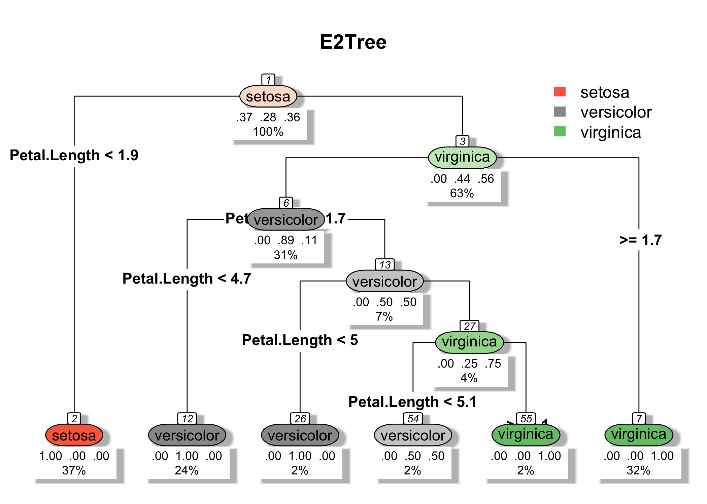
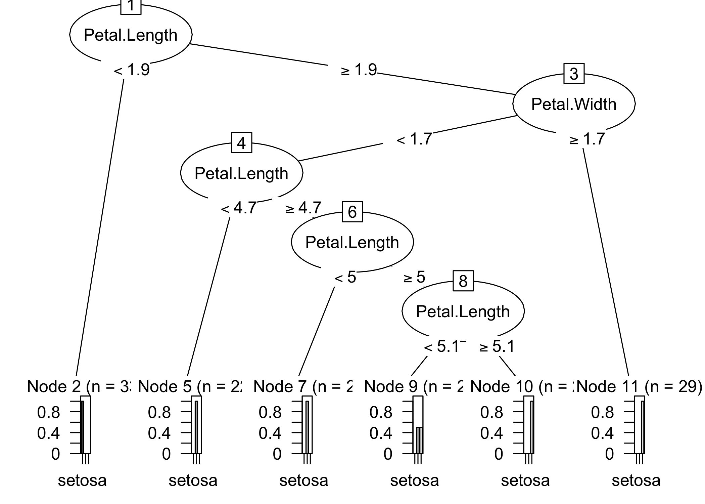
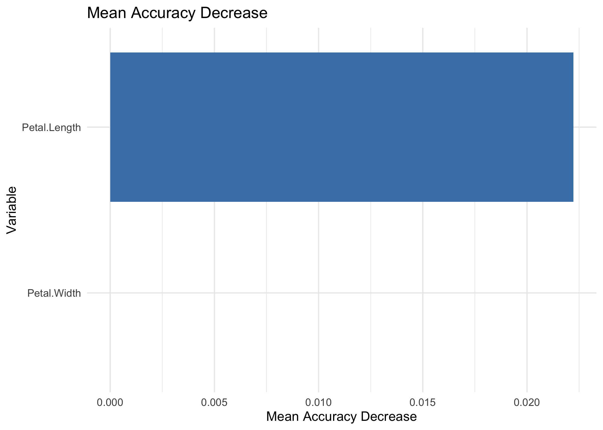
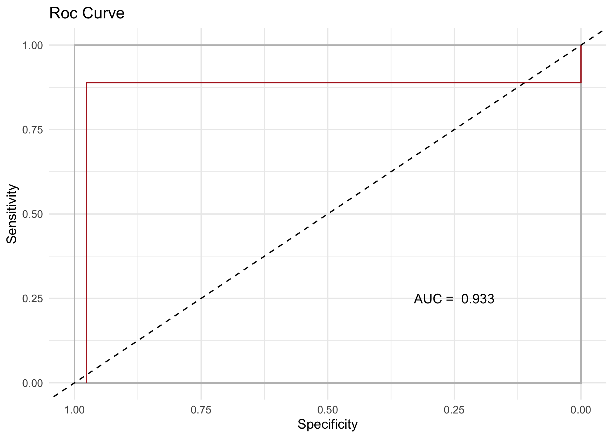

<!-- README.md is generated from README.Rmd. Please edit that file -->

# Explainable Ensemble Trees (e2tree)

<!-- badges: start -->

[](https://github.com/massimoaria/e2tree/actions/workflows/R-CMD-check.yaml)
[](https://CRAN.R-project.org/package=e2tree)
[](https://cran.r-project.org/package=e2tree)

<!-- badges: end -->

<p align="center">


</p>

The **Explainable Ensemble Trees** (**e2tree**) key idea consists of the
definition of an algorithm to represent every ensemble approach based on
decision trees model using a single tree-like structure. The goal is to
explain the results from the ensemble algorithm while preserving its
level of accuracy, which always outperforms those provided by a decision
tree. The proposed method is based on identifying the relationship
tree-like structure explaining the classification or regression paths
summarizing the whole ensemble process. There are two main advantages of
e2tree: - building an explainable tree that ensures the predictive
performance of an RF model - allowing the decision-maker to manage with
an intuitive structure (such as a tree-like structure).

In this example, we focus on Random Forest but, again, the algorithm can
be generalized to every ensemble approach based on decision trees.

## Setup

You can install the **developer version** of e2tree from
[GitHub](https://github.com) with:

``` r
install.packages("remotes")
remotes::install_github("massimoaria/e2tree")
```

You can install the **released version** of e2tree from
[CRAN](https://CRAN.R-project.org) with:

``` r
if (!require("e2tree", quietly=TRUE)) install.packages("e2tree")
```

``` r
require(e2tree)
require(randomForest)
require(ranger)
require(dplyr)
require(ggplot2)
if (!(require(rsample, quietly=TRUE))){install.packages("rsample"); require(rsample, quietly=TRUE)}
options(dplyr.summarise.inform = FALSE)
```

## S3 Classes and Methods

The **e2tree** package uses a proper S3 class system. The main classes
and their associated methods are:

| Class | Methods |
|----|----|
| `e2tree` | `print`, `summary`, `plot`, `predict`, `fitted`, `residuals`, `as.rpart`, `nodes`, `e2splits` |
| `eValidation` | `print`, `summary`, `plot`, `measures`, `proximity` |
| `loi` | `print`, `summary`, `plot` |
| `loi_perm` | `print`, `summary`, `plot` |

E2Tree objects can also be converted to other formats for
interoperability:

- `as.rpart()` converts to `rpart` format for use with `rpart.plot`
- `as.party()` converts to `partykit`’s `constparty` format (if partykit
  is installed)

## Example 1: IRIS dataset (Classification)

Starting from the IRIS dataset, we train an ensemble tree using the
randomForest package and then use e2tree to obtain an explainable tree
synthesis of the ensemble classifier.

``` r
# Set random seed to make results reproducible:
set.seed(0)

# Initialize the split
iris_split <- iris %>% initial_split(prop = 0.6)
iris_split
#> <Training/Testing/Total>
#> <90/60/150>
# Assign the data to the correct sets
training <- iris_split %>% training()
validation <- iris_split %>% testing()
response_training <- training[,5]
response_validation <- validation[,5]
```

Train a Random Forest model with 1000 weak learners

``` r
# Perform training with "ranger" or "randomForest" package:
## RF with "ranger" package
ensemble <- ranger(Species ~ ., data = training, num.trees = 1000, importance = 'impurity')

## RF with "randomForest" package
#ensemble = randomForest(Species ~ ., data = training, importance = TRUE, proximity = TRUE)
```

Create the dissimilarity matrix between observations:

``` r
D = createDisMatrix(ensemble, data = training, label = "Species", parallel = list(active = FALSE, no_cores = NULL))
```

Build an explainable tree for RF:

``` r
setting=list(impTotal=0.1, maxDec=0.01, n=2, level=5)
tree <- e2tree(Species ~ ., data = training, D, ensemble, setting)
```

### S3 methods for e2tree objects

The `e2tree` class supports standard S3 methods for inspecting the
fitted model:

**Print** — compact model overview:

``` r
print(tree)
#> 
#>   Explainable Ensemble Tree (E2Tree)
#>   -----------------------------------
#>   Task:            Classification
#>   Response:        Species
#>   Predictors:      4 (Sepal.Length, Sepal.Width, Petal.Length, Petal.Width)
#>   Observations:    90
#>   Nodes:           11 (total), 6 (terminal)
#>   Max depth:       5
#>   Split variables: Petal.Length, Petal.Width
#>   Classes:         setosa, versicolor, virginica
```

**Summary** — full model details including terminal nodes and decision
rules:

``` r
summary(tree)
#> 
#> ====================================================================== 
#>                     E2TREE MODEL SUMMARY
#> ====================================================================== 
#> 
#> MODEL INFORMATION
#> ---------------------------------------- 
#>   Task:              Classification
#>   Response:          Species
#>   Observations:      90
#>   Total Nodes:       11
#>   Terminal Nodes:    6
#>   Max Depth:         5
#>   Split Variables:   Petal.Length, Petal.Width
#>   Classes:           setosa, versicolor, virginica
#> 
#> 
#> TERMINAL NODES
#> ---------------------------------------------------------------------- 
#>   Node      Prediction            n  Purity      Wt
#> ------------------------------------------------------- 
#>   2         setosa               33  100.0%      --
#>   12        versicolor           22  100.0%      --
#>   26        versicolor            2  100.0%      --
#>   54        versicolor            2   50.0%      --
#>   55        virginica             2  100.0%      --
#>   7         virginica            29  100.0%      --
#> 
#> 
#> DECISION RULES
#> ---------------------------------------------------------------------- 
#> 
#> Rule 1 (Node 2, n=33):
#>     IF   Petal.Length <=1.9
#>   THEN: setosa
#> 
#> Rule 2 (Node 12, n=22):
#>     IF   Petal.Length >1.9
#>     AND  Petal.Width <=1.7
#>     AND  Petal.Length <=4.7
#>   THEN: versicolor
#> 
#> Rule 3 (Node 26, n=2):
#>     IF   Petal.Length >1.9
#>     AND  Petal.Width <=1.7
#>     AND  Petal.Length >4.7
#>     AND  Petal.Length <=5
#>   THEN: versicolor
#> 
#> Rule 4 (Node 54, n=2):
#>     IF   Petal.Length >1.9
#>     AND  Petal.Width <=1.7
#>     AND  Petal.Length >4.7
#>     AND  Petal.Length >5
#>     AND  Petal.Length <=5.1
#>   THEN: versicolor
#> 
#> Rule 5 (Node 55, n=2):
#>     IF   Petal.Length >1.9
#>     AND  Petal.Width <=1.7
#>     AND  Petal.Length >4.7
#>     AND  Petal.Length >5
#>     AND  Petal.Length >5.1
#>   THEN: virginica
#> 
#> Rule 6 (Node 7, n=29):
#>     IF   Petal.Length >1.9
#>     AND  Petal.Width >1.7
#>   THEN: virginica
#> 
#> ======================================================================
```

**Plot** — tree visualization via `rpart.plot`:

``` r
plot(tree, ensemble)
#> Warning: Cannot retrieve the data used to build the model (so cannot determine roundint and is.binary for the variables).
#> To silence this warning:
#>     Call rpart.plot with roundint=FALSE,
#>     or rebuild the rpart model with model=TRUE.
```



### Accessor functions

Accessor functions provide a clean interface to extract components
without exposing the internal structure:

``` r
# Extract terminal nodes
nodes(tree, terminal = TRUE)
#>    node  n       pred prob  impTotal impChildren decImp decImpSur variable
#> 2     2 33     setosa  1.0 0.0222880          NA     NA        NA     <NA>
#> 12   12 22 versicolor  1.0 0.2026426          NA     NA        NA     <NA>
#> 26   26  2 versicolor  1.0 0.5207338          NA     NA        NA     <NA>
#> 54   54  2 versicolor  0.5 0.5794982          NA     NA        NA     <NA>
#> 55   55  2  virginica  1.0 0.5404635          NA     NA        NA     <NA>
#> 7     7 29  virginica  1.0 0.1514348          NA     NA        NA     <NA>
#>    split splitLabel variableSur splitLabelSur parent children terminal
#> 2     NA       <NA>        <NA>          <NA>      1       NA     TRUE
#> 12    NA       <NA>        <NA>          <NA>      6       NA     TRUE
#> 26    NA       <NA>        <NA>          <NA>     13       NA     TRUE
#> 54    NA       <NA>        <NA>          <NA>     27       NA     TRUE
#> 55    NA       <NA>        <NA>          <NA>     27       NA     TRUE
#> 7     NA       <NA>        <NA>          <NA>      3       NA     TRUE
#>                                                                                                                                obs
#> 2  4, 5, 8, 11, 14, 17, 21, 23, 26, 27, 29, 30, 32, 35, 37, 39, 42, 43, 44, 46, 47, 48, 49, 57, 60, 62, 64, 72, 73, 80, 81, 84, 85
#> 12                                             2, 6, 7, 10, 13, 20, 24, 33, 51, 54, 55, 56, 61, 65, 68, 75, 76, 77, 83, 86, 87, 90
#> 26                                                                                                                          12, 50
#> 54                                                                                                                          22, 79
#> 55                                                                                                                          69, 89
#> 7                  1, 3, 9, 15, 16, 18, 19, 25, 28, 31, 34, 36, 38, 40, 41, 45, 52, 53, 58, 59, 63, 66, 67, 70, 71, 74, 78, 82, 88
#>                                                                                                       path
#> 2                                                                                       Petal.Length <=1.9
#> 12                                            !Petal.Length <=1.9 & Petal.Width <=1.7 & Petal.Length <=4.7
#> 26                        !Petal.Length <=1.9 & Petal.Width <=1.7 & !Petal.Length <=4.7 & Petal.Length <=5
#> 54  !Petal.Length <=1.9 & Petal.Width <=1.7 & !Petal.Length <=4.7 & !Petal.Length <=5 & Petal.Length <=5.1
#> 55 !Petal.Length <=1.9 & Petal.Width <=1.7 & !Petal.Length <=4.7 & !Petal.Length <=5 & !Petal.Length <=5.1
#> 7                                                                 !Petal.Length <=1.9 & !Petal.Width <=1.7
#>    ncat pred_val    yval2.V1    yval2.V2    yval2.V3    yval2.V4    yval2.V5
#> 2    NA        1  1.00000000 33.00000000  0.00000000  0.00000000  1.00000000
#> 12   NA        2  2.00000000  0.00000000 22.00000000  0.00000000  0.00000000
#> 26   NA        2  2.00000000  0.00000000  2.00000000  0.00000000  0.00000000
#> 54   NA        2  2.00000000  0.00000000  1.00000000  1.00000000  0.00000000
#> 55   NA        3  3.00000000  0.00000000  0.00000000  2.00000000  0.00000000
#> 7    NA        3  3.00000000  0.00000000  0.00000000 29.00000000  0.00000000
#>       yval2.V6    yval2.V7 yval2.nodeprob
#> 2   0.00000000  0.00000000     0.36666667
#> 12  1.00000000  0.00000000     0.24444444
#> 26  1.00000000  0.00000000     0.02222222
#> 54  0.50000000  0.50000000     0.02222222
#> 55  0.00000000  1.00000000     0.02222222
#> 7   0.00000000  1.00000000     0.32222222

# Extract split information
str(e2splits(tree), max.level = 1)
#> List of 2
#>  $ splits: num [1:5, 1:5] 90 57 28 6 4 -1 -1 -1 -1 -1 ...
#>   ..- attr(*, "dimnames")=List of 2
#>  $ csplit: NULL
```

### Coercion to other formats

E2Tree objects can be converted to standard tree formats for use with
other packages:

``` r
# Convert to rpart format
rpart_obj <- as.rpart(tree, ensemble)

# Convert to partykit format (if installed)
if (requireNamespace("partykit", quietly = TRUE)) {
  party_obj <- partykit::as.party(tree)
  plot(party_obj)
}
```



### Prediction

Use the standard `predict()` method for prediction on new data:

``` r
# Predict on validation set
pred <- predict(tree, newdata = validation, target = "virginica")
head(pred)
#>      fit accuracy score
#> 1 setosa        1     0
#> 2 setosa        1     0
#> 3 setosa        1     0
#> 4 setosa        1     0
#> 5 setosa        1     0
#> 6 setosa        1     0
```

Comparison of predictions (training sample) of RF and e2tree

``` r
# Training predictions
pred_train <- predict(tree, newdata = training, target = "virginica")

# "ranger" package
table(pred_train$fit, ensemble$predictions)
#>             
#>              setosa versicolor virginica
#>   setosa         33          0         0
#>   versicolor      0         23         3
#>   virginica       0          1        30

# "randomForest" package
#table(pred_train$fit, ensemble$predicted)
```

Comparison of predictions (training sample) of RF and correct response

``` r
# "ranger" package
table(ensemble$predictions, response_training)
#>             response_training
#>              setosa versicolor virginica
#>   setosa         33          0         0
#>   versicolor      0         22         2
#>   virginica       0          3        30

## "randomForest" package
#table(ensemble$predicted, response_training)
```

Comparison of predictions (training sample) of e2tree and correct
response

``` r
table(pred_train$fit, response_training)
#>             response_training
#>              setosa versicolor virginica
#>   setosa         33          0         0
#>   versicolor      0         25         1
#>   virginica       0          0        31
```

Fitted values for the training data:

``` r
head(fitted(tree))
#> [1] "virginica"  "versicolor" "virginica"  "setosa"     "setosa"    
#> [6] "versicolor"
```

### Variable importance

Variable importance is automatically detected as classification or
regression:

``` r
V <- vimp(tree, training)
V$vimp
#> # A tibble: 2 × 9
#>   Variable     MeanImpurityDecrease MeanAccuracyDecrease `ImpDec_ setosa`
#>   <chr>                       <dbl>                <dbl>            <dbl>
#> 1 Petal.Length                0.365             2.22e- 2            0.317
#> 2 Petal.Width                 0.214             1.41e-16           NA    
#> # ℹ 5 more variables: `ImpDec_ versicolor` <dbl>, `ImpDec_ virginica` <dbl>,
#> #   `AccDec_ setosa` <dbl>, `AccDec_ versicolor` <dbl>,
#> #   `AccDec_ virginica` <dbl>
V$g_imp
```


``` r
V$g_acc
```



### Prediction on validation sample

``` r
ensemble.pred <- predict(ensemble, validation[,-5])

pred_val <- predict(tree, newdata = validation, target = "virginica")
```

Comparison of predictions (validation sample) of RF and e2tree

``` r
## "ranger" package
table(pred_val$fit, ensemble.pred$predictions)
#>             
#>              setosa versicolor virginica
#>   setosa         17          0         0
#>   versicolor      0         26         0
#>   virginica       0          0        17

## "randomForest" package
#table(pred_val$fit, ensemble.pred$predicted)
```

Comparison of predictions (validation sample) of e2tree and correct
response

``` r
table(pred_val$fit, response_validation)
#>             response_validation
#>              setosa versicolor virginica
#>   setosa         17          0         0
#>   versicolor      0         24         2
#>   virginica       0          1        16
roc_res <- roc(response_validation, pred_val$score, target="virginica")
```



``` r
roc_res$auc
#> [1] 0.9325397
```

## Validation of the E2Tree Structure

A critical question when using E2Tree is: *how well does the single tree
capture the structure of the original ensemble?*

Assessing the fidelity of this reconstruction requires measuring
**agreement** between the ensemble and E2Tree proximity matrices — a
fundamentally different question from measuring their **association**.
The distinction parallels the classical one between *correlation* and
*concordance* in method comparison studies (Bland & Altman, 1986; Lin,
1989): two proximity matrices can be perfectly correlated yet
systematically disagree in their actual values. The Mantel test, being
scale-invariant, would declare perfect association in such a case. But
for E2Tree validation, we need to know whether the *actual proximity
values* are faithfully reproduced.

The `eValidation()` function supports two approaches via the `test`
argument:

- `test = "mantel"`: The classical Mantel test for *association*
- `test = "measures"`: A family of divergence/similarity measures for
  *agreement*
- `test = "both"` (default): Both approaches

### Divergence and similarity measures

| Measure | Type | Range | What it measures |
|----|----|----|----|
| **nLoI** | divergence | \[0, 1\] | Normalized Loss of Interpretability — weighted divergence with diagnostic decomposition |
| **Hellinger** | divergence | \[0, 1\] | Hellinger distance — robust to sparse matrices |
| **wRMSE** | divergence | \[0, 1\] | Weighted RMSE — emphasizes high-proximity regions |
| **RV** | similarity | \[0, 1\] | RV coefficient — global structural similarity (scale-invariant) |
| **SSIM** | similarity | \[-1, 1\] | Structural Similarity Index — captures local block patterns |

All measures are tested simultaneously using a **unified row/column
permutation test**.

### Running the validation

``` r
val <- eValidation(training, tree, D, test = "both", graph = FALSE, n_perm = 999, seed = 42)
```

**Print** — compact results with Mantel test and all measures:

``` r
print(val)
#> 
#> ##############################################################################
#>    E2Tree Validation
#> ##############################################################################
#> 
#>   Matrix dimension:    90 x 90
#>   Pairs:               4005
#> 
#>   Mantel test:         z = 1046.09, p = 0.0010
#> 
#> ------------------------------------------------------------------------------
#>   Measure          Type        Observed    Null mean    Z-stat     p-value
#> ------------------------------------------------------------------------------
#>   nLoI           [div]     0.0480     0.4126     -56.63   0.0010 ** 
#>   Hellinger      [div]     0.2154     0.6250     -81.19   0.0010 ** 
#>   wRMSE          [div]     0.1700     0.8406    -142.36   0.0010 ** 
#>   RV             [sim]     0.9674     0.3294     +57.04   0.0010 ** 
#>   SSIM           [sim]     0.6420     0.0088    +116.47   0.0010 ** 
#> ------------------------------------------------------------------------------
#>   Permutations: 999 (row/column), conf.level: 95%
#> 
#>   LoI Decomposition (per-pair avg):  mean_in = 0.007366,  mean_out = 0.064683
#> 
#>   [div] = divergence (lower=better), [sim] = similarity (higher=better)
#>   Signif. codes: 0 '***' 0.001 '**' 0.01 '*' 0.05 '.' 0.1
#> 
#> ##############################################################################
```

**Summary** — includes the LoI diagnostic decomposition:

``` r
summary(val)
#> 
#> ##############################################################################
#>    E2Tree Validation
#> ##############################################################################
#> 
#>   Matrix dimension:    90 x 90
#>   Pairs:               4005
#> 
#>   Mantel test:         z = 1046.09, p = 0.0010
#> 
#> ------------------------------------------------------------------------------
#>   Measure          Type        Observed    Null mean    Z-stat     p-value
#> ------------------------------------------------------------------------------
#>   nLoI           [div]     0.0480     0.4126     -56.63   0.0010 ** 
#>   Hellinger      [div]     0.2154     0.6250     -81.19   0.0010 ** 
#>   wRMSE          [div]     0.1700     0.8406    -142.36   0.0010 ** 
#>   RV             [sim]     0.9674     0.3294     +57.04   0.0010 ** 
#>   SSIM           [sim]     0.6420     0.0088    +116.47   0.0010 ** 
#> ------------------------------------------------------------------------------
#>   Permutations: 999 (row/column), conf.level: 95%
#> 
#>   LoI Decomposition (per-pair avg):  mean_in = 0.007366,  mean_out = 0.064683
#> 
#>   [div] = divergence (lower=better), [sim] = similarity (higher=better)
#>   Signif. codes: 0 '***' 0.001 '**' 0.01 '*' 0.05 '.' 0.1
#> 
#> ##############################################################################
#> 
#> 
#> 
#> ##############################################################################
#>    Loss of Interpretability (LoI) --Decomposition
#> ##############################################################################
#> 
#>   nLoI (normalized):   0.0480
#>   LoI (raw):           192.1100
#>   n = 90, pairs = 4005 (within: 1168, between: 2837)
#> 
#> ------------------------------------------------------------------------------
#>   Component              Total       Pairs     Mean/pair
#> ------------------------------------------------------------------------------
#>   Within-node (LoI_in)    8.6039       1168     0.007366
#>   Between-node (LoI_out)183.5062       2837     0.064683
#> ------------------------------------------------------------------------------
#> 
#>   Per-pair interpretation (comparable across components):
#> 
#>     mean_in  = 0.007366  (avg calibration error within nodes)
#>     mean_out = 0.064683  (avg ensemble proximity lost by separation)
#> 
#>   Diagnostic: LOW mean_out. The partition correctly separates pairs
#>   that have low ensemble proximity --the tree structure is well-placed.
#> 
#>   Diagnostic: LOW mean_in. Within-node proximity values closely
#>   match the ensemble --excellent calibration.
#> 
#> ##############################################################################
```

**Plot** — heatmaps, null distribution, and LoI decomposition:

``` r
plot(val)
```


### Extracting results with accessors

Use accessor functions instead of direct `$` access:

``` r
# Validation measures table
measures(val)
#>      method       type   observed   null_mean     null_sd     z_stat p_value
#> 1      nLoI divergence 0.04796755 0.412605505 0.006438700  -56.63223   0.001
#> 2 Hellinger divergence 0.21542068 0.625021454 0.005044737  -81.19368   0.001
#> 3     wRMSE divergence 0.16995523 0.840584726 0.004710777 -142.36068   0.001
#> 4        RV similarity 0.96743746 0.329429934 0.011185735   57.03760   0.001
#> 5      SSIM similarity 0.64198676 0.008751186 0.005436671  116.47487   0.001
#>     ci_lower  ci_upper
#> 1 0.04013923 0.0626473
#> 2 0.20911191 0.2271914
#> 3 0.16400739 0.1810256
#> 4 0.94219513 0.9816048
#> 5 0.62833640 0.6503210

# Proximity matrices
prox <- proximity(val, type = "both")
str(prox, max.level = 1)
#> List of 2
#>  $ ensemble: num [1:90, 1:90] 1 0.947 0.951 0.917 0.92 ...
#>   ..- attr(*, "dimnames")=List of 2
#>  $ e2tree  : num [1:90, 1:90] 1 1 1 1 1 1 1 1 1 1 ...
#>   ..- attr(*, "dimnames")=List of 2
```

### The nLoI Decomposition

The nLoI is unique among the measures because it decomposes into two
interpretable components:

- **LoI_in** (within-node): measures how well the E2Tree reproduces the
  ensemble’s proximity values for pairs it groups *together*.

- **LoI_out** (between-node): measures the ensemble proximity lost for
  pairs that E2Tree *separates* into different nodes.

Since the number of within-node and between-node pairs can differ
dramatically, the `loi()` function reports **per-pair averages**
(`mean_in` and `mean_out`) that enable meaningful comparison:

``` r
O <- proximity(val, type = "ensemble")
O_hat <- proximity(val, type = "e2tree")

result <- loi(O, O_hat)
summary(result)
#> 
#> ##############################################################################
#>    Loss of Interpretability (LoI) --Decomposition
#> ##############################################################################
#> 
#>   nLoI (normalized):   0.0480
#>   LoI (raw):           192.1100
#>   n = 90, pairs = 4005 (within: 1168, between: 2837)
#> 
#> ------------------------------------------------------------------------------
#>   Component              Total       Pairs     Mean/pair
#> ------------------------------------------------------------------------------
#>   Within-node (LoI_in)    8.6039       1168     0.007366
#>   Between-node (LoI_out)183.5062       2837     0.064683
#> ------------------------------------------------------------------------------
#> 
#>   Per-pair interpretation (comparable across components):
#> 
#>     mean_in  = 0.007366  (avg calibration error within nodes)
#>     mean_out = 0.064683  (avg ensemble proximity lost by separation)
#> 
#>   Diagnostic: LOW mean_out. The partition correctly separates pairs
#>   that have low ensemble proximity --the tree structure is well-placed.
#> 
#>   Diagnostic: LOW mean_in. Within-node proximity values closely
#>   match the ensemble --excellent calibration.
#> 
#> ##############################################################################
```

The per-pair averages provide actionable diagnostics:

- **mean_out \> 0.3**: the tree is splitting apart pairs with
  substantial ensemble proximity — consider more terminal nodes
- **mean_out \< 0.1**: the partition correctly separates low-proximity
  pairs — tree structure is well-placed
- **mean_in \> 0.1**: within-node calibration error is high — check
  proximity estimation
- **mean_in \< 0.01**: excellent within-node match between E2Tree and
  ensemble

### Standalone LoI permutation test

For a quick significance assessment:

``` r
perm <- loi_perm(O, O_hat, n_perm = 999, seed = 42)
print(perm)
#> 
#> ==============================================================================
#>    Permutation Test for Loss of Interpretability (LoI)
#> ==============================================================================
#> 
#>   Observed nLoI:       0.0480
#>   Null mean:           0.4128
#>   Null SD:             0.0062
#>   Z-statistic:         -58.5019
#> 
#> ------------------------------------------------------------------------------
#>   Hypothesis Test (H1: nLoI < expected by chance)
#> ------------------------------------------------------------------------------
#>   p-value:             0.0010 **
#>   95% CI:             [0.0399, 0.0646]
#>   Permutations:        999 (row/column)
#> 
#> ------------------------------------------------------------------------------
#>   Decomposition (per-pair averages)
#> ------------------------------------------------------------------------------
#>   mean_in  (within):   0.007366  (n_pairs = 1168)
#>   mean_out (between):  0.064683  (n_pairs = 2837)
#> 
#> ==============================================================================
#>   Signif. codes: 0 '***' 0.001 '**' 0.01 '*' 0.05 '.' 0.1
```

``` r
plot(perm)
```


