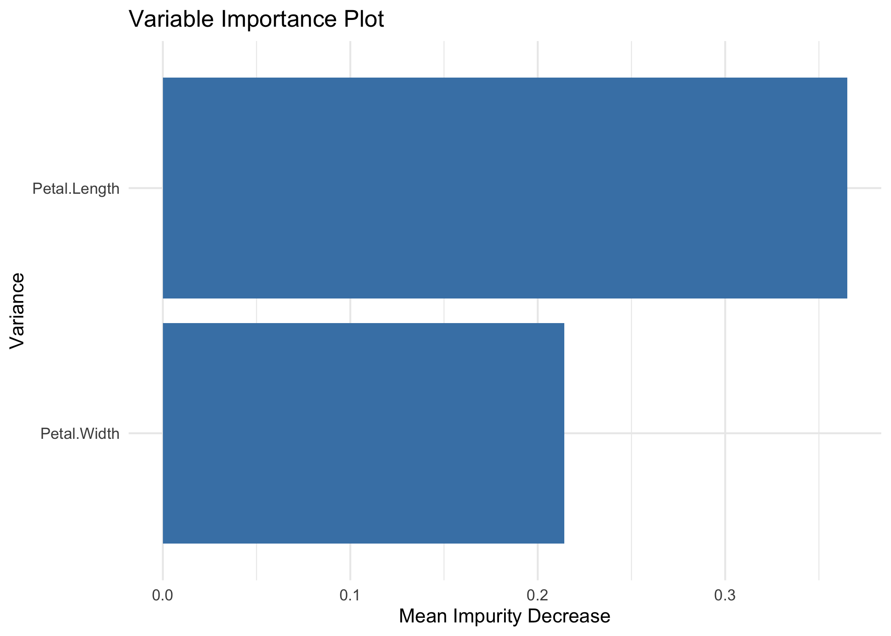
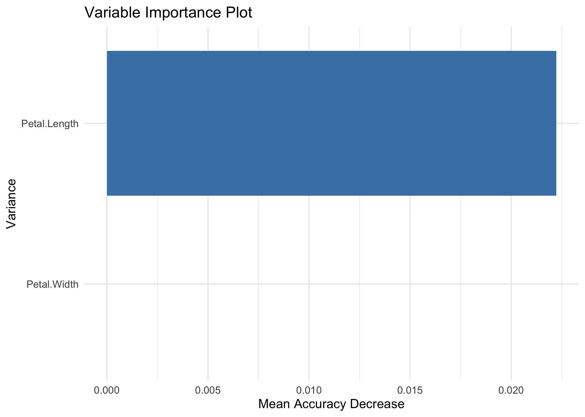
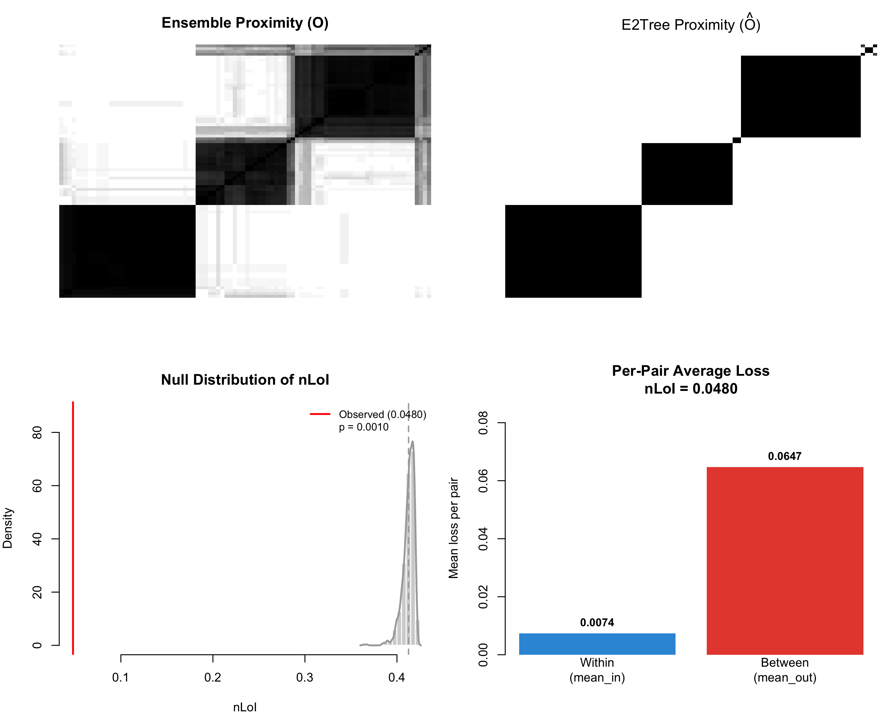
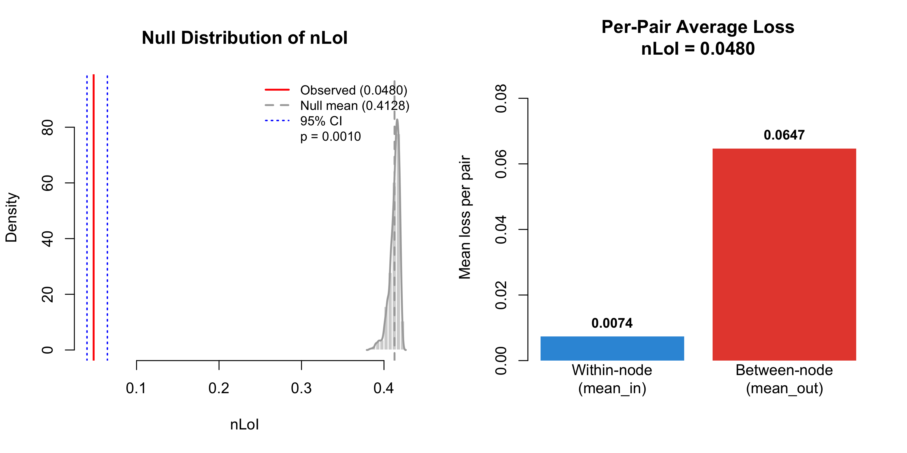

<!-- README.md is generated from README.Rmd. Please edit that file -->

# Explainable Ensemble Trees (e2tree)

<!-- badges: start -->

[](https://github.com/massimoaria/e2tree/actions/workflows/R-CMD-check.yaml)
[](https://CRAN.R-project.org/package=e2tree)
[](https://cran.r-project.org/package=e2tree)

<!-- badges: end -->

<p align="center">


</p>

The **Explainable Ensemble Trees** (**e2tree**) key idea consists of the
definition of an algorithm to represent every ensemble approach based on
decision trees model using a single tree-like structure. The goal is to
explain the results from the ensemble algorithm while preserving its
level of accuracy, which always outperforms those provided by a decision
tree. The proposed method is based on identifying the relationship
tree-like structure explaining the classification or regression paths
summarizing the whole ensemble process. There are two main advantages of
e2tree: - building an explainable tree that ensures the predictive
performance of an RF model - allowing the decision-maker to manage with
an intuitive structure (such as a tree-like structure).

In this example, we focus on Random Forest but, again, the algorithm can
be generalized to every ensemble approach based on decision trees.

## Setup

You can install the **developer version** of e2tree from
[GitHub](https://github.com) with:

``` r
install.packages("remotes")
remotes::install_github("massimoaria/e2tree")
```

You can install the **released version** of e2tree from
[CRAN](https://CRAN.R-project.org) with:

``` r
if (!require("e2tree", quietly=TRUE)) install.packages("e2tree")
```

``` r
require(e2tree)
require(randomForest)
require(ranger)
require(dplyr)
require(ggplot2)
if (!(require(rsample, quietly=TRUE))){install.packages("rsample"); require(rsample, quietly=TRUE)}
options(dplyr.summarise.inform = FALSE)
```

## Warning

This package is still under development and, for the time being, the
following limitations apply:

- Only ensembles trained with the **randomForest** and **ranger**
  packages are currently supported. Support for additional packages and
  approaches will be added in the future.

- Currently **e2tree** works only for classification and regression
  problems. It will gradually be extended to handle other types of
  response variables, such as count data, multivariate responses, and
  more.

## Example 1: IRIS dataset

In this example, we want to show the main functions of the e2tree
package.

Starting from the IRIS dataset, we will train an ensemble tree using the
randomForest package and then subsequently use e2tree to obtain an
explainable tree synthesis of the ensemble classifier. We run a Random
Forest (RF) model, and then obtain the proximity matrix of the
observations as output. The idea behind the proximity matrix: if a pair
of observations is often at a terminal node of several trees, this means
that both explain an underlying relationship. From this we are able to
calculate co-occurrences at nodes between pairs of observations and
obtain a matrix O of Co-Occurrences that will then be used to construct
the graphical E2Tree output. The final aim will be to explain the
relationship between predictors and response, reconstructing the same
structure as the proximity matrix output of the RF model.

``` r
# Set random seed to make results reproducible:
set.seed(0)

# Initialize the split
iris_split <- iris %>% initial_split(prop = 0.6)
iris_split
#> <Training/Testing/Total>
#> <90/60/150>
# Assign the data to the correct sets
training <- iris_split %>% training()
validation <- iris_split %>% testing()
response_training <- training[,5]
response_validation <- validation[,5]
```

Train a Random Forest model with 1000 weak learners

``` r
# Perform training with "ranger" or "randomForest" package:
## RF with "ranger" package
ensemble <- ranger(Species ~ ., data = training, num.trees = 1000, importance = 'impurity')

## RF with "randomForest" package
#ensemble = randomForest(Species ~ ., data = training, importance = TRUE, proximity = TRUE)
```

Here, we create the dissimilarity matrix between observations through
the createDisMatrix function

``` r
D = createDisMatrix(ensemble, data = training, label = "Species", parallel = list(active = FALSE, no_cores = NULL))
```

Setting e2tree parameters

``` r
setting=list(impTotal=0.1, maxDec=0.01, n=2, level=5)
```

Build an explainable tree for RF

``` r
tree <- e2tree(Species ~ ., data = training, D, ensemble, setting)
```

### S3 methods for e2tree objects

The `e2tree` class supports standard S3 methods for inspecting the
fitted model:

**Print** — compact model overview:

``` r
print(tree)
#> 
#>   Explainable Ensemble Tree (E2Tree)
#>   -----------------------------------
#>   Task:            Classification
#>   Response:        Species
#>   Predictors:      4 (Sepal.Length, Sepal.Width, Petal.Length, Petal.Width)
#>   Observations:    90
#>   Nodes:           11 (total), 6 (terminal)
#>   Max depth:       5
#>   Split variables: Petal.Length, Petal.Width
#>   Classes:         setosa, versicolor, virginica
```

**Summary** — full model details including terminal nodes and decision
rules:

``` r
summary(tree)
#> 
#> ====================================================================== 
#>                     E2TREE MODEL SUMMARY
#> ====================================================================== 
#> 
#> MODEL INFORMATION
#> ---------------------------------------- 
#>   Task:              Classification
#>   Response:          Species
#>   Observations:      90
#>   Total Nodes:       11
#>   Terminal Nodes:    6
#>   Max Depth:         5
#>   Split Variables:   Petal.Length, Petal.Width
#>   Classes:           setosa, versicolor, virginica
#> 
#> 
#> TERMINAL NODES
#> ---------------------------------------------------------------------- 
#>   Node      Prediction            n  Purity      Wt
#> ------------------------------------------------------- 
#>   2         setosa               33  100.0%     —
#>   12        versicolor           22  100.0%     —
#>   26        versicolor            2  100.0%     —
#>   54        versicolor            2   50.0%     —
#>   55        virginica             2  100.0%     —
#>   7         virginica            29  100.0%     —
#> 
#> 
#> DECISION RULES
#> ---------------------------------------------------------------------- 
#> 
#> Rule 1 (Node 2, n=33):
#>     IF   Petal.Length <=1.9
#>   THEN: setosa
#> 
#> Rule 2 (Node 12, n=22):
#>     IF   Petal.Length >1.9
#>     AND  Petal.Width <=1.7
#>     AND  Petal.Length <=4.7
#>   THEN: versicolor
#> 
#> Rule 3 (Node 26, n=2):
#>     IF   Petal.Length >1.9
#>     AND  Petal.Width <=1.7
#>     AND  Petal.Length >4.7
#>     AND  Petal.Length <=5
#>   THEN: versicolor
#> 
#> Rule 4 (Node 54, n=2):
#>     IF   Petal.Length >1.9
#>     AND  Petal.Width <=1.7
#>     AND  Petal.Length >4.7
#>     AND  Petal.Length >5
#>     AND  Petal.Length <=5.1
#>   THEN: versicolor
#> 
#> Rule 5 (Node 55, n=2):
#>     IF   Petal.Length >1.9
#>     AND  Petal.Width <=1.7
#>     AND  Petal.Length >4.7
#>     AND  Petal.Length >5
#>     AND  Petal.Length >5.1
#>   THEN: virginica
#> 
#> Rule 6 (Node 7, n=29):
#>     IF   Petal.Length >1.9
#>     AND  Petal.Width >1.7
#>   THEN: virginica
#> 
#> ======================================================================
```

**Plot** — tree visualization via `rpart.plot`:

``` r
plot(tree, ensemble)
```


### Prediction

Prediction with the new tree (example on training)

``` r
pred <- ePredTree(tree, training[,-5], target="virginica")
```

Comparison of predictions (training sample) of RF and e2tree

``` r
# "ranger" package
table(pred$fit, ensemble$predictions)
#>             
#>              setosa versicolor virginica
#>   setosa         33          0         0
#>   versicolor      0         23         3
#>   virginica       0          1        30

# "randomForest" package
#table(pred$fit, ensemble$predicted)
```

Comparison of predictions (training sample) of RF and correct response

``` r
# "ranger" package
table(ensemble$predictions, response_training)
#>             response_training
#>              setosa versicolor virginica
#>   setosa         33          0         0
#>   versicolor      0         22         2
#>   virginica       0          3        30

## "randomForest" package
#table(ensemble$predicted, response_training)
```

Comparison of predictions (training sample) of e2tree and correct
response

``` r
table(pred$fit,response_training)
#>             response_training
#>              setosa versicolor virginica
#>   setosa         33          0         0
#>   versicolor      0         25         1
#>   virginica       0          0        31
```

Variable Importance

``` r
V <- vimp(tree, training)
V
#> $vimp
#> # A tibble: 2 × 9
#>   Variable     MeanImpurityDecrease MeanAccuracyDecrease `ImpDec_ setosa`
#>   <chr>                       <dbl>                <dbl>            <dbl>
#> 1 Petal.Length                0.365             2.22e- 2            0.317
#> 2 Petal.Width                 0.214             1.41e-16           NA    
#> # ℹ 5 more variables: `ImpDec_ versicolor` <dbl>, `ImpDec_ virginica` <dbl>,
#> #   `AccDec_ setosa` <dbl>, `AccDec_ versicolor` <dbl>,
#> #   `AccDec_ virginica` <dbl>
#> 
#> $g_imp
```



    #> 
    #> $g_acc



Comparison with the validation sample

``` r
ensemble.pred <- predict(ensemble, validation[,-5])

pred_val<- ePredTree(tree, validation[,-5], target="virginica")
```

Comparison of predictions (sample validation) of RF and e2tree

``` r
## "ranger" package
table(pred_val$fit, ensemble.pred$predictions)
#>             
#>              setosa versicolor virginica
#>   setosa         17          0         0
#>   versicolor      0         26         0
#>   virginica       0          0        17

## "randomForest" package
#table(pred_val$fit, ensemble.pred$predicted)
```

Comparison of predictions (validation sample) of e2tree and correct
response

``` r
table(pred_val$fit, response_validation)
#>             response_validation
#>              setosa versicolor virginica
#>   setosa         17          0         0
#>   versicolor      0         24         2
#>   virginica       0          1        16
roc_res <- roc(response_validation, pred_val$score, target="virginica")
```


``` r
roc_res$auc
#> [1] 0.9325397
```

## Validation: Measuring Reconstruction Quality

A critical question when using E2Tree is: *how well does the single tree
capture the structure of the original ensemble?* This is a question of
**agreement** (do the proximity values match?) rather than mere
**association** (is the pattern correlated?).

The `eValidation()` function provides a comprehensive validation
framework that computes multiple divergence and similarity measures,
each capturing a different aspect of reconstruction quality:

| Measure | Type | Range | What it measures |
|----|----|----|----|
| **nLoI** | divergence | \[0, 1\] | Normalized Loss of Interpretability — weighted divergence with diagnostic decomposition |
| **Hellinger** | divergence | \[0, 1\] | Hellinger distance — robust to sparse matrices |
| **wRMSE** | divergence | \[0, 1\] | Weighted RMSE — emphasizes high-proximity regions |
| **RV** | similarity | \[0, 1\] | RV coefficient — global structural similarity (scale-invariant) |
| **SSIM** | similarity | \[-1, 1\] | Structural Similarity Index — captures local block patterns |

All measures are tested simultaneously using a **unified row/column
permutation test** with a single set of permutations.

### Running the validation

``` r
val <- eValidation(training, tree, D, graph = FALSE, n_perm = 999, seed = 42)
```

**Print** — compact results table with all measures and permutation
test:

``` r
print(val)
#> 
#> ##############################################################################
#>    E2Tree Validation
#> ##############################################################################
#> 
#>   Matrix dimension:    90 x 90
#>   Pairs:               4005
#> 
#>   Mantel test:         z = 1046.09, p = 0.0010
#> 
#> ------------------------------------------------------------------------------
#>   Measure          Type        Observed    Null mean    Z-stat     p-value
#> ------------------------------------------------------------------------------
#>   nLoI           [div]     0.0480     0.4126     -56.63   0.0010 ** 
#>   Hellinger      [div]     0.2154     0.6250     -81.19   0.0010 ** 
#>   wRMSE          [div]     0.1700     0.8406    -142.36   0.0010 ** 
#>   RV             [sim]     0.9674     0.3294     +57.04   0.0010 ** 
#>   SSIM           [sim]     0.6420     0.0088    +116.47   0.0010 ** 
#> ------------------------------------------------------------------------------
#>   Permutations: 999 (row/column), conf.level: 95%
#> 
#>   LoI Decomposition:   within = 4.5%,  between = 95.5%
#> 
#> ##############################################################################
#>   [div] = divergence (lower=better), [sim] = similarity (higher=better)
#>   Signif. codes: 0 '***' 0.001 '**' 0.01 '*' 0.05 '.' 0.1
```

**Summary** — includes the LoI diagnostic decomposition:

``` r
summary(val)
#> 
#> ##############################################################################
#>    E2Tree Validation
#> ##############################################################################
#> 
#>   Matrix dimension:    90 x 90
#>   Pairs:               4005
#> 
#>   Mantel test:         z = 1046.09, p = 0.0010
#> 
#> ------------------------------------------------------------------------------
#>   Measure          Type        Observed    Null mean    Z-stat     p-value
#> ------------------------------------------------------------------------------
#>   nLoI           [div]     0.0480     0.4126     -56.63   0.0010 ** 
#>   Hellinger      [div]     0.2154     0.6250     -81.19   0.0010 ** 
#>   wRMSE          [div]     0.1700     0.8406    -142.36   0.0010 ** 
#>   RV             [sim]     0.9674     0.3294     +57.04   0.0010 ** 
#>   SSIM           [sim]     0.6420     0.0088    +116.47   0.0010 ** 
#> ------------------------------------------------------------------------------
#>   Permutations: 999 (row/column), conf.level: 95%
#> 
#>   LoI Decomposition:   within = 4.5%,  between = 95.5%
#> 
#> ##############################################################################
#>   [div] = divergence (lower=better), [sim] = similarity (higher=better)
#>   Signif. codes: 0 '***' 0.001 '**' 0.01 '*' 0.05 '.' 0.1
#> 
#> 
#> 
#> ##############################################################################
#>    Loss of Interpretability (LoI) — Decomposition
#> ##############################################################################
#> 
#>   nLoI (normalized):   0.0480
#>   LoI (raw):           192.1100
#>   n = 90, pairs = 4005
#> 
#> ------------------------------------------------------------------------------
#>   Component                Value       Pairs      Proportion   Diagnosis
#> ------------------------------------------------------------------------------
#>   Within-node (LoI_in)     8.6039       1168        4.5%     
#>   Between-node (LoI_out) 183.5062       2837       95.5%     <- dominant
#> ------------------------------------------------------------------------------
#> 
#>   Interpretation: Partition loss dominates. The E2Tree is separating
#>   observations that the ensemble considers similar. Consider increasing
#>   the number of terminal nodes or relaxing pruning constraints.
#> 
#> ##############################################################################
```

**Plot** — heatmaps, null distribution, and LoI decomposition:

``` r
plot(val)
```



### The LoI Decomposition

The key diagnostic feature of the nLoI is its **decomposability** into
two components:

- **LoI_in** (within-node): measures how well the E2Tree reproduces the
  ensemble’s proximity values for pairs it groups *together*. A high
  proportion indicates the partition is correct but within-node
  calibration is off.

- **LoI_out** (between-node): measures the cost of pairs the E2Tree
  *separates* into different nodes. A high proportion indicates the tree
  needs more terminal nodes.

This decomposition is available directly from the `loi()` function:

``` r
O <- val$Proximity_matrix_ensemble
O_hat <- val$Proximity_matrix_e2tree

result <- loi(O, O_hat)
summary(result)
#> 
#> ##############################################################################
#>    Loss of Interpretability (LoI) — Decomposition
#> ##############################################################################
#> 
#>   nLoI (normalized):   0.0480
#>   LoI (raw):           192.1100
#>   n = 90, pairs = 4005
#> 
#> ------------------------------------------------------------------------------
#>   Component                Value       Pairs      Proportion   Diagnosis
#> ------------------------------------------------------------------------------
#>   Within-node (LoI_in)     8.6039       1168        4.5%     
#>   Between-node (LoI_out) 183.5062       2837       95.5%     <- dominant
#> ------------------------------------------------------------------------------
#> 
#>   Interpretation: Partition loss dominates. The E2Tree is separating
#>   observations that the ensemble considers similar. Consider increasing
#>   the number of terminal nodes or relaxing pruning constraints.
#> 
#> ##############################################################################
```

The decomposition provides actionable diagnostics:

- If **LoI_out \> 70%**: increase tree complexity (more nodes, relaxed
  pruning)
- If **LoI_in \> 70%**: partition boundaries are adequate, but proximity
  calibration needs improvement
- If **balanced**: reconstruction is limited by the inherent
  fuzzy-to-crisp structural transition

### Standalone LoI permutation test

For a standalone permutation test with detailed output:

``` r
perm <- loi_perm(O, O_hat, n_perm = 999, seed = 42)
print(perm)
#> 
#> ==============================================================================
#>    Permutation Test for Loss of Interpretability (LoI)
#> ==============================================================================
#> 
#>   Observed nLoI:       0.0480
#>   Null mean:           0.4128
#>   Null SD:             0.0062
#>   Z-statistic:         -58.5019
#> 
#> ------------------------------------------------------------------------------
#>   Hypothesis Test (H1: nLoI < expected by chance)
#> ------------------------------------------------------------------------------
#>   p-value:             0.0010 **
#>   95% CI:             [0.0399, 0.0646]
#>   Permutations:        999 (row/column)
#> 
#> ------------------------------------------------------------------------------
#>   Decomposition
#> ------------------------------------------------------------------------------
#>   LoI_in  (within):    8.6039  (  4.5% of total)
#>   LoI_out (between):   183.5062  ( 95.5% of total)
#> 
#> ==============================================================================
#>   Signif. codes: 0 '***' 0.001 '**' 0.01 '*' 0.05 '.' 0.1
```

``` r
plot(perm)
```


